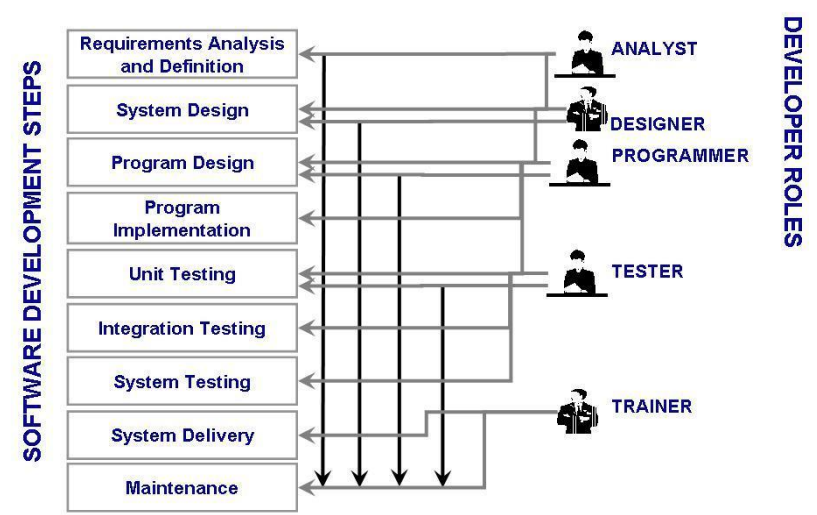
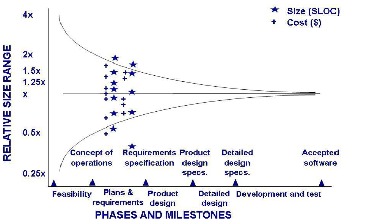
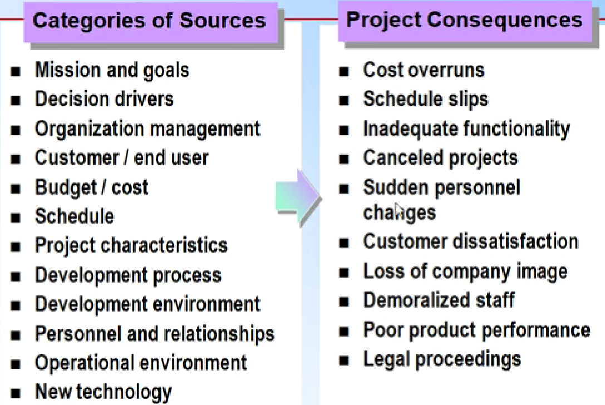
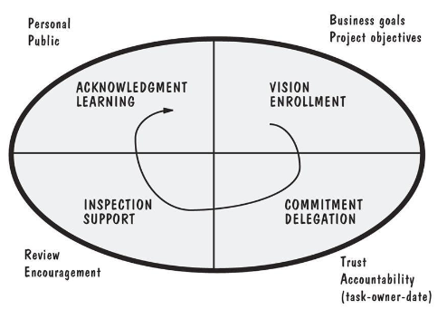
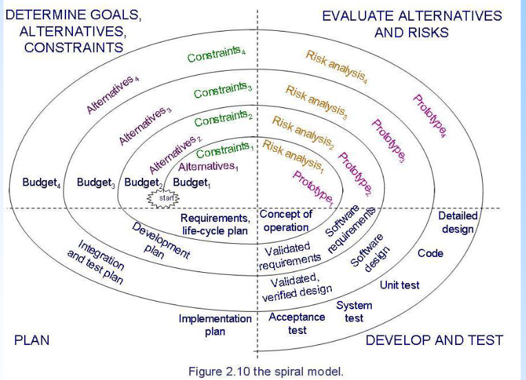
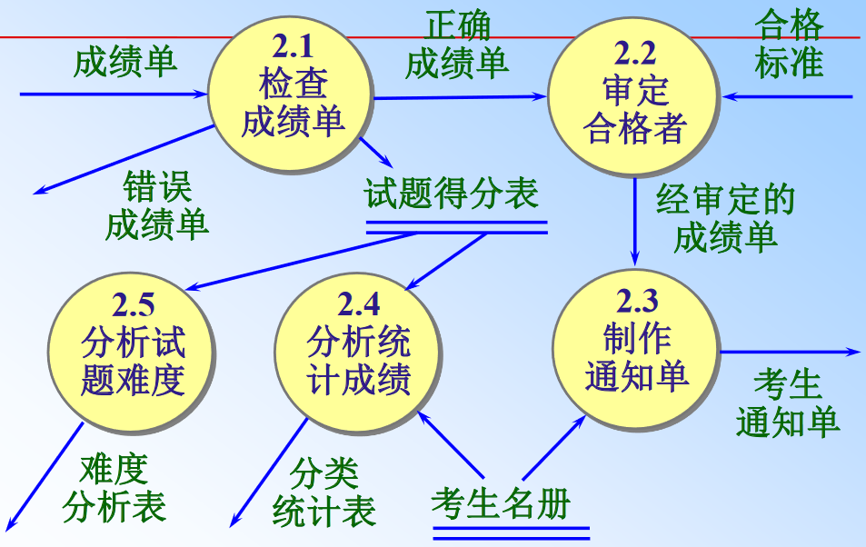
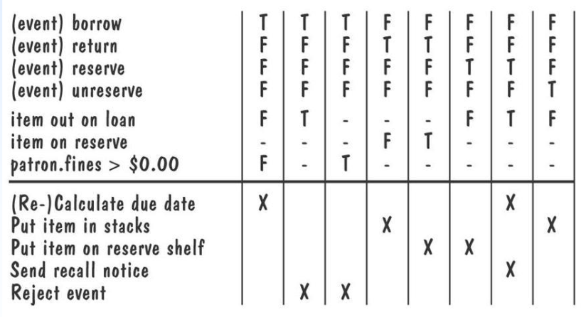
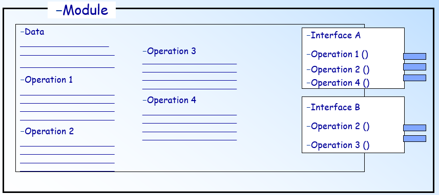
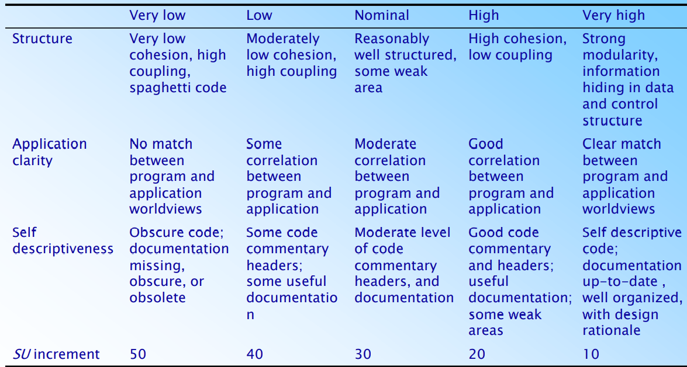
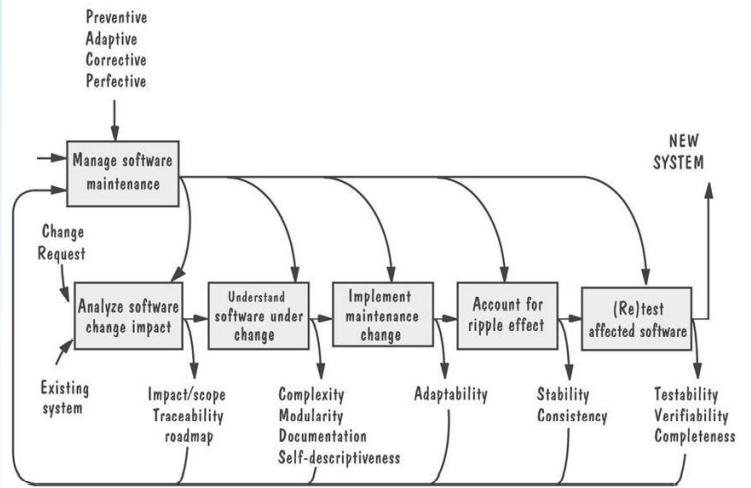

# 第0章 说明

## 课程要求
1. 教材是全英文的，期末考试的试题也是全英文的，可以用中文答题。
2. 上课过程中互动环节比较多，互动环节的表现是平时成绩的主要依据。
    > 不要去想你的答案是对的还是错的，只要是你自己思考的结果都是好的！！
3. 上课的回帖、平时作业、实验项目，都不允许任何抄袭！！

## 课程开设的意义1
1. 可以选择的岗位：测试工程师、算法工程师、系统分析师、软件架构师、需求分析工程师、开发工程师、数据库工程师、前端工程师
2. 未来职业的可能发展方向：第一阶段初级在他人帮助下工作；第二阶段能独立完成工作；第三阶段能够独挡一面完成具有挑战性的工作；第四阶段是能够带领几个人工作；第五阶段能够带领一个团队工作。之后，参与组织/企业内部的战略决策。
1. 专业课程设置的意义以及升学如何选择研究方向
   1. 本科开设的课程：程序设计、数据结构、数据库、软件测试、UML、离散数学、计算机组成原理
   2. 常见的研究方向：软件工程、计算机图形图像处理、网络安全、软件安全、体系结构、模式识别、数据挖掘

## 课程开设的意义2
基于人脸识别技术的门禁系统：
- 迪士尼公园的门禁系统（替代传统的纸质票据和二维码）
- 银行里的门禁系统（金库，现金库等等）

---
- 这两款系统是否相同？不同在哪里？
- 能否开发同一个系统，用于这两种不同的情况？

---
- IT 教育，不仅仅是代码！
- 程序员写多少代码不重要，重要的是解决问题的效率。
- 不要重复造轮子。

## 课程目标
- 熟悉软件开发中的各种活动，并能够在软件开发时进行团队协作。
- 理解软件生命周期模型，以及模型在软件开发管理中的作用。
- 能根据问题的特点选择合适的过程模型。
- 掌握解决问题的方法，并能用软件工程语言表达问题以及问题的解决方案。
- 理解软件设计的重要性，能对问题给出多种解决方案，并根据问题的业务背景对不同方案进行折中与选择。
- 掌握软件工程的基本概念和常用的开发方法，能在解决问题时灵活运用这些概念和方法。

## 如何学习软件工程？


- 外因：问题背景
  - 职业决定
  - 学习特殊领域的特点：嵌入式、信息系统、网络...
- 外因：工具
  - 掌握常用工具的使用: 编程工具、管理工具...
  - 实践
- 外因：技术、方法（重要）
  - 课堂学习 ： 结构化、面向对象...
  - 实践巩固
- 内因：知识背景（重要）
  - 课堂学习基础
  - 课外大量阅读
- 内因：实践经验（重要）
  - 多动手实践
  - 多参与交流（浏览专业论坛）
- 内因：灵感：Up to you!

## 《软件工程》课程—项目分组要求
1. 人数要求：5-7 个人一组，不超过 7 个人。如果超过 7 个人，那么项目的规模和复杂度也要超过全班的平均水平。
2. 项目类型：选择项目组熟悉需求的项目，不要选择自己搞不清楚需求的项目，也不要选择教务管理系统、图书馆管理系统等需求过于普遍的项目。鼓励大家做一些具有创新性和应用价值的项目。
3. 项目组分工：每个人必须在项目组扮演至少一个角色，项目完成之后，所有相关文档、代码等都要提交。如果项目结束后，只完成了“月报告”“总结报告”等非核心活动的文档，那么将没有个人得分。
4. 成绩评定（期中成绩）：同一个小组中，每个人的成绩取决于他在项目中的角色和贡献，且每个人的成绩不相同。

成绩具体计算办法：小组得分（满分 70 分）+个人得分（满分 30 分）。  
针对项目分组要求，还有不明确的地方，可以在 QQ群中@我提问。

## 《软件工程》课程—项目分组建议
1. 项目组人员：项目组内男女搭配，并且每个成员都具有不同的技术，每个人都能独当一面。
2. 项目组建设：以此为契机，组建自己的团队，选择一个创新性和可扩展空间较大的项目，可以长期进行开发和维护。成果可以用来参加各种竞赛，争取最终可以作为自己的创业项目、考研或找工作时的可展示系统等。
3. 项目选择：如果想进行长期开发和维护，并且自己已经组建了一个比较完善的团队，也可以做实验室的项目，大家可以联系不同的实验室，找一些比较实际的需求来完成系统。这类系统通常比较具有前沿性和完整性，用来参加各类竞赛比较有优势

## 课程教材及参考文献
教材（全英文）：《Software Engineering》(4th Edition) -- Shari L. fleeger Joanne M. Atlee  
参考资料：
- 《大象：Thinking in UML(第2版)》 谭云杰著， 中国水利水电出版社
- 《软件工程(第3版)》张海潘，倪宁著，人民邮电出版社
- 《软件工程》赖均、陶春梅、刘兆宏、胡峰著作，清华大学出版社
- 《软件建模与设计：UML、用例、模式和软件体系结构》Hassan Gomaa 著 机械工业出版社

## 教学方法


# 第1章 Why software engineering（为什么软件工程）

## 1.0 Discussion（讨论）

### What is software ？（什么是软件）
- **Code** in machine-readable form（机器可读形式的代码）
- **Data** (temporary and permanent data)（数据（临时和永久数据））
- All the **documents（文档）**
  - Specification documents（规范文件）
  - Design documents（设计文件）
  - Legal and accounting documents（法律和会计文件）
  - All types of manuals（所有类型的手册）
  - Other management documents（其他管理文件）

### Software Characteristics（软件特征）
- **Abstract**—It is a kind of logic entity, not concrete physical entity.（抽象 - 它是一种逻辑实体，而不是具体的物理实体。）
- Software **does not** wear out.（软件不会磨损。）
- Software is **portable**.（软件是便携式的。）
- Software **depends on** the hardware and operating systems.（依赖于硬件和操作系统。）
- We **develop** software, not manufacture software.（软件是开发出来的，而不是制造出来的。）
- In the past, it was **customized**. With the development of object-oriented technology and component technology, **software assembly** can now be realized.（过去，它是定制的。随着面向对象技术和组件技术的发展，现在可以实现软件组件。）

### The value of a software（软件的价值）
- Software is a tool that is used to help people solve problems.（软件是一种用于帮助人们解决问题的工具。）
- The value of software is that it can meet the needs of the problem domain and meet people's expectations for problem solving.（软件的价值是它可以满足问题域的需求，并满足人们对解决问题的期望。）


## 1.1 What is Software Engineering？（什么是软件工程？）
- It is essential that we first understand the mature of the problem（首先了解问题的成熟度）
  - Software is complex（软件复杂）:
    - abstract 抽象的
    - information transformer 信息转换器
    - multiple factors 多种因素
- Then, we can use technology as a tool to implement our solution.（然后，我们可以使用技术作为实现我们解决方案的工具。）
- The analysis process（分析过程）Problem -> Subproblems
- The synthesis process（合成过程） Solutions -> Solution

---
- Software products are large and complex（软件产品很大而复杂）
- Development requires analysis and synthesis（开发需要分析和综合）
  - Analysis（分析）: decompose a large problem into smaller,understandable pieces（将大问题分解为更小，可理解的碎片）
    - abstraction is the key（抽象是关键）
  - Synthesis（合成）: build (compose) a software from smaller building blocks（构建（撰写）来自较小构建块的软件）
    - composition is challenging（组成是挑战性的）

---
- Method（方法）: refers to a formal procedure; a formal “recipe” for accomplishing a goal that is typically independent of the tools used（指的是正式程序; 用于完成通常独立于所用工具的目标的正式“配方”）
- Tool（工具）: an instrument or automated system for accomplishing something in a better way（以更好的方式完成某些东西的仪器或自动化系统）
- Procedure（程序）: a combination of tools and techniques to produce a product（生产产品的工具和技术的组合）
- Paradigm（范式）: philosophy or approach for building a product (e.g., OO vs structured approaches)（建筑产品的哲学或方法（例如，OO VS结构化方法））

### Where Does the Software Engineer Fit In?（软件工程师在哪里适合？）
- Computer science（计算机科学）: focusing on computer hardware,compilers, operating systems, and programming languages（专注于计算机硬件，编译器，操作系统和编程语言）
- Software engineering（软件工程）: a discipline that uses computer and software technologies as a problem-solving tools（一种使用计算机和软件技术作为解决问题的学科）
- Relationship between computer science and software engineering（计算机科学与软件工程的关系） 

### Summary
- Problem-solving technique（解决问题技术）: analysis and synthesis（分析和合成）
- **Three factors of software engineering（软件工程的三要素）: method, tool, and procedure（方法，工具和过程）**
- Software engineering（软件工程）: uses computer and software technologies as a problem-solving tools（使用计算机和软件技术作为解决问题的工具）


## 1.2 How Successful Have We Been?（我们有多成功?）
- Perform tasks more quickly and effectively（更快速、更有效地执行任务）
  - Word processing, spreadsheets, e-mail（文字处理、电子表格、电子邮件）
- Support advances in medicine, agriculture, transportation, multimedia education, and most other industries（支持医药、农业、交通运输、多媒体教育等大多数行业的发展）
- Many good stories（很多好故事）
- However, software is not without problems（然而，软件也不是没有问题。）

### Sidebar 1.1 Terminology for Describing Bugs（描述bug的术语）
> A fault（故障）: occurs when a human makes a mistake, called an error, in performing some software activities.（当人类在执行某些软件活动时犯了称为Error的错误时发生。）  
> A failure（失效）: is a departure from the system's required behaviour.（偏离系统要求的行为。）  
> Human Error -> Fault -> Failure


## 1.3 What Is Good Software?（什么是好软件?）

### Sidebar 1.2 Perspective on Quality（对质量的看法，质量观）
- The transcendental view: quality is something we can recognize but not define（超越观：质量是我们可以认识但无法定义的东西。）
- The user view: quality is fitness for purpose（用户观点：质量是合乎目的的。）
- The manufacturing view: quality is conformance to specification（制造观点：质量符合规格。）
- The product view: quality tied to inherent product characteristics（产品观点：质量与固有的产品特性挂钩。）
- The value-based view: depends on the amount the customers is willing to pay for it（基于价值的观点：取决于客户愿意支付的金额。）

---
- Good software engineering must always include a strategy for producing quality software（好的软件工程必须始终包括生产质量软件的策略）
- Three ways of considering quality（**考虑质量的三种方式**）★
  - The quality of the product（**产品的质量**）
  - The quality of the process（**过程的质量**）
  - The quality of the product in the context of the business environment（**在商业环境的背景下产品的质量**）

### The Quality of the Product（产品的质量）
- Users judge external characteristics（用户判断外部特征） (e.g., correct functionality, number of failures, type of failures)（例如，正确的功能，故障次数，故障类型）
- Designers and maintainers judge internal characteristics（设计师和维护者判断内部特征） (e.g., types of faults)（例如，故障类型）
- Thus different **stakeholders** may have different criteria（因此不同的利益相关方（干系人）可能有不同的标准）
- Need quality models to relate the user's external view to developer's internal view（需要质量模型将用户的外部视图与开发人员的内部视图相关联）
- McCall's quality model（麦考尔质量模型） 

### The Quality of the Process（过程的质量）
- Quality of the development and maintenance process is as important as the product quality（开发和维护过程的质量与产品质量一样重要）
- Modeling will address questions such as（建模将解决以下问题）
  - Where to find a particular kind of fault（找到特定类型的错误的地方）
  - How to find faults early（及早发现错误）
  - How to build in fault tolerance（内置容错功能）
  - What are alternative activities（替代（可供选择的）活动）
- The development process needs to be modeled（需要对开发流程进行建模）

---
Models for process improvement
- SEI's Capacity Maturity Model（CMM）
- ISO 9000
- Software Process Improvement and Capacity Etermination（SPICE）

### The Quality in the Context of the Business Environment（商业环境背景下的质量）
- Business value is as important as technical value（业务价值与技术价值同样重要）
- Business value (in relationship to technical value) must be quantified（必须量化业务价值（与技术价值的关系））
- A common approach: return on investment (ROI)   - what is given up for other purposes（一种共同的方法：投资回报（ROI） - 对其他目的的放弃了什么）
- ROI is interpreted in different terms: reducing costs, predicting savings, improving productivity, and costs (efforts and resources)（ROI以不同的方式解释：降低成本，预测节省，提高生产力和成本（努力和资源））
- The business value of software（软件的商业价值）:
  - Use 使用、Market 市场、Monopoly 垄断
- Example:Mini Program（小程序）、App（应用程序）

### (Summary)
- Three ways of considering quality（考虑质量的三种方式）
  - The quality of the product（产品的质量）
    - users & developers（用户和开发人员）
  - The quality of the process（过程的质量）
    - The development process needs to be modeled（需要建模的开发过程）
    - Process improvement & Experience（过程改进和经验）
  - The quality of the product in the context of the business environment（在商业环境的背景下产品的质量）
    - Use & Market & Monopoly（使用和市场和垄断）


## 1.4 Who Does Software Engineering?（软件开发中涉及的人员）★
- **Customer（客户）**: the company, organization, or person who pays for the software system（为软件系统买单的公司、组织或个人。）
- **Developer（开发人员）**: the company, organization, or person who is building the software system（构建软件系统的公司、组织或个人。）
- **User（用户）**: the person or people who will actually use the system（将实际使用系统的一个或多个人。）
- Participants (stakeholders) in a software development project（软件开发项目的参与者(利益相关者)）
  


## 1.5 A Systems Approach（系统方法）
- The characteristics of software（软件的特点）
- Hardware, software, interaction with people（硬件、软件、与人的互动）
- Define the **system boundary**（定义**系统边界**）
- Identify activities and objects（确定活动和对象）

### The Element of a System（系统的要素）
- Activities and objects（活动和对象）
  - An activity is an event initiated by a trigger（活动是由触发器发起的事件）
  - Objects or entities are the elements involved in the activities（对象或实体是活动中涉及的元素）
- Relationships and the system boundaries（关系和系统边界）
  - A relationship defines the interaction among entities and activities（关系定义实体和活动之间的交互）
  - System boundaries determine the origin of input and destinations of the output（系统边界确定输入的来源和输出的目的地）
- A computer system must also be clearly described: System definition of a paycheck production（还必须清楚地描述计算机系统：薪水生产的系统定义）
  

### Interrelated Systems（相互关联的系统）
- Some systems are dependent to other systems（一些系统取决于其他系统）
  - The interdependencies may be complex（相互依赖性可能是复杂的）
- It is possible for one system to exist inside another system（在另一个系统内部存在一个系统可以存在）
- If the boundary definitions are detailed, building a larger system from the smaller ones is relatively easy（如果详细说明边界定义，从较小的边界定义构建更大的系统相对容易）
- 
- A layered system（分层系统） 

### (Summary)
- System 系统（事物的集合）:
  - Activities 活动
  - Objects 对象
  - Relationships 关系
  - The system boundaries 系统边界☆
- Some systems are dependent to other systems（一些系统取决于其他系统）
- If the boundary definitions are detailed, building a larger system from the smaller ones is relatively easy（如果详细说明边界定义，从较小的边界定义构建更大的系统相对容易）


## 1.6 An Engineering Approach（工程方法）

### Building a System（构建/开发系统）
- Requirement analysis and definition（需求分析和定义）
- First version of the design（首先版本的设计）
- Revising the design（修改设计）
- Constructing the building(revising the design)（构建建筑物（修改设计））
- Testing（测试）
- Moving into the building（进入大楼）

---

- Repairing & Adding new facilities（修复和添加新设施）
- Changes can not be avoided（改变是不可避免的）
- Documents are important（文件是重要的）:
  - Utilized for Communication（用于通讯）
  - Providing the details of design and implementation（提供设计和实现的细节）
- Documents are also important in other fields（文件在其他领域也很重要）

### How to construct a building（软件开发中涉及的主要活动）★
- Requirement analysis and definition（需求分析和定义）
- High-level design / System design（概要设计 / 系统设计）【架构】
- Detailed design / Program design（详细设计 / 程序设计）【算法】
- Construction / Writing the programs / Coding（实现 / 编码）
- Partial testing / Unit testing（模块测试 / 单元测试）
- Integration testing（集成测试）【接口】
- User testing / System testing（用户测试 / 系统测试）
- System delivery（系统交付）
- Maintenance（维护）


## 1.7 Members of the Development Team（开发团队成员/软件开发中的开发人员）★
- Typical roles played by the members of a development team（开发团队成员扮演的典型角色）
  - 

---
- Requirement analysts（需求分析员）: work with the customers to identify and document the requirements（与客户一起识别并记录需求）
- Designers（设计人员）: generate a system-level description of what the system us supposed to do（生成一个系统级的描述，描述我们应该做的系统）
- Programmers（程序员 / 编码人员）: write lines of code to implement the design（写几行代码来实现设计）
- Testers（测试人员）: catch faults（捕获错误）
- Trainers（培训人员）: show users how to use the system（向用户展示如何使用系统）
- Maintenance team（维护团队）: fix faults that show up later（修复以后出现的故障）
- Librarians（资料管理员）: prepare and store documents such as software requirements（准备和存储文件，如软件需求）
- Configuration management team（配置管理团队）: maintain correspondence among various artifacts（维护各种工件之间的通信）


## 1.8 How Has Software Engineering Changed?（软件工程如何变化？）

### The Nature of the Change（变化的本质）
- Before 1970s
  - Single processors: mainframes（单处理器:主机）
  - Designed in one of two ways（两种设计方式之一）
    - as a **transformation(转换)**: input was converted to output（输入被转换为输出）
    - as a **transaction(事务)**: input determined which function should be performed（输入决定哪个功能应该被执行）
- After 1970s
  - Run on multiple systems（在多个系统上运行）
  - Perform multi-functions（执行多功能）

### Wasserman's Seven Key Factors (continued)（沃瑟曼的七个关键因素）
- The key factors that have changed the software Development（改变软件开发的关键因素）
  - 

### Wasserman's Discipline of Software Engineering（沃瑟曼的软件工程学科）
- **Abstractions（抽象）**
  - A description of the problem at some level of generalization Hide details（在某种程度上泛化问题的描述隐藏细节）
  - Electrical device
    - Sensor
      - Water sensor
      - Air sensor
- **Analysis and design methods and notations（分析和设计方法和符号）**
  - Provide documentation（提供文档）
  - Facilitate communication（促进沟通）
  - Offer multiple views（提供多个视图）
  - Unify different views（统一不同观点）
- **User interface prototyping（用户界面原型设计）**
  - Prototyping: building a small version of a system（原型设计:构建一个系统的小版本）
    - Help users identify key requirements of a system（帮助用户识别系统的关键需求）
    - Demonstrate feasibility（证明可行性）
  - Develop good user interface（开发良好的用户界面）
- **Software architecture（软件架构）**
  - A system's architecture describes the system in terms of a set of architectural units and relationships between these units（系统架构用一组架构单元以及这些单元之间的关系来描述系统）
  - Important for:
    - Coding
    - Testing
    - Maintenance
- **Software process（软件过程）**
  - Many variations（许多变化）
  - Different types of software need different processes（不同类型的软件需要不同的流程）
    - Enterprise-wide applications need a great deal of control（企业范围的应用需要大量的控制）
    - Departmental applications can take advantage of rapid development（部门应用可以利用快速发展的优势）
- **Software Reuse（软件复用）**
  - Commonalities between applications may allow reusing artifacts from previous developments（应用程序之间的共性可能允许重用以前开发的工件）
    - Improve productivity（提高生产力）
    - Reduce costs（降低成本）
  - Potential concerns（潜在的问题）
    - It may be faster to build a smaller application than searching for reusable components（构建一个较小的应用程序可能比寻找可重用的组件更快）
    - Generalized components take more time to build（通用组件需要更多的时间来构建）
    - Must clarify who will be responsible for maintaining reusable components（必须明确谁将负责维护可重用组件）
    - Generality vs specificity: always a conflict（概括性vs具体性:总是存在冲突）
- **Measurement（测量）**
  - Objective: describe quality goals in a quantitative ways（目标:以定量的方式描述质量目标）
  - 
- **Tools and integrated environments（工具和集成环境）**
  - Platform integration (on heterogeneous networks)（平台集成(异构网络)）
  - Presentation integration (commonality of user interface)（演示集成(用户界面的通用性)）
  - Process integration (linking tools and the development process)（过程集成(连接工具和开发过程)）
  - Data integration (to share common data)（数据集成(共享公共数据)）
  - Control integration (the ability of one tool to initiate action in another one)（控制集成(一种工具在另一种工具中启动行动的能力)）


# 第2章 Modeling the Process and Life Cycle（建模过程和生命周期）

## 2.1 The Meaning of Process（过程的意义）
- A process: a series of steps involving activities, constraints, and resources that produce an intended output of some kind（一系列涉及活动、约束和资源的步骤，产生某种预期的输出）
- A process involves a set of tools and techniques（过程是一套工具和技术）（process是processor的抽象）

### Process Characteristics（过程特征）
- Prescribes all major process activities（规定所有主要过程活动）
- Uses resources, subject to set of constraints (such as schedule)（根据限制(如时间表)使用资源）
- Produces intermediate and final products（生产中间产品和最终产品）
- May be composed of subprocesses with hierarchy or links（可能由具有层次结构或链接的子进程组成）
- Each process activity has entry and exit criteria（每个流程活动都有进入和退出标准）
- Activities are organized in sequence, so timing is clear（活动安排有序，时间安排清晰）
- Each process has guiding principles, including goals of each activity（每个过程都有指导原则，包括每个活动的目标）
- Constraints may apply to an activity, resource or product（约束可能适用于活动、资源或产品）

### The Importance of Processes（流程的重要性）
- Impose consistency and structure on a set of activities（要求一系列活动具有一致性和结构）
- More than a procedure（不仅仅是手术）
- Guide us to understand, control, examine, and improve the activities（指导我们理解、控制、检查和改进活动）
- Enable us to capture our experiences and pass them along（使我们能够捕捉我们的经验，并把它们传递下去）
- Learn from the past development projects, document the practices and furthermore improve ours'（从过去的发展项目中汲取经验，记录其实践，并进一步改善我们的项目）

### Software Life Cycle（软件生命周期）
- When a process involves building a software, the process may be referred to as software life cycle（当一个过程涉及到软件的构建时，这个过程可以称为软件生命周期）
  - Requirements analysis and definition（需求分析和定义）
  - System (architecture) design（系统(架构)设计）
  - Program (detailed/procedural) design（程序(详细/程序)设计）
  - Writing programs (coding/implementation)（编写程序(编码/实现)）
  - Testing: unit, integration, system（测试:单元、集成、系统）
  - System delivery (deployment)（系统交付(部署)）
  - Maintenance（维护）


## 2.2 Software Process Models（软件过程模型）

### Reasons for Modeling a Process（流程建模的原因）
- Understand the gap between prescriptions and description（理解处方和描述之间的差距）
- To form a common understanding（形成共识）
- To find inconsistencies, redundancies, omissions（找出矛盾、冗余、遗漏之处）
- To find and evaluate appropriate activities for reaching process goals（寻找并评估合适的活动以达到过程目标）
- To tailor a general process for a particular situation in which it will be used（为将在其中使用的特定情况定制一般过程）

### Software Development Process Models（软件开发过程模型）
- Waterfall model（瀑布模型）
- V model（V模型）
- Prototyping model（原型模型）
- Operational specification（运行规范）
- Transformational model（转换模型）
- Phased development: increments and iterations（阶段式开发:增量和迭代模型）
- Spiral model（螺旋模型）
- Agile methods（敏捷方法）

### Waterfall Model（瀑布模型）

- One of the first process development models proposed（最初提出的过程开发模型之一）
- Works for well understood problems with minimal or no changes in the requirements（在需求很少或没有变化的情况下，适用于已理解的问题）
- Simple and easy to explain to customers（简单易向客户解释）
- It presents（它展示了）
  - a very high-level view of the development process（开发过程的一个非常高级的视图）
  - sequence of process activities（过程活动的顺序）
- Each major phase is marked by milestones and deliverables (artifacts)（每个主要阶段都标有里程碑和可交付成果(工件)）

The disadvantages of waterfall（瀑布的缺点）
- Provides no guidance how to handle changes to products and activities during development (assumes requirements can be frozen)（没有提供在开发过程中如何处理产品和活动变更的指导(假设需求可以被冻结)）
- Views software development as manufacturing process rather than as creative process.（将软件开发视为制造过程而非创造过程。）
- There is no iterative activities that lead to creating a final product（没有导致最终产品生成的迭代活动）
- Long wait before a final product（在最终产品之前的漫长等待）

---
- There is no iteration in waterfall model（瀑布模型没有迭代）
- Most software developments apply a great many iterations（大多数软件开发应用了大量的迭代）
- 

Waterfall Model with Prototype（带原型的瀑布模型）
- A prototype is a partially developed product（原型是部分开发的产品）
- Prototyping helps（原型帮助）
  - users understand what the system will be like (user interface prototype)（用户理解系统会是什么样子(用户界面原型)）
  - developers assess alternative design strategies (design prototype)（开发人员评估替代设计策略(设计原型)）
- Prototyping is useful for verification and validation（原型对于验证和确认是有用的）
- Verification: are you building the product right?（验证性测试：你的产品是正确的吗?）【同行】
- Validation: are you building the right product?（确认性验证：你正在开发正确的产品吗?）【要有用户参与】


V & V :
- Validation ensures that the system has implemented all of the requirements, so that each system  function can be traced back to a particular requirement in the specification.（确保系统已经实现了所有的需求，以便每个系统功能可以追溯到规范中的特定需求。Results 结果）
- Verification ensures that each function works correctly.（确保各功能正常工作。Process 过程）

### V Model（V模型）

- Advantage:
  - make more explicit some of the iteration and rework that are hidden in the waterfall depiction（让一些隐藏在瀑布描述中的迭代和返工变得更加明确）
  - emphasize test（强调测试的重要性）
- Disadvantage
  - same as waterfall（与瀑布模型相同）

---
- A variation of the waterfall model（瀑布模型的变体）
- Uses unit testing to verify procedural design（使用单元测试验证程序设计）
- Uses integration testing to verify architectural (system) design（使用集成测试验证架构(系统)设计）
- Uses acceptance testing to validate the requirements（使用验收测试来验证需求）
- If problems are found during verification and validation, the left side of the V can be re-executed before testing on the right side is re-enacted（如果在验证和确认过程中发现问题，可以在重新执行右侧测试之前重新执行V的左侧）

### Prototyping Model（原型模型）
Allows repeated initialization of the requirements or design（允许需求或设计的重复初始化）


- Advantage
  - Reduces risk and uncertainty in the development（减少开发中的风险和不确定性）
- Disadvantage
  - The design is of less quality（设计质量较低）

### Operational Specification Model（运行规范）

- Advantage
  - Requirements are evaluated early in the development process（在开发过程的早期评估需求）
- Disadvantage
  - Functionality and the design are allowed to be merged（允许将功能和设计合并）

### Transformational Model（转换模型）

- Advantage
  - Applies a series of transformations to change a specification into a deliverable system（通过一系列的转换将一个规范转变为一个可交付的系统）
- Disadvantage
  - Requires formal specification（需要正式规范）

### Phased Development: Increments and Iterations（阶段式开发:增量和迭代模型）

- Incremental development: starts with small functional subsystem and adds functionality with each new release（增量开发:从小型功能子系统开始，并在每个新版本中添加功能）
- Iterative development: starts with full system, the changes functionality of each subsystem with each new release（迭代开发:从完整的系统开始，在每个新版本中改变每个子系统的功能）
- 

---
Phased development is desirable for several reasons（分阶段开发是可取的，原因有几个）
- Shorter cycle time（更短的周期时间）：缩短开发时间，快速投入使用
- Training can begin early, even though somefunctions are missing（即使有些功能缺失，培训也可以提早开始）
- Markets can be created early for functionality thathas never before been offered（可以尽早为以前从未提供过的功能创建市场）
- Frequent releases allow developers to fixunanticipated problems globaly and quickly（频繁的发布使开发者能够快速地全局修复未预料到的问题）
- The development team can focus on different areasof expertise with different releases（开发团队可以在不同的版本中专注于不同的专业领域）

Disadvantage
- System can be delivered pieces（系统可以分件交付）
- Good Management ability（良好的管理能力）

### Spiral model（螺旋模型）
- Suggested by Boehm(1988)


- Waterfall model plus risk analysis and prototyping（瀑布模型加上风险分析和原型设计）
- advantage
  - Combines development activities with riskmanagement to minimize and control risks（将开发活动与风险管理相结合，以最小化和控制风险）
- disadvantage
  - Appropriate only for big projects (highmanagement overhead)（只适用于大项目(高管理费用)）

### Agile Methods（敏捷方法）
- Emphasis on flexibility in producing software quickly and capably（强调快速、高效地制作软件的灵活性）
- Agile manifesto（敏捷宣言）
  - Value individuals and interactions over process and tools（重视个体和互动，而不是过程和工具）
  - Prefer to invest time in producing working software rather than in producing comprehensive documentation（更愿意将时间花在软件制作上，而不是制作完整的文档）
  - Focus on customer collaboration rather than contract negotiation（注重客户合作，而不是合同谈判）
  - Concentrate on responding to change rather than on creating a plan and then following it（集中精力应对变化，而不是制定计划然后执行）

### Agile Methods Examples of Agile Process（敏捷方法敏捷过程示例）
- Extreme programming (XP)（极限编程(XP)）
- Crystal: a collection of approaches based on the notion that every project needs a unique set of policies and conventions（基于每个项目都需要一套独特的政策和惯例的概念的方法集合）
- Scrum: 30-day iterations; multiple self-organizing teams; daily "scrum" coordination（30天的迭代;多个自组织团队;每日“scrum”协调）
- Adaptive software development (ASD)（适应性软件开发(ASD)）

### Agile Methods:Extreme Programming（敏捷方法:极限编程）
- Emphasis on four charateristics of agility（强调敏捷的四个特征）
  - Communication（沟通）: continual interchange between customers and developers（客户与开发人员之间的持续交流）
  - Simplicity（简单性）: select the simplest design or implementation（选择最简单的设计或实现）
  - Courage（勇气）: commitment to delivering functionality early and often（承诺尽早并经常交付功能）
  - Feedback（反馈）: loops built into the various activitites during the development process（在开发过程中建立在各种活动中的循环）

- It is not a snap decision whether to use an agile approach or not, just like flying or driving somewhere on a trip.（是否使用敏捷方法并不是一个简单的决定，就像乘飞机或开车去旅行一样。）
- Projects with less rigid constraints, experience and preferably co-located teams, smaller risks unclear requirements, and more flexible scheduling would be more compatible with an agile approach.（约束较少、经验丰富、团队位置较近、风险较小、需求不明确、日程安排更灵活的项目将更符合敏捷方法。）
- The following example uses Scrum roles, artifacts, and ceremonies.

### Agile Methods: Twelve Facets of XP（敏捷方法:极限编程的十二个方面）
- The planning game (customer defines value)（计划游戏(客户定义价值)）
- Small release（小版本）
- Metaphor (common vision, common names)（隐喻(常见的视觉，常见的名称)）
- Simple design（简单的设计）
- Writing tests first（先写测试）
- Refactoring（重构）
- Pair programming（结对编程）
- Collective ownership（集体所有制）
- Continuous integration (small increments)（持续集成(小增量)）
- Sustainable pace (40 hours/week)（可持续的节奏(每周40小时)）
- On-site customer（现场客户）
- Coding standard（编码标准）

### Sidebar 2.2 When Extreme is Too Extreme?（当极端变得太极端?）
- Extreme programming's practices are interdependent（极限编程的实践是相互依存的）
  - A vulnerability if one of them is modified（一个漏洞，如果其中一个被修改）
- Requirements expressed as a set of testcases must be passed by the software（用一组测试用例表示的需求必须被软件通过）
  - System passes the tests but is not what the customer is paying for（系统通过了测试，但不是客户所购买的）
- Refactoring issue（重构问题）
  - Difficult to rework a system without degrading its architecture（在不降低体系结构的情况下重新设计系统是很困难的）


## Summary

### 软件生存周期过程的分类
按承担软件开发工作的主体，将软件生存周期过程分为三类
1. 基本过程：是指那些与软件生产直接相关的活动集。又按过程中活动的不同主体，将基本过程（类）分为5个过程：获取过程、供应过程、开发过程、运行过程、维护过程
   1. 获取过程：获取过程是获取者（需方）所从事的活动和任务，其目的是获得满足客户所表达的那些要求的产品和/或服务。该过程以定义客户要求开始，以接受客户所要求的产品和/或服务结束。
   2. 供应过程：供应过程是供方为了向客户提供满足需求的软件产品或服务所从事的一系列活动和任务，其目的是向客户提供一个满足已达成需求的产品或服务。
   3. 开发过程：开发过程是软件开发者所从事的一系列活动和任务,其目的是将一组需求转换为一个软件产品或系统。包括13个活动：过程的实施准备、系统需求分析、系统结构设计、软件需求分析、软件体系结构设计、软件详细设计、软件编码和测试、软件集成、软件合格测试、系统集成、系统合格测试、软件安装、软件验收支持。
   4. 运行过程：运作过程是系统操作者所从事的一系列活动和任务。其目标是在软件产品预期的环境中运行该产品，并为该软件产品的维护提供支持。
   5. 维护过程：维护过程是维护者所从事的一系列的活动和任务。其目的是：对交付后的系统或软件产品，或为了纠正其错误，改进其性能或其它属性，而对其进行修改；或因环境变更，而对其进行调整。
2. 支持过程：是有关各方按其目标所从事的一系列支持活动集。又按过程中活动的不同主体，将支持过程（类）分为8个过程：文档过程、配置管理过程、质量保证、验证过程、确认过程、联合评审、审计过程、问题解决等。
   1. 文档过程：为记录生存周期过程所产生的信息而定义的活动。
   2. 配置管理过程：应用管理上的和技术上的规程来支持整个软件生存周期的过程。
   3. 质量保证过程：为客观地保证软件产品和过程符合规定的需求以及已建立的计划而定义的活动。
   4. 验证过程：根据软件项目需求，按不同深度（为需方、供方或某独立方）验证软件产品而定义的活动。
   5. 确认过程：确认过程是一个确定需求和最终的、已建成的系统或软件产品是否满足特定预期用途的过程。
   6. 联合评审过程：为评价一项活动的状态和产品而定义的活动。
   7. 审计过程：确定遵照需求、计划合同的程度。
   8. 问题解决过程：为分析和解决问题而定义的活动。
3. 组织过程：是指那些与软件生产组织有关的活动。分为7个过程：管理过程、基础设施过程、改进过程、人力资源过程、资产管理过程、复用程序管理过程、领域软件工程过程。
   1. 管理过程：管理过程是管理人员从事的、对其它过程进行管理的活动和任务
   2. 基础设施过程：为其他过程建立和维护所需基础设施的过程
   3. 改进过程：改进过程是管理人员从事的一组活动和任务。其目的是:建立。评价、测量、控制和改进软件生存周期过程。
   4. 人力资源过程：是为组织和项目提供具有技能和知识人员的过程。
   5. 资产管理过程：为组织的资产管理者而定义的活动。
   6. 复用程序管理过程：为组织的软件复用而定义的活动。
   7. 领域软件工程过程：为领域模型、领域软件体系结构的确定及该领域资产的开发和维护而定义的活动。
4. 各类过程之间的关系
   

### concept（概念）
- Process（过程）: a series of steps involving activities, constrains, and resources that produce an intended output of some kind（一系列涉及活动、约束和资源的步骤，产生某种预期的输出。）
- Process involves activities, resources, and product（过程包括活动、资源和产品）

---
- software Life Cycle: a process involves building a software.（软件生命周期：软件构建的过程。）
  - Activity（活动）
    - Requirements analysis and definition（需求分析和定义）
    - System (architecture)design（系统(架构)设计）
    - Program (detailed/procedural) design（程序(详细/程序)设计）
    - Writing programs (coding/implementation)（编写程序(编码/实现)）
    - Testing: unit, integration, system（测试：单元、集成、系统）
    - System delivery (deployment) Maintenance（系统交付(部署)维护）
  - Software development products（软件开发产品）
  - Resources（资源）

---
- A process model is useful for guiding team behavior, coordination and collaboration（流程模型有助于指导团队行为、协调和协作）
  - Waterfall model（瀑布模型）
  - V model（V模型）
  - Prototyping model（原型设计模式）
  - Operational specification（操作规范）
  - Transformational model（转换模型）
  - Phased development: increments and iteration（阶段性开发:增量和迭代）
  - Spiral model（螺旋模型）
  - Agile methods（敏捷方法）
    - Advantage and disadvantage（优点和缺点）

### applicable（适用的）
- According problem to select process model（根据问题选择流程模型）


# 第3章 Planning and Managing the Project（规划和管理该项目）

## 3.1 Tracking Progress（跟踪进展）
- Do we understand customer's needs?（我们了解客户的需求吗?）
- Can we design a system to solve customer's problems or satisfy customer's needs?（我们能否设计一个系统来解决客户的问题或满足客户的需求?）
- How long will it take to develop the system?（开发该系统需要多长时间?）
- How much will it cost to develop the system?（开发该系统需要多少费用?）

### Project Schedule（项目进度）
- Describes the software-development cycle for a particular project by（描述一个特定项目的软件开发周期）
  - enumerating the phases or stages of the project（列举工程计划的阶段或阶段）
  - breaking each phase into discrete tasks or activities to be completed（将每个阶段分解为需要完成的独立任务或活动）
- Portrays the interactions among the activities and estimates the times that each task or activity will take（描述活动之间的交互，并估计每个任务或活动将花费的时间）

### Project Schedule: Approach（项目进度:方法）
- Understanding customer's needs by listing all project deliverables（通过列出所有项目可交付成果来了解客户的需求）
  - Documents（文档）
  - Demonstrations of function（功能演示）
  - Demonstrations of subsystems（子系统演示）
  - Demonstrations of accuracy（展示准确性）
  - Demonstrations of reliability, performance or security（可靠性、性能或安全性的演示）
- Determining milestones and activities to produce the deliverables（确定里程碑和活动，以产生可交付成果）

### Milestones and activities（里程碑和活动）
- Activity（活动）: takes place over a period of time（发生在一段时间内）
- Milestone（里程碑）: completion of an activity -- a particular point in time（一个活动的完成——在一个特定的时间点）
- Precursor（前驱）: event or set of events that must occur in order for an activity to start（一个活动启动时必须发生的事件或一组事件）
- Duration（历时）: length of time needed to complete an activity（完成一个活动所需的时间长度）
- Due date（截止日期）: date by which an activity must be completed（活动必须完成的日期）

### Project Schedule (continued)（项目进度(续)）
- Project development can be separated into a succession of phases which are composed of steps, which are composed of activities（项目开发可以分为一系列的阶段，这些阶段由步骤组成，步骤由活动组成）
- 

### Work Breakdown and Activity Graphs（工作分解和活动图）
- Work breakdown structure depicts the project as a set of discrete pieces of work（工作分解结构将项目描述为一组离散的工作片段）
- Activity graphs depict the dependencies among activities（活动图描述活动之间的依赖关系）
  - Nodes: project milestones（节点：项目里程碑）
  - Lines: activities involved（线：所涉及的活动）

---

- A WBS is a deliverable-oriented grouping of the work involved in a project that defines the total scope of the project（WBS是对项目中涉及的工作进行的面向交付的分组，它定义了项目的总体范围）
- WBS is a foundation document that provides the basis for planning and managing project schedules, costs, resources, and changes（WBS是一个基础文件，为计划和管理项目进度、成本、资源和变更提供基础）
- Decomposition is subdividing project deliverables into smaller pieces（分解是将项目可交付成果细分为更小的部分）
- 
- 
- 
- Activity graph for building a house
  - 

### WBS Alternatives（工作分解结构的替代品）
- Activity hierarchy structured by life cycle phase（由生命周期阶段构成的活动层次结构）
  - include several levels of activity in each phase（在每个阶段包括几个活动水平）
  - work products are created by activities and tasks（工作产品是由活动和任务创建的）
- Component hierarchy reflects product structure（组件层次反映了产品的结构）
  - highest level shows product elements（最高层次显示产品元素）
  - life cycle activities appear in lower levels（生命周期活动出现在较低水平）
  - work products are created by the tasks（工作产品由任务创建的替代品）

### WBS Organized by Phase（按阶段组织的工作分解结构）


### Component hierarchy Example（组件层次结构的例子）


### Guidelines for WBS Elements（WBS元素指南）
- All work is represented somewhere in the WBS（所有的功都在WBS的某个地方表示）
- The WBS generally incorporates the product structure（WBS一般包含产品结构）
- Each work element is found in just one task in the WBS（每个工作元素只在WBS中的一个任务中找到）
- Each task is uniquely identified（每个任务唯一标识）
- Each task is defined with a minimal number of dependencies（每个任务都定义了最小数量的依赖项）
- Each task has well-defined completion criteria（每个任务都有明确的完成标准）
- Each task has a uniform type of work（每项任务都有统一的工作类型）
- Each task requires a small number of people to complete（每个任务只需要少数人完成）
- Each task is small enough to detect problems and recover quickly（每个任务都足够小，可以快速发现问题并恢复）
- Granularity of tasks is refined as project proceeds（随着项目的进行，细化任务的粒度）

### Special WBS Considerations（特殊的WBS考虑）
- Some work does not generate project deliverables（有些工作不能生成项目可交付成果）
  - long-running work of SQA, SCM, Project Management（SQA, SCM，项目管理的长期工作）
  - peer reviews of work products（工作产品的同行评审）
  - participating in monthly project or program reviews（参与月度项目或项目评审）
  - inter-group activities with other project teams（与其他项目团队的团队间活动）
  - participation in change request analysis（参与变更请求分析）
  - other support activities（其他支援活动）
- This work may be included as "level of effort" tasks（这项工作可能包括“努力程度”任务）

### Estimating Completion（估计完成）

- Adding estimated time in activity graph of each activity to be completed tells us more about the project's schedule（在每个待完成活动的活动图中添加预计时间，可以告诉我们更多关于项目进度的信息）
  - 

### Estimating Completion for Building a House（估算房屋建造的完成情况）


### Critical Path Method (CPM)（关键路径法）
- Minimum amount of time it will take to complete a project（完成一个项目所需的最短时间）
  - Reveals those activities that are most critical to completing the project on time（揭示对按时完成项目至关重要的活动）
- Real time (actual time)（实时(实际时间)）: estimated amount of time required for the activity to be completed（预计完成活动所需的时间）
- Available time（可用时间）: amount of time available in the schedule for the activity's completion（活动完成时间表中可用的时间量）
- Slack time（闲置时间）: the difference between the available time and the real time for that activity（该活动可用时间与实际时间之间的差值）
- Critical path（关键路径）: the slack at every node is zero（每个节点的松弛量为零）
  - can be more than one in a project schedule（在项目进度表中可以有多个）
- Slack time = available time   - real time = latest start time   - earliest start time（松弛时间 = 可用时间-实时时间 = 最近开始时间-最早开始时间）

### Slack Time for Activities of Building a House


### CPM Bar Chart（关键路径条形图）
- Including information about the early and late start dates（包括早开始日期和晚开始日期信息）
- Asterisks indicate the critical path（“星号”表示关键路径）
- 

### Tools to Track Progress（跟踪进度的工具）
- Example: to track progress of building a communication software（追踪通讯软件的开发进度）
- 

Tools to Track Progress: Gantt Chart（甘特图）
- Activities shown in parallel（并行显示的活动）
  - helps understand which activities can be performed concurrently（有助于理解哪些活动可以并发执行）
  - 

Tools to Track Progress: Resource Histogram（资源柱状图）
- Shows people assigned to the project and those needed for each stage of development（展示分配给项目的人员和每个开发阶段所需的人员）
- 

Tools to Track Progress: Expenditures Tracking（支出跟踪）
- An example of how expenditures can be monitored（如何监测支出的一个例子）
- 


## 3.2 Project Personnel（项目人员）
- Key activities requiring personnel（需要人员的关键活动）
  - requirements analysis（需求分析）
  - system design（系统设计）
  - program design（程序设计）
  - program implementation（程序实现）
  - testing（测试）
  - training（培训）
  - maintenance（维护）
  - quality assurance（质量保证）
- There is great advantage in assigning different responsibilities to different people（把不同的责任分配给不同的人有很大的好处）

### Choosing Personnel（选择人员）
- Ability to perform work（能够完成工作）
- Interest in work（工作兴趣）
- Experience with（经验）
  - similar applications（类似的应用程序）
  - similar tools, languages, or techniques（相似的工具、语言或技术）
  - similar development environments（相似的开发环境）
- Training（培训）
- Ability to communicate with others（与他人沟通的能力）
- Ability to share responsibility（能够分担责任）
- Management skills（管理技能）

### Communication（沟通）
- A project's progress is affected by（项目进度受）
  - degree of communication（通讯程度）
  - ability of individuals to communicate their ideas（表达个人观点的能力）
- Software failures can result from breakdown in communication and understanding（软件故障可能会导致沟通和理解的中断）
- Line of communication can grow quickly（沟通渠道可以快速增长）
- If there is n worker in project, then there are n(n-1)/2 pairs of communication（如果项目中有n个worker，则有n(n-1)/2对通信）
  

### Sidebar 3.1 Make Meeting Enhance Project Progress（让会议促进项目进展）
- Common complains about meeting（常见的会议抱怨）
  - the purpose is unclear（目的不明）
  - the attendees are unprepared（与会者毫无准备）
  - essential people are late or absent（重要的人迟到或缺席）
  - the conversation veers away from its purpose（谈话偏离了目的）
  - participants do not discuss, instead argue（参与者不讨论，而是争论）
  - decisions are never enacted afterward（决策永远不会在之后颁布）
- Ways to ensure a productive meeting（确保会议富有成效的方法）
  - clearly decide who should be in the meeting（明确决定谁应该参加会议）
  - develop an agenda（制定议程）
  - have someone who tracks the discussion（找个人跟踪讨论）
  - have someone who ensures follow-up actions（找一个能确保后续行动的人）

### Work Styles（工作风格）
- Extroverts（外向者）: tell their thoughts（说出自己的想法）
- Introverts（内向者）: ask for suggestions（寻求建议）
- Intuitives（直觉）: base decisions on feelings（基于感觉做出决定）
- Rationals（理性）: base decisions on facts, options（以事实、选择为基础做出决定）
- Horizontal axis（横轴）: communication styles（沟通方式）
- Vertical axis（垂直轴）: decision styles（决策风格）
  - 
- Work styles determine communication styles（工作风格决定沟通风格）
- Understanding workstyles（理解工作）
  - help to be flexible（帮助你变得灵活）
  - give information based on other's priorities（根据他人的优先事项提供信息）
- Impacts/Affect interaction among customers, developers and users（影响客户、开发者和用户之间的互动）

### Project Organization（项目组织）
- Depends on（取决于）
  - backgrounds and work styles of team members（团队成员的背景和工作风格）
  - number of people on team（团队成员的数量）
  - management styles of customers and developers（客户和开发者的管理风格）
- Examples:（例子）
  - Chief programmer team（首席程序员团队）: one person totally responsible for a system's design and development（一人完全负责系统的设计和开发）
  - Egoless approach（无私）: hold everyone equally responsible（让每个人都承担同等的责任）

### Project Organization: Chief Programmer Team（项目组织:首席程序员团队）
- Each team member must communicate often with chief, but not necessarily with other team members（每个团队成员必须经常与主管沟通，但不一定与其他团队成员沟通）
  

### Project Organization (continued)
- Characteristics of projects and the suggested organizational structure to address them（项目的特点和建议的组织结构来解决这些问题）

| Highly structured（高度结构化） | Loosely structured（结构松散）         |
| ------------------------------- | -------------------------------------- |
| High certainty（高确定性）      | Uncertainty（不确定性）                |
| Repetition（重复）              | New techniques or technology（新技术） |
| Large projects（大项目）        | Small projects（小项目）               |


## 3.3 Effort Estimation（工作评估）
- Estimating project costs is one of the crucial aspects of project planning and management（估算项目成本是项目计划和管理的重要方面之一）
- Estimating cost has to be done as early as possible during the project life cycle（在项目的生命周期中，必须尽早进行成本估算）
- Type of costs（成本类型）
  - facilities（设施）: hardware, space, furniture, telephone, etc（五金、空间、家具、电话等）
  - software tools for designing software（用于设计软件的工具）
  - staff (effort)（员工(努力)）: the biggest component of cost（成本的最大组成部分）

### Estimation Should be Done Repeatedly（评估应反复进行）
- Uncertainty early in the project can affect the accuracy of cost and size estimations（项目早期的不确定性会影响成本和规模估算的准确性）
- 

### Sidebar 3.3 Causes of Inaccurate Estimates（估计数字不准确的原因）
- Key causes（主要原因）
  - Frequent request for change by users（用户频繁要求更改）
  - Overlooked tasks（被忽视的任务）
  - User's lack of understanding of the requirements（用户缺乏对需求的理解）
  - Insufficient analysis when developing estimates（在进行估算时分析不足）
  - Lack of coordination of system development, technical services, operations, data administration, and other functions during development（开发过程中缺乏系统开发、技术服务、运营、数据管理等功能的协调）
  - Lack of an adequate method or guidelines for estimating（缺乏适当的评估方法或指导方针）
- Key influences（关键影响）
  - Complexity of the proposed application system（建议的应用系统的复杂性）
  - Required integration with existing system（需要与现有系统集成）
  - Complexity of the program in the system（系统中程序的复杂性）
  - Size of the system expressed as number of functions or programs（系统的大小，表示为功能或程序的数量）
  - Capabilities of the project team members（项目组成员的能力）
  - Project team's experience with the application, the programming language, and hardware（项目团队在应用程序、编程语言和硬件方面的经验）
  - Capabilities of the project team members（项目组成员的能力）
  - Database management system（数据库管理系统）
  - Number of project team member（项目组成员数量）
  - Extent of programming and documentation standards（编程和文档标准的范围）

### Type of Estimation Methods（评估方法类型）
- Expert judgment（专家判断）
  - Top-down or bottom-up（自上而下或自下而上）
    - Analogy（类比）: pessimistic (x), optimistic (y), most likely (z);estimate as (x + y + 4z)/6
    - Delphi technique（德尔菲法）: based on the average of “secret” expert judgments（基于“秘密”专家判断的平均值）
- Algorithmic methods（算法方法）: $E = (a + bS^c) m(X)$
  - Walston and Felix model: $E = 5.25 S^{0.91}$
  - Bailey and Basili model: $E = 5.5 + 0.73 S^{1.16}$

### Expert Judgement: Wolverton Model（专家判断：Wolverton模型）
- Two factors that affect difficulty（影响难度的两个因素）
  - whether problem is old (O) or new (N)（问题是旧的(O)还是新的(N)）
  - whether it is easy (E) or moderate (M)（是容易(E)还是中等(M)）
  

### Algorithmic Method: Watson and Felix Model（算法方法：Watson和Felix模型）
- A productivity index is included in the equation（方程式中包括生产率指数）
- There are 29 factors that can affect productivity（影响生产力的因素有29个）
  - 1 if increase the productivity（1如果提高生产率）
  - 0 if has no effect on productivity（0如果对生产率没有影响）
  - -1 if decrease the productivity（-1表示生产率降低）

### Watson and Felix Model Productivity Factors（沃森和菲利克斯模型生产率因素）


### Algorithmic Method: Bailey-Basili technique（算法方法:Bailey-Basili技术）
- Minimize standard error estimate to produce an equation such as（将标准误差估计最小化，得到如下方程）：$E = 5.5 + 0.73S^{1.16}$
- Adjust initial estimate based on the difference ratio（根据差值比调整初始估算值）
  - If R is the ratio between the actual effort, E, and the predicted effort, E', then the effort adjustment is defined as（如果R是实际付出的努力E与预测付出的努力E'的比值，则努力调整定义为）
  - $ER_{adj} = R   - 1 if R > 1 = 1   - 1/R if R < 1$
- Adjust the initial effort estimate $E_{adj}$（调整初始的工作量估算）
  - $E_{adj} = (1 + ER_{adj})E if R > 1 = E/(1 + ER_{adj}) if R < 1$

### COCOMO model
- Introduced by Boehm（由Boehm介绍）
- COCOMO II
  - updated version（更新版本）
  - include models of reuse（包括重用模型）
- The basic models（基本模型）
  - $E = bS^cm(X)$
  - where
    - $bS^c$ is the initial size-based estimate（基于初始大小的估计）
    - m(X) is the vector of cost driver information（成本动因信息向量）

### COCOMO II: Stages of Development（开发阶段）
- Application composition（应用程序组合）
  - prototyping to resolve high-risk user interface issues（原型设计以解决高风险用户界面问题）
  - size estimates in object points（物体点的大小估计）
- Early design（早期设计）
  - to explore alternative architectures and concepts（探索不同的架构和概念）
  - size estimates in function points（功能点的尺寸估计）
- Postarchitecture
  - development has begun（开发已经开始）
  - size estimates in lines of code（估计代码行数）

### COCOMO II: Estimate Application Points（估算申请点数）
- To compute application points, first we need to count the number of screens, reports and programming language used to determine the complexity level（要计算应用点，首先我们需要计算屏幕、报告和用来确定复杂性级别的编程语言的数量）
  
- Determine the relative effort required to implement a report or screen simple, medium or difficult（确定执行报告或筛选简单、中等或困难所需的相对努力）
- Calculate the productivity factor based on developer experience and capability（根据开发人员的经验和能力计算生产率因素）
- Determine the adjustment factors expressed as multipliers based on rating of the project（根据对项目的评价，确定以乘数表示的调整因素）

### Complexity Weights for Application Points（应用程序点的复杂度权重）


### Productivity Estimate Calculation（生产率估计计算）


### Tool Use Categories（工具使用类别）
| Category（类别） | Meaning（含义）                                                                                                                                          |
| ---------------- | -------------------------------------------------------------------------------------------------------------------------------------------------------- |
| Very low         | Edit, code, debug（编辑，代码，调试）                                                                                                                    |
| Low              | Simple front-end, back-end CASE, little integration（前端简单，后端CASE，集成少）                                                                        |
| Nominal          | Basic life-cycle tools, moderately integrated（基本的生命周期工具，适度集成）                                                                            |
| High             | Strong, mature life-cycle tools, moderately integrated（强大，成熟的生命周期工具，适度集成）                                                             |
| Very high        | Strong, mature, proactive life-cycle tools, well-integrated with processes, methods, reuse（强大、成熟、主动的生命周期工具，与流程、方法、重用良好集成） |

### Machine Learning Techniques（机器学习技术）
- Example: case-based reasoning (CBR)（基于案例的推理(CBR)）
  - user identifies new problem as a case（用户识别新问题作为案例）
  - system retrieves similar cases from repository（系统从存储库中检索类似的案例）
  - system reuses knowledge from previous cases（系统重用以前案例中的知识）
  - system suggests solution for new case（系统提出新案件的解决方案）
- Example: neural network（神经网络）
- Two big hurdles in creating successful CBR system（创建成功的CBR系统的两大障碍）
  - characterizing cases（描述情况下）
  - determining similarity（确定相似）

### Machine learning techniques: Neural Network（机器学习技术神经网络）
- Neural network used by Shepperd to produce effort estimation（Shepperd用来估算工作量的神经网络）


### Finding the Model for Your Situation（为你的情况寻找模型）
- Mean magnitude of relative error (MMRE)（平均相对误差幅度）
  - absolute value of mean of $[(actual - estimate)/actual]$
  - goal: should be .25 or less
- Pred(x/100): percentage of projects for which estimate is within x% of the actual（估算值与实际值在x%以内的项目百分比）
  - goal: should be .75 or greater for x = .25
  - 75% project estimates are within 25% of actual

### Evaluating Models (continued)（评估模型）
- No model appears to have captured the essential charateristics and their relationships for all types of development（似乎没有一种模式捕捉到所有类型发展的基本特征及其关系）

| Model                           | PRED(0.25) | MMRE      |
| ------------------------------- | ---------- | --------- |
| Walston-Felix                   | 0.30       | 0.48      |
| Basic COCOMO                    | 0.27       | 0.60      |
| Intermediate COCOMO             | 0.63       | 0.22      |
| Intermediate COCOMO (variation) | 0.76       | 0.19      |
| Bailey-Basili                   | 0.78       | 0.18      |
| Pfleeger                        | 0.50       | 0.29      |
| SLIM                            | 0.06-0.24  | 0.78-1.04 |
| Jensen                          | 0.06-0.33  | 0.70-1.01 |
| COPMO                           | 0.38-0.63  | 0.23-5.7  |
| General COPMO                   | 0.78       | 0.25      |

- It is important to understand which types of effort are needed during development even when we have reasonably accurate estimate（即使我们有相当准确的估计，理解开发过程中需要哪些类型的工作也是很重要的）
  - Categorize and save the results（分类和保存结果）
- Two different reports of effort distribution from different researchers（来自不同研究人员的两份不同的努力分配报告）
  

### conclusion
- Project Personnel
- Project organization
- Effort estimation


## 3.4 Risk Management（风险管理）

### What is a Risk?（什么是风险?）
- What do you think is risk?（你认为什么是风险?）
- Risk must have a negative impact on projects. Right? Why?（风险必须对项目产生负面影响。对吧?为什么?）
- Risk is the same as crisis. Right? Why?（风险就是危机。对吧?为什么?）
- Risk management should be taken before the start, throughout the life cycle, or after the end?（风险管理应在生命周期开始前、整个生命周期或结束后进行?）

- Risk is an **unwanted** event that has **negative** consequences（风险是一种不希望发生的、会产生负面后果的事件）
- Distinguish risks from other project events（从其他项目事件中区分风险）
  - Risk impact(风险影响): the loss associated with the event（指与事件相关的损失）
  - Risk probability(风险概率): the likelihood that the event will occur（指事件发生的可能性）
- Quantify the effect of risks（量化风险的影响）
  - Risk exposure = (risk probability) x (risk impact)（风险敞口=(风险概率)x(风险影响)）
- Risk sources(风险来源): generic and project-specific（一般性和项目特异性）

### Sidebar 3.4 Boehm's Top Ten Risk Items（Boehm的十大风险项目）
- Personnel shortfalls（人员短缺）
- Unrealistic schedules and budgets（不切实际的时间表和预算）
- Developing the wrong functions（开发错误的函数）
- Developing the wrong user interfaces（开发错误的用户界面）
- Gold-plating（镀金技术）
- Continuing stream of requirements changes（持续的需求变更流）
- Shortfalls in externally-performed tasks（外部执行任务不足）
- Shortfalls in externally-furnished components（外部装备部件短缺）
- Real-time performance shortfalls（实时性能不足）
- Straining computer science capabilities（培养计算机科学能力）


### Risk Management Activities（风险管理活动）


- Example of risk exposure calculation（风险曝光计算示例）
  - PU: prob. of unwanted outcome（概率。不想要的结果）
  - LU: loss assoc with unwanted outcome（与不想要的结果相关的损失）


- Three strategies for risk reduction（降低风险的三种策略）
  - Avoiding the risk（避免风险）: change requirements for performance or functionality（改变对性能或功能的要求）
  - Transferring the risk（转移风险）: transfer to other system, or buy insurance（转移到其他系统，或购买保险）
  - Assuming the risk（承担风险）: accept and control it（接受并控制风险）
- Cost of reducing risk（降低风险的成本）
  - Risk leverage = (risk exposure before reduction   - (risk exposure after reduction) / (cost of risk reduction)（风险杠杆=(降低前的风险敞口-(降低后的风险敞口)/(降低风险的成本)）

### Categories of Sources and Consequences of Risk（风险来源和后果的类别）


### Risk Factor Table Format（风险因子表格式）
Mission and Goals Category（任务和目标类别）

| Risk Factor         | Low Risk Cue                                   | Medium Risk Cue                                           | High Risk Cue                                               |
| ------------------- | ---------------------------------------------- | --------------------------------------------------------- | ----------------------------------------------------------- |
| Project fit         | Directly supports customer's mission and goals | Indirectly impacts one or more goals                      | Does not support or relate to customer's missionor goals    |
| Customer perception | Customer expects team to provide this product  | Team is working on project not expected by customer       | Project is mismatch with prior products of this team        |
| Work flow           | Little or no change to work flow               | Will change some aspect or have small affect on work flow | Significantly change to work flow or method of ornanizatinn |

### Reviewing Factors（评估因素）
- Select appropriate table of factors（选择合适的因素表）
- Examine each risk factor and rate its relevance（检查每个风险因素并评估其相关性）
  - High - suggests a potentially high threat risk（表示潜在的高威胁风险）
  - Medium - may suggest a risk to the project（可能对项目有风险）
  - Low - no apparent risk to project from this（项目没有明显的风险）
  - NA - factor is not applicable to project（因子不适用于项目）
  - NI - need more information; check with experts（需要更多信息;检查与专家）
  - TBD - need to have project proceed further; revisit later（To Be Determined待定：项目需要进一步推进;以后再完善）
- Later, use high rated factors to develop specific risk statements for the project（之后，使用高评级因素为项目制定具体的风险报表）

### Factors Help You Focus


### The Risk Statement


For a risk to be managed, it must be clearly stated（对于要管理的风险，必须明确说明）

### Forms of Risk Statement（风险声明的形式）
- Common forms（常见的形式）
  - lf \<some condition arises\>, then \<this result is projected\>.（如果<某个条件出现>，则<这个结果被投影为>。）
  - Because \<some condition is already true or anticipated\>, then \<this result is projected\>（因为<某个条件已经为真或预期的>，那么<这个结果被投影为>）
- State each risk so that any team member or stakeholder can understand it（说明每个风险，以便团队成员或利益相关者能够理解）
- Risk statements are generally negative in appearance; the action planned later is generally the positive response（风险说明一般在外观上是负面的;之后计划的行动通常是积极的反应）

### Examples
- lf the new operating system on which this product is based misses its delivery schedule，we will need to use our old platform and redesign several new features.（如果这个产品所基于的新操作系统错过了它的交付计划，我们将需要使用我们的旧平台并重新设计一些新功能。）
- Because a competitor is offering high salaries，some of our project team members may leave our company, making it difficult to finish our project deliverables on time.（由于竞争对手提供高工资，我们的项目团队的一些成员可能离开我们的公司，使我们难以按时完成项目交付。）

### Action and Contingency Plans（行动及应变计划）
- Develop risk action plans for the controllable risks（针对可控风险制定风险行动计划）
  - identify additional work to do, to prevent the risk（确定要做的额外工作，以防止风险）
  - provide alternatives for components that might not appear from a supplier（为供应商可能没有提供的组件提供替代方案）
  - develop ways to keep all key staff on the project（开发让所有关键员工参与项目的方法）
  - etc.（等等。）
- Define ways to minimize the loss, if the risk does occur（如果风险确实发生，明确如何将损失降到最低）
- Devise contingency plans for（制定应急计划）
  - high exposure risks, in case the action plan fails（高暴露风险，以防行动计划失败）
  - any risk for which there is no possible action plan（任何没有可行行动计划的风险）

### When to use Contingency Plan（何时使用应急计划）
- Risk Statement（风险声明）
  - If the XX component is not ready by the first of June, we will be unable to provide a Web-based interface.（如果XX组件在6月1日之前还没有准备好，我们将无法提供基于web的界面。）
- Risk Action（风险行动）
  - Provide one of our project personnel as a design consultant to the builders of XX, so they can work more quickly.（为XX的施工人员提供一名项目人员作为设计顾问，使他们工作更快。）
- Contingency Plan（应急计划）
  - If by the first of April, we do not have a beta version of XX, prepare the training materials so our customer can use the current version for six months without a Web interface.（如果在4月1日之前，我们还没有XX的beta版本，请准备培训材料，以便我们的客户可以在没有Web界面的情况下使用当前版本六个月。）

### conclusion
- Risk is an unwanted event that has negative consequences
- Risk exposure = (risk probability) x (risk impact)
- Risk Statement
- Risk Action
- Contingency Plan


## 3.5 The Project Plan（项目计划）

### Project Plan Contents（项目计划内容）
- Project scope（项目范围）
- Project schedule（项目进度）
- Project team organization（项目团队组织）
- Technical description of system（系统的技术描述）
- Project standards and procedures（项目标准和流程）
- Quality assurance plan（质量保证计划）
- Configuration management plan（配置管理计划）
- Documentation plan（文档计划）
- Data management plan（数据管理计划）
- Resource management plan（资源管理计划）
- Test plan（测试计划）
- Training plan（培训计划）
- Security plan（安全计划）
- Risk management plan（风险管理计划）
- Maintenance plan（维护计划）

### Project Plan Lists（项目计划列表）
- List of the people in development team（开发团队成员名单）
- List of hardware and software（硬件和软件清单）
- Standards and methods, such as（标准和方法，例如）
  - algorithms（算法）
  - tools（工具）
  - review or inspection techniques（审查或检查技术）
  - design language or representaions（设计语言或表现形式）
  - coding languages（编程语言）
  - testing techniques（测试技术）

### Figure 1-1 The Triple Constraint of Project Management（项目管理的三重约束）


### Managing Project Trade-offs（管理项目的权衡）
- Priorities should be based on the project's development strategy（优先次序应根据项目的发展战略）
- Project trade-off matrix is a useful tool to facilitate communication with stakeholders（项目权衡矩阵是与干系人沟通的有效工具）
  - establish areas in which stakeholders are willing to compromise（确定利益相关者愿意妥协的领域）
  - surface assumptions, constraints and risks（表面假设、约束和风险）
- Criteria in priority order（按优先级排序）
  - optimize - what is most important to the stakeholders（高-对利益相关者来说最重要的是什么）
  - constrain - what conditions must be met（中-必须满足什么条件）
  - accept - the trade-off（低-交换）

### Project Trade-off Matrix（项目交换矩阵）
- Blocks in the matrix represent product development strategies（矩阵中的块代表产品开发策略）
- Rule: Each row and each column must have exactly one check mark（规则：每一行和每一列必须有一个正确的检查标记）

| .              | OPTIMIZE          | CONSTRAIN          | ACCEPT                         |
| -------------- | ----------------- | ------------------ | ------------------------------ |
| COST/RESOURCES | Minimum cost      | Not to exceed      | Time and materials             |
| TIME/SCHEDULE  | Early to market   | Time box           | Don't ship before ready        |
| SCOPE          | Maximize benefits | Ship essential set | Drop features before ship date |

### Example Strategies（策略示例） - 1
- Example product development strategy（产品开发策略示例）:
  - optimize the schedule in order to get to market early（优化计划，尽早上市）
  - constrain cost/resources to manage budget（控制成本/资源以管理预算）
  - accept delivery of features incrementally over multiple releases（接受在多个版本中递增地交付特性）

| Project Dimension | Optimize | Constrain | Accept |
| ----------------- | -------- | --------- | ------ |
| Cost/Resources    |          | X         |        |
| Time/Schedule     | X        |           |        |
| Scope             |          |           | X      |

Rule: Each row and each column must have exactly one check mark（规则：每一行和每一列都必须有一个检查标记）

### Example Strategies - 2
- Example time and materials project strategy（时间和材料项目策略示例）:
  - optimize features（优化功能）
  - constrain schedule to meet goals（限制时间以达到目标）
  - accept cost/resources needed to develop features（接受开发特性所需的成本和资源）

| Project Dimension | Optimize | Constrain | Accept |
| ----------------- | -------- | --------- | ------ |
| Cost/Resources    |          |           | X      |
| Time/Schedule     |          | X         |        |
| Scope             | X        |           |        |

Rule: Each row and each column must have exactly one check mark

### Communication Representations（沟通交涉）
- Communication Reporting Matrix（通讯报告矩阵）
  - shows report types and frequency（显示报告类型和频率）
  - lists key providers of information on one axis（在一个轴上列出关键的信息提供者）
  - lists those who need the information on another（列出那些需要信息的人）
- Forms to show the information vary（显示信息的形式不同）
  - use what works best for the project（使用对项目最有效的方法）
  - be sure all key interactions are covered（确保所有的关键互动都被涵盖）
  - be sure all who are involved in the communication know what to provide, as well as what to do with the information（确保所有参与交流的人都知道应该提供什么，以及如何处理这些信息）

### Sample Reporting Matrix（样品报告矩阵） - 1


### Sample Reporting Matrix - 2


### 3W+H
- What
- Who
- When
- how

### Exercise: Tailoring a Project Plan（练习：修改项目计划）
附1：Software Project Plan Template


## 3.6 Process Models and Project Management（过程模型和项目管理）

### Enrollment Management Model: Digital Alpha AXP（注册管理模式：数字Alpha AXP）
- Establish an appropriately large shared vision（建立适度大的共同愿景）
- Delegate completely and elicit specific commitments from participants（完全授权，并引出参与者的具体承诺）
- Inspect vigorously and provide supportive feedback（积极检查并提供支持性反馈）
- Acknowledge every advance and learn as the program progresses（承认每一个进步，并随着项目的进展而学习）

---

- Vision: to “enroll” the related programs, so they all shared common goals（愿景:“报名”相关项目，让他们都有共同的目标）
  - 
- An organization that allowed technical focus and project focus to contribute to the overall program（一种允许技术焦点和项目焦点对整个规划做出贡献的组织）
  - 

### Accountability modeling: Lockheed Martin
- Matrix organization（矩阵组织）
  - Each engineer belongs to a functional unit based on type of skill（每个工程师根据技能类型属于一个功能单元）
  - But was assigned to one or more projects as that skill was needed（但根据需要被分配到一个或多个项目）
- Functional structure
  - 
- Project structure
  - 
- Matrix structure
  - 

---

- Matrix organization
  - Each engineer belongs to a functional unit based on type of skill
  - But was assigned to one or more projects as that skill was needed
- Integrated product development team（集成的产品开发团队）
  - Combines people from different functional units into interdisciplinary work unit（将来自不同职能单位的人员组合成跨学科的工作单位）
- Each activity tracked using cost estimation, critical path analysis, schedule tracking（使用成本估算、关键路径分析、进度跟踪跟踪每项活动）

---

The process involves a continuing exchange of accountings and consequences, with the goal of doing only what makes sense for both the team and the stakeholders.（这个过程包括持续的会计核算和结果的交换，目标是只做对团队和利益相关者都有意义的事情。）


---

- Teams had multiple, overlapping activities（团队有多个重叠的活动）
- An activity map used to illustrate progress on each activity（活动地图，用于说明每个活动的进度）
  - 
- Each activitiy's progress was tracked using earned value chart（使用挣值图表跟踪每个活动的进度）
  - 
  - 

### Anchoring (Common) Milestones（锚定(共同)的里程碑）
- Life cycle objectives（生命周期目标）
  - Objectives（目标）: Why is the system being developed?（为什么开发这个系统?）
  - Milestones and schedules（里程碑和时间表）: What will be done by when?（什么时候完成?）
  - Responsibilities（职责）: Who is responsible for a function?（谁负责某项活动?）
  - Approach（方法）: How will the job be done, technically and managerially?（从技术和管理上如何完成工作?）
  - Resources（资源）: How much of each resource is needed?（每个资源需要多少?）
  - Feasibility（可行性）: Can this be done, and is there a good business reason for doing it?（这能做到吗?做这件事有好的商业理由吗?）
- Life-cycle architecture（生命周期架构）: define the system and software architectures and address architectural choices and risks（定义系统和软件架构，解决架构选择和风险）
- Initial operational capability（初始操作能力）: readiness of software, deployment site, user training（软件准备就绪、部署地点、用户培训）
- The Win-Win spiral model suggested by Boehm is used as supplement to the milestones（Boehm提出的双赢螺旋模型被用作里程碑的补充）
  - 
  - 


## 3.7 Information System Example（信息系统示例）

## 3.8 Real Time Example（实时示例）

## 3.9 What this Chapter Means for You（本章对你意味着什么）
- Key concepts in project management（项目管理的关键概念）
  - Project planning（项目计划）
  - Cost and schedule estimation（成本和进度估计）
  - Risk management（风险管理）
  - Team Organization（团队组织）
- Project planning involves input from all team members（项目计划需要所有团队成员的参与）
- Communication path grows as the size of the team increases and need to be taken into account when planning and estimating schedule（沟通路径随着团队规模的增长而增长，在计划和估计进度时需要考虑到这一点）


# 第4章 Capturing the Requirements（获取需求）

## 4.1 The Requirements Process（需求过程）

### Sidebar 4.1 Why Are Requirements Important?（为什么需求很重要?）
- Top factors that caused project to fail（导致项目失败的主要因素）
  - Incomplete requirements（不完整的需求）
  - Lack of user involvement（缺乏用户参与）
  - Unrealistic expectations（不切实际的期望）
  - Lack of executive support（缺乏行政支持）
  - Changing requirements and specifications（更改需求和规格）
  - Lack of planning（缺乏规划）
  - System no longer needed（不再需要系统）
- Requirements error can be expensive if not detected early（如果没有及早发现需求错误，代价可能会很高）

---

- A requirement is an expression of desired behaviour.（需求是期望行为的一种表达。）
- A requirement deals with（需求处理）
  - objects or entities（对象或实体）
  - the state they can be in（他们可能的状态）
  - functions that are performed to change states or object characteristics（用来改变状态或对象特性的函数）

---

- A **requirement** is:
  - (1) A condition or capability needed by a user to solve a problem or achieve an objective（用户解决问题或实现目标所需要的条件或能力）【Users】
  - (2) A condition or capability that must be met or processed by a system or system component to satisfy a contract, standard, specification or other formally imposed documents（系统或系统部件必须满足或处理的条件或能力，以满足合同、标准、规范或其他正式实施的文件）【Developers】
  - A documented representation of a conditions or capability in as in (1) and (2)（第(1)和(2)项条件或能力的书面陈述）【Documentation】

---

- **Requirements focus on the customer needs, not on the solution or implementation**（需求关注客户需求，而不是解决方案或实施）
  - designate what behavior, without saying how that behavior will be realized（指明什么行为，但不要说该行为将如何实现）

### Process for Capturing Requirements（获取需求的过程）
- Requirements analyst & systems analyst（需求分析师和系统分析师）
- The final outcome is a **Software Requirements Specification (SRS)** document.（最终的结果是软件需求规范(SRS)文档。）

★ 


## 4.2 Requirements Elicitation（需求引发）
- The SRS would be used in:（需求规格说明书将用于:）
  - Design（设计）
  - Test（测试）
  - Maintenance（维护）
  - Requirements change（需求变更）
  - Requirements elicitation（需求引发）

---

- Customers do not always understand what their needs and problems are（客户并不总是了解他们的需求和问题）
- It is important to discuss the requirements with everyone who has a stake in the system（与与系统有利害关系的每个人讨论需求是很重要的）
- Reverse communication（反向通信）
  - Feedback，suggestions（反馈，建议）
- Come up with agreement on what the requirements are（就要求达成一致）
  - If we can not agree on what the requirements are, then the project is doomed to fail（如果我们不能就需求达成一致，那么这个项目注定会失败）
  - Common understanding（共同的理解）

### Stakeholders（利益相关者）
- Clients（委托人）: pay for the software to be developed（支付软件开发的费用）
- Customers（客户）: buy the software after it is developed（软件开发完成后再购买）
- Users（用户）: use the system（使用系统）
- Domain experts（领域专家）: familiar with the problem that the software must automate（熟悉软件需要自动化处理的问题）
- Market Researchers（市场调研）: conduct surveys to determine future trends and potential customers（进行调查以确定未来趋势和潜在客户）
- Lawyers or auditors（律师或审计师）: familiar with government, safety, or legal requirements（熟悉政府、安全或法律要求）
- Software engineers or other technology experts（软件工程师或其他技术专家）

### Means of Eliciting Requirements（引出需求的方法）
- Observing the user's operation（观察用户的操作，与风险承担者进行会谈）
- Reviewing available documentations（审查现有可用文件）
- Observing the current system (if one exists)（观察当前系统（如果存在），收集关于用户如何执行任务的客观信息。）
- Apprenticing with users to learn about user's task in more details（与用户一起学习用户任务的更多细节）
- Interviewing user or stakeholders in groups（以小组形式访问用户或利益相关者。做用户的学徒，在用户执行任务时，更详细的学习。）
- Using domain specific strategies, such as Joint Application Design（使用领域特定的策略，如联合应用程序设计）
- Brainstorming with current and potential users（就如何改进将要构建的产品，与现有和潜在用户进行头脑风暴）

- The Volere requirements process model suggests some additional sources for requirements（Volere需求过程模型提出了一些额外的需求来源）
  - 

### Sidebar 4.2 Agile Requirements Modeling（敏捷需求建模）
- If requirements are tighly coupled and complex, we may be better off with a “heavy” process that empasizes up-front modeling（如果需求是紧密耦合且复杂的，那么我们最好使用强调预先建模的“繁重”过程）
- If the requirements are uncertain, agile methods are an alternative approach（如果需求是不确定的，那么敏捷方法是一种可选择的方法）
- Agile methods gather and implement the requirements in increments（敏捷方法以增量方式收集和实现需求）
- Extreme Programming (XP) is an agile process（极限编程(XP)是一个敏捷的过程）
  - The requirements are defined as we build the system（需求是在我们构建系统时定义的）
  - No planning or designing for possible future requirements（没有规划或设计未来可能的需求）
  - Encodes the requirements as test cases that eventually implementation must pass（将需求编码为最终实现必须通过的测试用例）

### Stakeholders & Requirements（利益相关者与需求）


## 4.3 Types of Requirements（需求类型）
- Functional requirement（功能需求）: describes required behavior in terms of required activities（用所需的活动描述所需的行为）
- Quality requirement or nonfunctional requirement（质量需求或非功能需求）: describes some quality characteristic that the software must posses（描述软件必须具备的一些质量特征）
- Design constraint（设计约束）: a design decision such as choice of platform or interface components（设计决策，如平台或接口组件的选择）
- Process constraint（流程约束）: a restriction on the techniques or resources that can be used to build the system（对可用于构建系统的技术或资源的限制）

### TABLE 4.2 Questions to Tease Out Different Types of Requirements（梳理不同类型需求的问题）
Functional Requirements（功能需求）
- Functionality（功能）
  - What will the system do?（系统会做什么?）
  - When will the system do it?（系统什么时候开始?）
  - Are there several modes of operation?（有几种运作模式吗?）
  - What kinds of computations or data transformations must be performed?（必须执行什么类型的计算或数据转换?）
  - What are the appropriate reactions to possible stimuli?（对可能的刺激有什么适当的反应?）
- Data（数据）
  - For both input and output, what should be the format of the data?（对于输入和输出，数据的格式应该是什么?）
  - Must any data be retained for any period of time?（任何数据必须保留一段时间吗?）

Quality Requirements（质量要求）
- Performance（性能）
  - Are there constraints on execution speed, response time, or throughout?（执行速度、响应时间或整个过程有限制吗?）
  - What efficiency measures will apply to resource usage and response time?（什么效率措施适用于资源使用和响应时间?）
  - How much data will flow through the system?（有多少数据将流经系统?）
  - How often will data be received or sent?（接收或发送数据的频率?）
- Usability and Human Factors（可用性和人为因素）
  - What kinds of training will be required for each type of user?（每种类型的用户需要什么样的培训?）
  - How easy should it be for a user to understand and use the system?（用户理解和使用系统有多容易?）

Design Constraints（设计约束）
- Physical Environment（物理环境）
  - Where is the equipment to be located?（设备安装在哪里?）
  - Is there one location or several?（有一个地点还是几个?）
  - Are there any environmental restrictions, such as temperature, humidity, or magnetic interference?（是否有环境限制，如温度、湿度或磁干扰?）
  - Are there any constraints on the size of the system?（系统大小有限制吗?）
  - Are there any constraints on power, heating, or air conditioning?（对电力、供暖或空调有限制吗?）

Process Constraints（过程的约束）
- Resources（资源）
  - What materials, personnel, or other resources are needed to build the system?（构建系统需要哪些材料、人员或其他资源?）
  - What skills must the developers have?（开发者必须具备哪些技能?）
- Documentation（文档）
  - How much documentation is required?（需要多少文件?）
  - Should it be online, in book format, or both?（是在网上，还是以书的形式，还是两者兼而有之?）
  - To what audience should each type of documentation be addressed?（每种文档应该针对哪些受众?）
- Standards（标准）

### Sidebar 4.4 Making Requirements Testable（制作要求测试的）
- Fit criteria form objective standards for judging whether a proposed solution satisfies the requirements（拟合标准形成客观标准，以判断所提出的解决方案是否满足要求）
  - It is easy to set fit criteria for quantifyable requirements（很容易为可量化的需求设定合适的标准）
  - It is hard for subjective quality requirements（很难有主观的质量要求）
- Three ways to help make requirements testable（三种方法帮助使需求变得可测试）
  - Specify a quantitative description for each adverb and adjective（为每个副词和形容词指定数量描述）
  - Replace pronouns with specific names of entities（将代词替换为实体的具体名称）
  - Make sure that every noun is defined in exaclty one place in the requirements documents（确保每个名词在需求文档中准确地定义在一个位置）

### Resolving Conflicts（解决冲突）
- Different stakeholder has different set of requirements（不同的涉众有不同的需求集）
  - potential conflicting ideas（潜在的矛盾观点）
- Need to prioritize requirements（需要优先考虑需求）
- Prioritization might separate requirements into three categories（优先级划分可以将需求分为三类）
  - essential: absolutely must be met（绝对必须满足）
  - desirable: highly desirable but not necessary（非常可取但不是必要的）
  - optional: possible but could be eliminated（可能，但可以删除）


## 4.4 Characteristic of Requirements（需求特征）
- Correct（正确）
- Consistent（一致）
- Unambiguous（明确，无二义性）
- Complete（完备）
- Feasible（可行）
- Relevant（相关）
- Testable / measurable（可测试/可测量）
- Traceable（可追踪的）


## 4.5 Modeling Notations（建模符号）
- It is important to have standard notations for modeling, documenting, and communicating decisions（拥有标准的符号来建模、记录和沟通决策是很重要的）
- Modeling helps us to understand requirements thoroughly（建模帮助我们彻底理解需求）
  - Holes in the models reveal unknown or ambiguous behavior（模型中的漏洞揭示了未知或模糊的行为）
  - Multiple, conflicting outputs to the same input reveal inconsistencies in the requirements（同一输入的多个冲突输出显示需求的不一致性）

### Entity-Relationship Diagrams（实体关系图）
- Entity diagram of turnstile problem（旋转门问题实体图）
  - 

- A popular graphical notational paradigm for representing conceptual models（一种流行的图形符号范式，用于表示概念模型）
- Has three core constructs（有三个核心结构）
  - An entity（实体）: depicted as a rectangle, represents a collection of real-world objects that have common properties and behaviors（一个矩形，是现实世界中具有共同属性和行为的对象的集合）
  - A relationship（关系）: depicted as an edge between two entities, with diamond in the middle of the edge specifying the type of relationship（描述为两个实体之间的一条边，边中间的菱形表示关系的类型）
  - An attribute（属性）: an annotation on an entity that describes data or properties associated with the entity（对实体的注解，用来描述该实体关联的数据或属性）

- ER diagrams are popular because（ER图之所以流行是因为）
  - they provide an overview of the problem to be addressed（它们提供了待解决问题的概述）
  - the view is relatively stable when changes are made to the problem's requirements（当对问题的需求进行更改时，视图相对稳定）
- ER diagram is likely to be used to model a problem early in the requirements process（ER图可能被用于在需求过程的早期建模问题）


### ER Diagrams Example: UML Class Diagram（ER图示例:UML类图）
- UML (Unified Modeling Language) is a collection of notations used to document software specifications and designs（统一建模语言是一组用于记录软件规范和设计的符号集合）
- It represents a system in terms of（它表示一个系统）
  - objects（对象）: akin to entities, organized in classes that have an inheritance hierarchy（类似于实体，组织在有继承层次的类中）
  - methods（方法）: actions on the object's variables（对对象变量的操作）

- Attributes and operations are associated with the class rather than instances of the class（属性和操作是与类关联的，而不是类的实例）
- A class-scope attribute represented as an underlined attribute, is a data value that is shared by all instances of the class（一个用下划线表示的类范围属性，是一个由类的所有实例共享的数据值）
- A class-scope operation written as underlined operation, is an operation performed by the abstract class rather than by class instances（一个类范围的操作被写为带下划线的操作，是一个由抽象类而不是由类实例执行的操作）
- An association, marked as a line between two classes, indicates a relationship between classes' entities（关联，标记为两个类之间的一条线，表示类实体之间的关系）

- Aggregate association is an association that represents interaction, or events that involve objects in the associated (marked with white diamond)   - “has-a” relationship（聚合关联是一个表示交互的关联，或者涉及关联(用白菱形标记)中的对象的事件。—“has-a”关系）
- Composition association is a special type of aggregation, in which instances of the compound class are physically constructed from instances of component classes (marked with black diamond)（组合关联是一种特殊类型的聚合，其中复合类的实例是由组件类的实例物理构造的(用黑菱形标记)）

### Event Traces（事件跟踪）
- Graphical representation of two traces for the turnstile problem（旋转门问题的两条轨迹的图形表示）
  - trace on the left represents typical behavior（左边的跟踪代表典型行为）
  - trace on the right shows exceptional behavior（右边的跟踪显示异常行为）
  - 

- A graphical description of a sequence of events that are exchanged between real-world entities（真实世界实体之间交换的一系列事件的图形描述）
  - Vertical line: the timeline of distinct entity, whose name appear at the top of the line（竖线:不同实体的时间线，其名称出现在线的顶部）
  - Horizontal line: an event or interaction between the two entities bounding the line（水平线:一个事件或两个实体之间的相互作用边界线）
  - Time progresses from top to bottom（时间从上到下推移）
- Each graph depicts a single trace, representing one of several possible behaviors（每个图描述了一个单一的跟踪，代表几种可能的行为之一）
- Traces have a semantic that is relatively precise, simple and easy to understand（跟踪具有相对精确、简单和易于理解的语义）

### Event Traces Example: Message Sequence Chart（事件跟踪示例:消息序列图）
- An enhanced event-trace notation, with facilities for creating and destroying entities, specifying actions and timers, and composing traces（增强的事件跟踪表示法，具有创建和销毁实体、指定动作和计时器以及编写跟踪的功能）
  - Vertical line represents a participating entity（竖线表示参与实体）
  - A message is depicted as an arrow from the sending entity to the receiving entity（从发送实体到接收实体的消息被描绘成一个箭头）
  - Actions are specified as labeled rectangles positioned on an entity's execution line（动作被指定为放置在实体执行行上的有标签的矩形）
  - Conditions are important states in an entity's evolution, represented as labeled hexagon（条件是实体进化中的重要状态，用标记的六边形表示）

- Message sequence chart for library loan transaction（图书馆借阅事务的消息序列图）
  
  

### State Machines（状态机）
- Finite state machine model of the tunstile problem（隧道问题的有限状态机模型）
  - 
- A graphical description of all dialog between the system and its environment（图形化描述系统和环境之间的所有对话）
  - Node (state) represents a stable set of conditions that exists between event occurences（节点表示在事件发生之间存在的一组稳定的条件）
  - Edge (transition) represents a change in behavior or condition due to the occurrence of an event（边表示由于某一事件的发生而导致的行为或状态的改变）
- Useful both for specifying dynamic behavior and for describing how behavior should change in response to the history of events that have already occurred（用于指定动态行为和描述行为应该如何根据已经发生的事件的历史而改变）

- A path: starting from the machine's initial state and following transitions from state to state（路径:从机器的初始状态开始，然后从一个状态过渡到另一个状态）
  - A trace of observable events in the environment（环境中可观察事件的痕迹）
- Deterministic state machine: for every state and event there is a unique response（确定性状态机:对于每个状态和事件都有一个独特的响应）

### State Machines Example: UML Statechart Diagrams（状态机示例:UML状态图）
- A UML statechart diagram depicts the dynamic behavior of the objects in a UML class（UML状态图描述UML类中对象的动态行为）
  - UML class diagram has no information about how the entities behave, how the behaviors change（UML类图没有关于实体如何行为，行为如何变化的信息）
- A UML model is a collection of concurrently executing statecharts（UML模型是一组并发执行的状态图的集合）
- UML statechart diagram have a rich syntax, including state hierarchy, concurrency, and intermachine communication（UML状态图具有丰富的语法，包括状态层次结构、并发性、机器间通信等）

- The UML statechart diagram for the Publication class from the Library class model（来自Library类模型的Publication类的UML状态图）
  - 
  - 
- `event(args) [condition] / action *^ 0bject.event(args)`
  - 
- A state machine of a course object（课程对象的状态机）
  - 

### State Machines Example: Petri Nets
- Petri net of book loan
  - 

- A form or state-transition notation that is used to model concurrent activities and their interaction（一种用于建模并发活动及其交互的形式或状态转换符号）
  - Circles (places) represent activities or conditions（圈(地方)代表活动或条件）
  - Bars represents transitions（条形表示过渡）
  - Arcs connect a transition with its input places and its output places（电弧连接一个过渡与它的输入位置和输出位置）
  - The places are populated with tokens, which act as enabling conditions for the transitions（这些地方被标记填充，作为过渡的启用条件）
  - Each arc can be assigned a weight that specifies how many tokens are removed from arc's input place, when the transition fires（每个电弧可以分配一个权重，指定多少令牌从电弧的输入位置，当过渡点火）

### Data-Flow Diagrams（数据流图）
- ER diagram, event trace, state machines depict only lower-level behaviours（ER图、事件跟踪、状态机只描述较低级的行为）
- A data-flow diagram (DFD) models functionality and the flow of data from one function to another（数据流图(DFD)对功能和从一个功能到另一个功能的数据流进行建模）
  - A bubble represents a process（一个气泡代表一个过程）
  - An arrow represents data flow（箭头表示数据流）
  - A data store: a formal repository or database of information（数据存储:正式的信息存储库或数据库）
  - Rectangles represent actors: entities that provide input data or receive the output result（矩形表示参与者:提供输入数据或接收输出结果的实体）
- 
- 
- Advantage:
  - Provides an intuitive model of a proposed system's high-level functionality and of the data dependencies among various processes（提供建议系统的高级功能及各流程之间的数据依赖关系的直观模型）
- Disadvantage:
  - Can be aggravatingly ambiguous to a software developer who is less familiar with the problem being modeled（对于不熟悉所建模问题的软件开发人员来说，可能会变得非常模糊）

- 第0层数据流图
  - 
- 第1层数据流图 (a)
  - 
- 第1层数据流图 (b)
  - 

### Data-Flow Diagrams Example: Use Cases（用例）
- Components（组件）
  - A large box: system boundary（大盒子:系统边界）
  - Stick figures outside the box: actors, both human and systems（盒子外的简笔人物:演员，包括人类和系统）
  - Each oval inside the box: a use case that represents some major required functionality and its variant（盒子内的每个椭圆形:一个用例，代表一些主要的需要的功能和它的变体）
  - A line between an actor and use case: the actor participates in he use case（参与者和用例之间的一条线:参与者参与用例）
- Use cases do not model all the tasks, instead they are used to specify user views of essential system behavior（用例并不为所有的任务建模，相反，它们被用来指定基本系统行为的用户视图）
- 

### Functions and Relations（功能和关系）
- Formal methods or approach: mathematically based specification and design techniques（形式化方法:基于数学的规格说明和设计技术）
- Formal methods model requirements or software behaviour as a collection of mathematical functions or relations（形式化方法将需求或软件行为建模为数学函数或关系的集合）
  - Functions specify the state of the system's execution, and output（函数指定系统的执行状态和输出）
  - A relation is used whenever an input value maps more than one output value（当一个输入值映射多个输出值时，使用关联）
- Functional method is consistent and complete（函数法是一致和完整的）

- Example: representing turnstile problem using two functions（例如:用两个函数来表示旋转门问题）
  - One function to keep track of the state（一个跟踪状态的功能）
  - One function to specify the turnstile output（一个功能来指定旋转门输出）
  - 

### Functions and Relations Example: Decision Tables（函数和关系示例：决策表）
- Decision table for library functions borrow, return, reserve, and unreserve（库函数的借用、返回、保留和无保留决策表）
- 

- It is a tabular representation of a functional specification that maps events and conditions to appropriate responses or action（它是一个功能规范的表格表示，将事件和条件映射到适当的响应或动作）
- The specification is formal because the inputs (events and conditions) and outputs (actions) may be expressed in natural language（规范是正式的，因为输入(事件和条件)和输出(动作)可以用自然语言表达）
- If there is n input conditions, there are 2n possible combination of input conditions（如果有n个输入条件，则有2n个可能的输入条件组合）
- Combinations map to the same set of result can be combined into a single column（组合映射到同一组结果，可以组合成一列）

### Functions and Relations Example: Decision Tree（决策树）


### Functions and Relations Example: Parnas Tables
- Tabular representations of mathematical functions or relations（用表格表示数学函数或关系）
  - The column and row headers are predicates used to specify cases（列头和行头是用于指定case的谓词）
  - The internal table entries store the possible function results（内部表项存储可能的函数结果）
  - An entry “X” either could be invalid under the specified conditions or the combination of conditions is infeasible（“X”项在指定条件下可能无效，或组合条件不可行）
- 

### Logic
- An operational notation is a notation used to describe a problem or a proposed software solution in terms of situational behaviour（操作符号是一种用来描述问题或根据情景行为提出的软件解决方案的符号）
  - Model of case-based behaviour（基于案例的行为模式）
  - Examples: state machine, event traces, data-flow diagram, functional method（状态机、事件跟踪、数据流图、函数法）
- A descriptive notation is a notation that describes a problem or a proposed solution in terms of its properties or its variant behaviour（描述性表示法是一种根据问题的属性或其变体行为来描述问题或建议解决方案的表示法）
  - Example: ER图、logic

- Consider the following variables of turnstile problem, with their initial value（考虑旋转门问题的下列变量及其初始值）
  - 
- The first-order logic expressions（一阶逻辑表达式）
  - 

- Temporal logic introduces additional logical connectives for constraining how variables can change value over time（时态逻辑引入了额外的逻辑连接来约束变量如何随时间改变值）
- The following connectives constrain future variable values, over a single execution（以下连接词约束将来的变量值，在单个执行中）
  - □f Ξ f is true now and throughout the rest of execution
  - ⋄f Ξ f is true now or at some point in the execution
  - ○f Ξ f is true in the next point in the execution
  - f W g = f is true until a point where g is true, but g may never be true
- Turnstile properties expressed in temporal logic（以时间逻辑表达的旋转门属性）
  - □(insert_coin => ○ (may_enter W push))
  - □(∀n(insert_coin ∧ num_coins=n) => ○(num_coins=n+1))

### Logic Example: Object Constraint Language (OCL)（对象约束语言）
- A constraint language that is both mathematically precise and easy for non-mathematicians to read, write, and understand（一种约束语言，它在数学上是精确的，而且对于非数学家来说也很容易读、写和理解）
- Designed for expressing constraints on object models, and expressing queries on object type（用于表示对象模型的约束和对象类型的查询）

### Library classes annotated with OCL properties（用OCL属性标注的库类）


### Partial Z specification for the library problem（部分Z规范库的问题）


### Algebraic Specifications（代数规范）
- To specify the behavior of operations by specifying interactions between pairs of operations rather than modeling individual operations（通过指定操作对之间的交互来指定操作的行为，而不是对单个操作建模）
- It is hard to define a set of axioms that is complete and consistent and that reflects the desired behavior（很难定义一套完整的、一致的公理，并反映理想的行为）

### Algebraic Specifications Example: SDL Data（代数规范示例:SDL数据）
- Partial SDL data specification for the library problem（部分SDL数据规范库问题）
  - 

### Summary
Structured analysis:（结构分析:）
- ER diagrams   - Data Modeling（ER图-数据建模）
- Dataflow diagrams   - Function Modeling（数据流程图-功能建模）
- State transition diagrams (State machine) & Petri Net Diagram（状态转换图(状态机)和Petri网图）
  - Behavior Modeling（行为建模）
- Functions & Relations (Decision table, Parnas table, Decision tree)   - processes in DFD（功能与关系：决策表，Parnas表，决策树）
  

Object-oriented analysis:（面向对象分析）
- External view：Use case, Sequence chart（外部视图：用例、序列图）
- Internal view： Class diagram, State machine（内部视图：类图、状态机）
- Dynamic diagrams: Sequence chart, State machine（动态图：序列图、状态机）
- Static diagrams: Use case, Class diagram（静态图：用例图、类图）


## 4.6 Requirements and Specification Languages（需求和规范语言）


## 4.7 Prototyping Requirements（原型设计需求）

### Building a Prototype（构建一个原型）
- To elicit the details of proposed system（引出拟议系统的细节）
- To solicit feedback from potential users about（征求潜在用户关于）
  - what aspects they would like to see improve（他们希望看到哪些方面得到改善）
  - which features are not so useful（哪些功能不是很有用）
  - what functionality is missing（缺少什么功能）
- Determine whether the customer's problem has a feasible solution（确定客户的问题是否有可行的解决方案）
- Assist in exploring options for optimizing quality requirements（协助探索优化质量要求的方案）

### Prototyping Example（原型的例子）

- Prototype for building a tool to track how much a user exercises each day（构建一个跟踪用户每天锻炼多少的工具原型）
- Graphical respresentation of first prototype, in which the user must type the day, month and year（图形化的第一个原型，其中用户必须键入日，月和年）
- Second prototype shows a more interesting and sophisticated interface involving a calendar（第二个原型显示了一个更有趣和复杂的界面，包括日历）
  - User uses a mouse to select the month and year（用户用鼠标选择月份和年份）
  - The system displays the chart for that month, and the user selects the appropriate date in the chart（系统显示当月的图表，用户在图表中选择相应的日期）
- Third prototype shows that instead of calendar, the user is presented with three slide bars（第三个原型显示，用户看到的是三个滑动条，而不是日历）
  - User uses the mouse to slide each bar left or right（用户使用鼠标将每一栏向左或向右滑动）
  - The box at the bottom of the screen changes to show the selected day, month, and year（屏幕底部的方框会发生变化，显示所选的日、月、年）

### Approaches to Prototyping（原型化方法）
- Throwaway approach（抛弃型）
  - Developed to learn more about a problem or a proposed solution, and that is never intended to be part of the delivered software（开发以了解更多的问题或建议的解决方案，而这从来没有打算成为交付软件的一部分）
  - Allow us to write “quick-and-dirty”（允许我们写“快速上手”）
- Evolutionary approach（演化型）
  - Developed not only to help us answer questions but also to be incorporated into the final product（开发不仅帮助我们回答问题，但也纳入到最终产品）
  - Prototype has to eventually exhibit the quality requirements of the final product, and these qualities cannot be retrofitted（原型最终必须符合最终产品的质量要求，而这些质量不能进行改造）
- Both techniques are sometimes called rapid prototyping（这两种技术有时被称为快速原型）


## 4.8 Requirements Documentation（需求文档）

### Requirement Definition: Steps Documenting Process
- A requirement is:
  - (1) A condition or capability needed by a user to solve a problem or achieve an objective（用户解决问题或实现目标所需要的条件或能力）【Users】
  - (2) A condition or capability that must be met or processed by a system or system component to satisfy a contract, standard, specification or other formally imposed documents（系统或系统部件必须满足或处理的条件或能力，以满足合同、标准、规范或其他正式实施的文件）【Developers】
  - A documented representation of a conditions or capability in as in (1) and (2)（第(1)和(2)项条件或能力的书面陈述）【Documentation】

---

- Outline the general purpose and scope of the system, including relevant benefits, objectives, and goals（概述系统的一般用途和范围，包括相关的好处、目标和目标）
- Describe the background and the rationale behind proposal for new system（描述新系统建议的背景和理由）
- Describe the essential characteristics of an acceptable solution（描述可接受的解决方案的基本特征）
- Describe the environment in which the system will operate（描述系统运行的环境）
- Outline a description of the proposal, if the customer has a proposal for solving the problem（如果客户提出了解决问题的建议，请用提纲描述该建议）
- List any assumptions we make about how the environment behaves（列出我们对环境行为的任何假设）

### Requirements Specification: Steps Documenting Process（需求规范:步骤文档化过程）
- Describe all inputs and outputs in detail, including（详细描述所有的输入和输出，包括）
  - the sources of inputs（输入的来源）
  - the destinations of outputs（输出的目的地）
  - the value ranges（取值范围）
  - data format of inputs and output data（输入输出数据的数据格式）
  - data protocols（数据协议）
  - window formats and organizations（窗口格式和组织）
  - timing constraint（时间约束）
- Restate the required functionality in terms of the interfaces' inputs and outputs（根据接口的输入和输出重述所需的功能）
- Devise fit criteria for each of the customer's quality requirements（为客户的质量要求制定合适的标准）

### IEEE Standard for SRS Organized by Objects


### Sidebar 4.6 Level of Specification（水平的规范）
- Survey shows that one of the problems with requirement specifications was the uneven level of specification（调查显示，需求规范的问题之一是规范的层次不均衡）
  - Different writing styles（不同的写作风格）
  - Difference in experience（经验上的差异）
  - Different formats（不同的格式）
  - Over-specifying requirements（过于具体化的要求）
  - Under specifying requirements（根据规定的要求）
- Recommendations to reduce unevenness（减少不均匀的建议）
  - Write each clause so that it contains only one requirement（编写每个子句，使其只包含一个需求）
  - Avoid having one requirement refer to another requirement（避免一个需求指向另一个需求）
  - Collect similar requirements together（将类似的需求收集在一起）

### Process Management and Requirements Traceability（过程管理和需求可追溯性）
- Process management is a set of procedures that track（进程管理是一套跟踪的过程）
  - the requirements that define what the system should do（定义系统应该做什么的需求）
  - the design modules that are generated from the requirement（根据需求生成的设计模块）
  - the program code that implements the design（实现设计的程序代码）
  - the tests that verify the functionality of the system（用于验证系统功能的测试）
  - the documents that describe the system（描述系统的文档）
- It provides the threads that tie the system parts together（提供将系统各部分连接在一起的线程）

### Development Activities


### Requirement Traceability Matrix（需求跟踪矩阵）, RTM


As the software design, coding, and test development progress, the matrix should be updated continuously.（随着软件设计、编码和测试开发的进展，矩阵应该不断地更新。）


## 4.9 Validation and Verification（确认和验证）
- In requirements validation, we check that our requirements definition accurately reflects the customer's needs（在需求确认中，我们检查我们的需求定义是否准确地反映了客户的需求）
- In verification, we check that one document or artifact conforms to another（在验证中，我们检查一个文档或工件是否与另一个一致）
  - Validation: Requirements（确认:需求）
  - Verification: Specification（验证:规范）

Verification ensures that we build the system right, whereas validation ensures that we build the right system.（验证确保我们正确地构建系统，而确认则确保我们构建正确的系统。）

### List of techniques to validate requirements（验证需求的技术列表）


### Verification（验证）
- Check that the requirements-specification document corresponds to the requirements-definition（检查需求规范文档是否与需求定义相对应）
- Make sure that if we implement a system that meets the specification, then the system will satisfy the customer's requirements（确保如果我们实施的系统符合规格，那么该系统将满足客户的要求）
- Ensure that each requirement in the definition document is traceable to the specification（确保定义文档中的每个需求都可以追溯到规范）

### Process for Capturing Requirements（获取需求的过程）
- The final outcome is a Software Requirements Specification (SRS) document.（最终结果是软件需求规范(SRS)文件。）


### Requirements Review（需求评审）
In a review, representatives from our staff and the customer's staff examine the requirements document individually and then meet to discuss identified problems.
（在审查中，来自我们的工作人员和客户的工作人员的代表分别检查需求文档，然后开会讨论确定的问题。）

Validation criteria:（确认标准:）
- Review the stated goals and objectives of the system（审查系统的既定目标）
- Compare the requirements with the goals and objectives（将需求与目标和目的进行比较）
- Review the environment in which the system is to operate（检查系统运行的环境）
- Review the information flow and proposed functions（审查信息流和建议的职能）
- Assess and document the risk, discuss and compare alternatives（评估和记录风险，讨论和比较替代方案）
- Testing the system: how the requirements will be revalidated as the requirements grow and change（测试系统:随着需求的增长和变化，如何重新验证需求）


## 4.10 Measuring Requirements（测量要求）
- Measurements focus on three areas（度量集中在三个方面）
  - product（产品）
  - process（过程）
  - resources（资源）
- Number of requirements can give us a sense of the size of the developed system（需求的数量可以让我们对开发的系统的大小有一个感觉）
- Number of changes to requirements（需求变更次数）
  - Many changes indicate some instability or uncertainty in our understanding of the system（许多变化表明我们对系统的理解存在一些不稳定或不确定性）
- Requirement-size and change measurements should be recorded by requirements type（需求尺寸和变更测量应按需求类型记录）

### Rating Scheme on Scale from 1 to 5（1至5级的评定标准）
1. You understand this requirement completely, have designed systems from similar requirements, and have no trouble developing a design from this requirement（您完全理解这个需求，已经根据类似的需求设计了系统，并且可以毫无困难地根据这个需求开发设计）
2. Some elements of this requirement are new, but they are not radically different from requirements that have been successfully designed in the past（该需求的一些元素是新的，但它们与过去成功设计的需求没有根本的不同）
3. Some elements of this requirement are very different from requirements in the past, but you understand the requirement and can develop a good design from it（这个需求的一些元素与过去的需求非常不同，但是您可以理解这个需求，并且可以从中开发一个好的设计）
4. You cannot understand some parts of this requirement, and are not sure that you can develop a good design（您不能理解这个需求的某些部分，并且不能确定您是否能够开发出一个好的设计）
5. You do not understand this requirement at all, and can not develop a design（您根本不理解这个需求，因此无法开发设计）

### Testers/Designers Profiles（测试工程师/设计师简介）
- Figure (a) shows profiles with mostly 1s and 2s（图(a)为主要为1和2的剖面）
  - The requirements are in good shape（需求状态良好）
- Figure (b) shows profiles with mostly 4s and 5s（图(b)显示了主要为4和5的剖面）
  - The requirements should be revised（应修订规定）


## Summary


### What This Chapter Means for You（这一章对你意味着什么）
- It is essential that the requirements definition and specification documents describe the problem, leaving solution selection to designer（在需求定义和规格说明书中描述问题，将解决方案的选择留给设计师是很重要的）
- There are variety of sources and means for eliciting requirements（获取需求的来源和手段多种多样）
- There are many different types of definition and specification techniques（有许多不同类型的定义和规格说明技术）
- The specification techniques also differ in terms of their tool support, maturity, understand ability, ease of use, and mathematical formality（规格说明技术在工具支持、成熟度、理解能力、易用性和数学形式方面也有所不同）
- Requirements questions can be answered using models or prototypes（需求问题可以用模型或原型来回答）
- Requirements must be validated to ensure that they accurately reflect the customer's expectations（需求必须经过验证，以确保它们准确地反映客户的期望）


# 第5章 Designing the Architecture（设计架构）

## 5.1 The Design Process（设计过程）
- Design is the creative process of figuring out how to implement all of the customer's requirements; the resulting plan is also called the design（设计是一个创造性的过程，找出如何实现客户的所有要求;最终的计划也被称为设计）
- Early design decisions address the system's architecture（早期的设计决策解决了系统的架构）
- Later design decisions address how to implement the individual units（之后的设计决定是关于如何实现单个单元）

### Design is a Creative Process（设计是一个创造性的过程）
- Design is an intellectually challenging task（设计是一项智力上具有挑战性的任务）
  - Numerous possibilities the system must accommodate（系统必须容纳许多可能性）
  - Nonfunctional design goals (e.g., ease of use, ease to maintain)（非功能性设计目标(例如，易用性，易维护性)）
  - External factors (e.g., standard data formats, government regulations)（外部因素(如标准数据格式、政府法规)）
- We can improve our design by studying examples of good design（我们可以通过学习优秀设计的例子来改进我们的设计）
- Most design work is routine design, solve problem by reusing and adapting solutions from similar problems（大部分设计工作都是常规设计，通过重用和调整类似问题的解决方案来解决问题）

- Many ways to leverage existing solutions（利用现有解决方案的多种方式）
  - Cloning: Borrow design/code in its entirety, with minor adjustments（克隆:借用设计/代码在其整体，与小的调整）
  - Reference models: Generic architecture that suggests how to decompose the system（参考模型:建议如何分解系统的通用架构）
  - 

- Reference model for a compiler（编译器的参考模型）
  - 

- More typically, a reference model will not exist for the problem（更典型的是，一个参考模型将不存在的问题）
- Software architectures have generic solutions too, referred to as architectural styles（软件架构也有通用的解决方案，称为架构风格）
  - Focusing on one architectural style can create problems（专注于一种架构风格可能会产生问题）
  - Good design is about selecting, adapting, and integrating several architectural design styles to produce the desired result（好的设计是对几种建筑设计风格进行选择、调整和整合，以产生预期的结果）

- Many tools for understanding options and evaluating chosen architecture, including:（许多工具用于理解选项和评估选择的架构，包括：）
  - Design patterns（设计模式）: generic solutions for making lower-level design decisions（用于做出低级设计决策的通用解决方案）
  - Design convention or idiom（设计惯例或习惯用语）: collection of design decisions and advice that, taken together, promotes certain design qualities（设计决策和建议的集合，放在一起，促进某些设计质量）
  - Innovative design（创新的设计）: characterized by irregular bursts of progress that occur as we have flashes of insight（以不规则的进步为特征，当我们灵光一闪时，就会突飞猛进）
  - Design principles（设计原则）: descriptive characteristics of good design（优秀设计的描述性特征）

### Design Process Model（设计过程模型）
- Designing software system is an iterative process（设计软件系统是一个迭代的过程）
- The final outcome is the software architecture document (SAD)（最终结果是软件架构文档）
- 

### Sidebar 5.1 Agile Architectures（敏捷的架构）
- Helpful to use agile process when there is a great deal of uncertainly about requirements（当需求有很多不确定因素时，使用敏捷流程是很有帮助的）
- Agile architectures are based on four premises:（敏捷架构基于四个前提:）
  - valuing individuals and interactions over processes and tools（重视个人和互动，而不是过程和工具）
  - valuing working software over comprehensive documentation（重视可工作的软件而不是全面的文档）
  - valuing customer collaboration over contract negotiation（重视与客户的合作而非合同谈判）
  - valuing response to change over following plans（重视对变化的反应而不是后续计划）
- Possible problems with agile methods:（敏捷方法可能存在的问题:）
  - complexity and change must be carefully managed（复杂性和变化必须谨慎管理）
  - programmers encouraged to write code as models are being produced（鼓励程序员在生成模型时编写代码）
  - the need for constant refactoring（对不断重构的需求）


## 5.2 Modeling Architectures（建模体系结构）
- Collection of models helps to answer whether the proposed architecture meets the specified requirements（模型的收集有助于回答建议的体系结构是否满足指定的需求）
- Six ways to use the architectural models:（六种使用架构模型的方法:）
  - to understand the system（了解系统）
  - to determine amount of reuse from other systems and the reusability of the system being designed（确定其他系统的可重用性和所设计系统的可重用性）
  - to provide blueprint for system construction（提供系统建设蓝图）
  - to reason about system evolution（关于系统进化的推理）
  - to analyze dependencies（分析依赖性）
  - to support management decisions and understand risks（支持管理决策和了解风险）


## 5.3 Decomposition and Views（分解和视图）
- High-level description of system's key elements（系统关键要素的高层次描述）
- Creating a hierarchy of information with increasing details（创建一个细节越来越多的信息层次结构）
- 

### Popular Design Methods（流行的设计方法）
- Some design problems have no existing solutions（有些设计问题没有现成的解决方案）
  - Designers must decompose to isolate key problems（设计师必须分解以隔离关键问题）
- Some popular design methods:（一些流行的设计方法）
  - Functional decomposition（功能分解）
  - Feature-oriented decomposition（面向功能分解）
  - Data-oriented decomposition（面向数据的分解）
  - Process-oriented decomposition（面向流程的分解）
  - Event-oriented decomposition（面向事件的分解）
  - Object-oriented design（面向对象设计）

---

- Functional decomposition（功能分解）
  - partitions functions or requirements into modules（将功能或需求划分为模块）
  - begins with the functions that are listed in the requirements specification（从需求规范中列出的功能开始）
  - lower-level designs divide these functions into subfunctions, which are then assigned to smaller modules（低级别的设计将这些功能划分为子功能，然后再分配给更小的模块）
  - describes which modules (subfunctions) call each other（描述哪些模块(子函数)相互调用）

- Feature-oriented decomposition（面向功能分解）
  - assigns features to modules（为模块分配特性）
  - high-level design describes the system in terms of a service and a collection of features（高层次设计从服务和功能集合的角度来描述系统）
  - lower-level designs describe how each feature augments the service and identifies interactions among features（底层设计描述每个功能是如何增强服务的，并确定功能之间的交互）

- Data-oriented decomposition（面向数据的分解）
  - focuses on how data will be partitioned into modules（关注如何将数据划分为模块）
  - high-level design describes conceptual data structures（高级设计描述概念性的数据结构）
  - lower-level designs provide detail as to how（较低层次的设计提供了如何的细节）
    - data are distributed among modules（数据分布在各个模块之间）
    - distributed data realize the conceptual models（分布式数据实现概念模型）

- Process-oriented decomposition（面向流程的分解）
  - partitions the system into concurrent processes（将系统划分为多个并发进程）
  - high-level design:（高级设计）
    - identifies the system's main tasks（识别系统的主要任务）
    - assigns tasks to runtime processes（将任务分配给运行时进程）
    - explains how the tasks coordinate with each other（解释任务之间如何协调）
  - Lower-level designs describe the processes in more detail（较低层次的设计更详细地描述过程）

- Event-oriented decomposition（面向事件的分解）
  - focuses on the events that the system must handle and assigns responsibility for events to different modules（关注系统必须处理的事件，并将事件的责任分配给不同的模块）
  - high-level design catalogues the system's expected input events（高级设计对系统的预期输入事件进行分类）
  - lower-level designs decompose the system into states and describe how events trigger state transformations（较低级别的设计将系统分解为状态，并描述事件如何触发状态转换）

- Object-oriented decomposition（面向对象的分解）
  - assigns objects to modules（为模块分配对象）
  - high-level design identifies the system's object types and explains how objects are related to one another（高级设计定义了系统的对象类型，并解释了对象之间的关系）
  - lower-level designs detail the objects' attributes and operations（底层设计详细描述了对象的属性和操作）

---

- A design is modular when each activity of the system is performed by exactly one software unit, and when the inputs and outputs of each software unit are well-defined（当系统的每个活动都由一个软件单元执行，并且每个软件单元的输入和输出都有明确定义时，设计就是模块化的）
- A software unit is well-defined if its interface accurately and precisely specifies the unit's externally visible behavior（如果软件单元的接口准确且精确地指定了该单元的外部可见行为，则该软件单元被定义良好）

---

- Component（组件）
- Subsystem（子系统）
- Runtime process（运行时过程）
- Module（模块）
- Class（类）
- Package（包）
- Library（图书馆）
- Procedure（程序）
- Software unit（软件单元）

### Sidebar 5.2 Component-based Software Engineering（基于组件的软件工程）
- Component-based software engineering (CBSE) is a method of software development whereby systems are created by assembling together preexisting components（基于组件的软件工程(CBSE)是一种软件开发方法，通过将现有的组件组装在一起来创建系统）
- A component is “a self-contained piece of software with a well-defined set of interfaces” that can be developed, bought, and sold as a distinct entity（组件是“具有一组定义良好的接口的自包含的软件”，可以作为一个独立的实体进行开发、购买和销售）
- The goal of CBSE is to support the rapid development of new systems, by reducing development to component integration, and to ease the maintenance of such systems by reducing maintenance to component replacement（CBSE的目标是支持新系统的快速开发，通过减少组件集成的开发，并通过减少组件更换的维护来简化此类系统的维护）
- At this point, CBSE is still more of a goal than a reality with considerable on-going research（在这一点上，CBSE仍然是一个目标，而不是一个现实，有相当多的正在进行的研究）

### Architectural Views（体系结构视图）
- Common types of architectural views include:（常见的架构视图类型包括）
  - Decomposition view（分解视图）
  - Dependencies view（依赖视图）
  - Generalization view（概括的观点）
  - Execution view（执行视图）
  - Implementation view（实现视图）
  - Deployment view（部署视图）
  - Work-assignment view（工作分配视图）

### Decomposition View（分解视图）
- The decomposition view portrays the system as programmable units（分解视图将系统描述为可编程单元）
- This view is likely to be hierarchical（这个视图可能是分层的）
- May be represented by multiple models（可以由多个模型表示）

### Dependencies View（依赖视图）
- The dependencies view shows dependencies among software units（“依赖项”视图显示软件单元之间的依赖关系）
- This view is useful in project planning（这个观点在项目规划中很有用）
- Also useful for assessing the impact of making a design change to some software unit（也可用于评估设计变更对某些软件单元的影响）

### Generalization View（概括的观点）
- The generalization view shows software units that are generalizations or specializations of one another（泛化视图显示的是相互泛化或专门化的软件单元）
- This view is useful when designing abstract or extendible software units（这个视图在设计抽象的或可扩展的软件单元时很有用）

### Execution View（执行视图）
- The execution view is the traditional box-and-arrow diagram that software architects draw, showing the runtime structure of a system in terms of its components and connectors（执行视图是软件架构师绘制的传统框箭头图，显示了系统的组件和连接器的运行时结构）
- Each component is a distinct executing entity, possibly with its own program stack（每个组件都是一个独立的执行实体，可能有自己的程序堆栈）
- A connector is some intercomponent communication mechanism, such as a communication channel, shared data repository, or remote procedure call（连接器是一些组件间的通信机制，例如通信通道、共享数据存储库或远程过程调用）

### Implementation View（实现视图）
- The implementation view maps code units to the source file that contains their implementation（实现视图将代码单元映射到包含代码单元实现的源文件）
- Helps programmers find the implementation of a software unit within a maze of source-code files（帮助程序员在错综复杂的源代码文件中找到软件单元的实现）

### Deployment View（部署视图）
- The deployment view maps runtime entities, such as components and connectors, onto computer resources, such as processors, data stores, and communication networks（部署视图将运行时实体(如组件和连接器)映射到计算机资源(如处理器、数据存储和通信网络)上）
- It helps the architect analyze the quality attributes of a design, such as performance, reliability, and security（帮助架构师分析设计的质量属性，如性能、可靠性和安全性）

### Work-assignment View（工作分配视图）
- The work-assignment view decomposes the system's design into work tasks that can be assigned to project teams（工作分配视图将系统设计分解为可以分配给项目团队的工作任务）
- Helps project managers plan and allocate project resources, as well as track each team's progress（帮助项目经理计划和分配项目资源，并跟踪每个团队的进度）


## 5.4 Architectural Styles and Strategies（建筑风格与策略）
- Pipes-and-Filter（管道和过滤器）
- Client-Server（客户端-服务器）
- Peer-to-Peer（点对点）
- Publish-Subscribe（发布-订阅）
- Repositories（存储库）
- Layering（分层）

### Pipes-and-Filter（管道和过滤器）
- The system has（系统有）
  - Streams of data (pipe) for input and output（输入和输出的数据流(管道)）
  - Transformation of the data (filter)（数据的转换(过滤器)）
  - 

- Several important properties（几个重要属性）
  - The designer can understand the entire system's effect on input and output as the composition of the filters（设计师可以将整个系统对输入和输出的影响理解为滤波器的组成）
  - The filters can be reused easily on other systems（过滤器可以很容易地在其他系统上重用）
  - System evolution is simple（系统演化简单）
  - Allow concurrent execution of filters（允许并发执行过滤器）
- Drawbacks（缺点）
  - Encourages batch processing（鼓励批量处理）
  - Not good for handling interactive application（不适合处理交互式应用程序）
  - Duplication in filters functions（过滤器功能重复）

### Client-Server（客户端-服务器）
- Two types of components:（两类组成部分:）
  - Server components offer services（服务器组件提供服务）
  - Clients access them using a request/reply protocol（客户端通过请求/应答协议访问）
- Client may send the server an executable function, called a callback（客户端可以向服务器发送一个可执行函数，称为回调函数）
  - The server subsequently calls under specific circumstances（服务器在特定情况下调用）
  - 
- Characteristics
  - Improve system performance by shuffling the components among computer processes.（通过在计算机进程之间变换组件来提高系统性能。）
  - Improve system modularity（提高系统模块化程度）
  - Supports reuse（支持重用）

### Sidebar 5.3 The World Cup Client-Server System（世界杯客户端-服务器系统）
- Over one month in 1994, the World Cup soccer matches were held in the United States. Design system issues:（1994年，在一个多月的时间里，世界杯足球赛在美国举行。设计系统问题:）
  - 24 teams played 52 games（24支球队参加52场比赛）
  - nine different cities that spanned four time zones（跨越四个时区的九个不同城市）
  - results of each game were recorded and disseminated to the press and to the fans（每一场比赛的结果都被记录下来，并分发给新闻界和球迷）
  - To deter violence among the fans, the organizers issued and tracked over 20,000 identification passes（为了阻止球迷之间的暴力，组织者发放并跟踪了2万多张身份证件）
- This system required both central control and distributed functions. Thus, a client-server architecture seemed appropriate.（该系统需要集中控制和分布式功能。因此，客户机-服务器体系结构似乎是合适的。）
- The system that was built included a central database, located in Texas, for ticket management, security, news services, and Internet links. This server also calculated games statistics and provided historical information, security photographs, and clips of video action.（建立的系统包括一个位于德克萨斯州的中央数据库，用于票务管理、安全、新闻服务和互联网链接。该服务器还计算游戏统计数据，并提供历史信息、安全照片和视频动作剪辑。）
- The clients ran on 160 Sun workstations that were located in the same cities as the games and provided support to the administrative staff and the press（客户端在160台Sun工作站上运行，这些工作站位于与奥运会相同的城市，为行政人员和媒体提供支持）

### Peer-to-Peer（点对点P2P）
- Each component acts as its own process and acts as both a client and a server to other peer components.（每个组件充当自己的进程，同时充当其他对等组件的客户端和服务器）
- Any component can initiate a request to any other peer component.（任何组件都可以向任何其他对等组件发起请求）
- Characteristics
  - Scale up well（很好地扩展）
  - Increased system capabilities（提高系统功能）
  - Highly tolerant of failures（高度容忍故障）
- Examples: Napster and Freenet

### Sidebar 5.4 Napster's P2P Architecture（Napster的P2P架构）
- Peers are typically users' desktop computer systems running general-purpose computing applications (email, word processors, Web browsers, etc.)（对等体通常是用户运行通用计算应用程序(电子邮件、文字处理程序、网络浏览器等)的桌面计算机系统。）
  - Many user systems do not have stable Internet protocol (IP) addresses（许多用户系统没有稳定的IP (Internet protocol)地址）
  - Not always available to the rest of the network（并不总是对网络的其他部分可用）
  - Most users are not sophisticated; they are more interested in content than in the network's configuration and protocols（大多数用户并不成熟;他们对内容比对网络的配置和协议更感兴趣）
  - Great variation in methods for accessing the network, from slow dial-up lines to fast broadband connections（接入网络的方式千差万别，从慢速拨号线路到快速宽带连接）
- Napster's sophistication comes from its servers, which organize requests and manage content, with actual content provided by users, shared from peer to peer, and the sharing goes to other (anonymous) users, not to a centralized file server（Napster的复杂性来自于它的服务器，这些服务器组织请求和管理内容，用户提供的实际内容，从点对点共享，共享给其他(匿名)用户，而不是一个集中的文件服务器）
- If the file content changes frequently, sharing speed is key, file quality is critical, or one peer needs to be able to trust another, a centralized server architecture may be more appropriate（如果文件内容变化频繁、共享速度快、文件质量高、需要相互信任等情况下，集中式服务器架构可能更合适）

### Publish-Subscribe（发布-订阅）
- Components interact by broadcasting and reacting to events（组件通过广播和响应事件进行交互）
  - Component expresses interest in an event by subscribing to it（组件通过订阅某个事件来表达对该事件的兴趣）
  - When another component announces (publishes) that event has taken place, subscribing components are notified（当另一个组件宣布(发布)事件已经发生，订阅组件被通知）
  - Implicit invocation is a common form of publish-subscribe architecture（隐式调用是发布-订阅架构的一种常见形式）
    - Registering: subscribing component associates one of its procedures with each event of interest (called the procedure)（注册:订阅组件将它的一个过程关联到每个感兴趣的事件(称为过程)）
- Characteristics
  - Strong support for evolution and customization（强大的进化和定制支持）
  - Easy to reuse components in other event-driven systems（在其他事件驱动系统中易于重用组件）
- drawback
  - Need shared repository for components to share persistent data（需要共享存储库，以便组件共享持久数据）
  - Difficult to test（难以测试）

### Repositories（存储库）
- Two components（两个组件）
  - A central data store（中央数据存储）
  - A collection of components that operate on it to store, retrieve, and update information（对其进行操作的组件的集合，用于存储、检索和更新信息）
- The challenge is deciding how the components will interact（挑战在于如何决定组件之间的交互）
  - A traditional database（传统数据库）
    - transactions trigger process execution（事务触发流程执行）
  - A blackboard（一个黑板）
    - the central store controls the triggering process（中央存储控制触发过程）
    - Knowledge sources: information about the current state of the system's execution that triggers the execution of individual data accessors（知识来源:触发单个数据访问器执行的系统执行的当前状态的信息）
- Major advantage: openness（主要优势:开放）
  - Data representation is made available to various programmers (vendors) so they can build tools to access the repository（数据表示为各种程序员(供应商)提供，这样他们就可以构建工具来访问存储库）
  - But also a disadvantage: the data format must be acceptable to all components（但也有一个缺点:数据格式必须为所有组件所接受）
  - 

### Layering（分层）
- Layers are hierarchical（层是分层的）
  - Each layer provides service to the one outside it and acts as a client to the layer inside it（每一层向外部层提供服务，并作为客户端向内部层提供服务）
  - Layer bridging: allowing a layer to access the services of layers below its lower neighbor（层桥接:允许一层访问其下一层邻居的服务）
- The design includes protocols（包括协议设计）
  - Explain how each pair of layers will interact（解释每对层是如何相互作用的）
- Advantages
  - High levels of abstraction（高度抽象）
  - Relatively easy to add and modify a layer（相对容易添加和修改一个层）
- Disadvantages
  - Not always easy to structure system layers（构造系统层并不总是容易的）
  - System performance may suffer from the extra coordination among layers（各层之间的协调可能会影响系统性能）

### Example of Layering System
- The OSI Model
  - 

### Combining Architectural Styles（结合建筑风格）
- Actual software architectures rarely based on purely one style（实际的软件架构很少基于纯粹的一种风格）
- Architectural styles can be combined in several ways（建筑风格可以通过多种方式组合）
- Use different styles at different layers (e.g., overall client-server architecture with server component decomposed into layers)（在不同的层使用不同的风格(例如，整体的客户-服务器架构，服务器组件分解成层)）
- Use mixture of styles to model different components or types of interaction (e.g., client components interact with one another using publish-subscribe communications（混合使用不同的样式来建模不同的组件或交互类型(例如，客户端组件通过发布-订阅通信相互交互)）
- If architecture is expressed as collection of models, documentation must be created to show relation between models（如果体系结构被表示为模型的集合，那么必须创建文档来显示模型之间的关系）

### Combination of Publish-Subscribe, Client-Server, and Repository Architecture Styles（发布-订阅、客户端-服务器和存储库架构风格的组合）


## 5.5 Achieving Quality Attributes（实现质量属性）
- Architectural styles provide general beneficial properties. To support specific quality attribute tactics are utilized:（建筑风格提供一般的有益属性。为了支持特定的质量属性策略）
  - Modifiability（可修改性）
  - Performance（性能）
  - Security（安全）
  - Reliability（可靠性）
  - Robustness（鲁棒性）
  - Usability（可用性）
  - Business goals（业务目标）

### Modifiability（可修改性）
- Design must be easy to change（设计必须易于更改）
- Two classifications of affected software units:（受影响的软件单位分为两类:）
  - Directly affected（直接影响）
  - Indirectly affected（间接影响）
- Directly affected units' responsibilities change to accommodate a system modification（直接受影响单位的职责变更以适应系统修改）
- Indirectly affected units' responsibilities do not change, but implementations must be revised（间接受影响的单位的职责不会改变，但实现必须修改）

- Tactics for minimizing the number of software units affected by a change focus on clustering the anticipated changes:（减少受变更影响的软件单元数量的策略，将预期的变更集中在一起:）
  - Anticipate expected changes（预测预期的变化）: Identify design decisions that are most likely to change, and encapsulate each in its own software unit（确定最可能发生变化的设计决策，并将其封装在自己的软件单元中）
  - Cohesion（内聚性）: Keeping software units highly cohesive increases the chances that a change to the system's responsibilities is confined to the few units that are assigned those responsibilities（保持软件单元的高度内聚性可以增加系统职责的变更被限制在少数被分配这些职责的单元上的机会）
  - Generality（通用性） : The more general the software units, the more likely change can be accommodated by modifying a unit's inputs rather than modifying the unit itself（软件单元越通用性，就越有可能通过修改单元的输入而不是修改单元本身来适应变化）

- Tactics for minimizing the impact on indirectly affected units focus on reducing dependencies（减少对间接受影响单位的影响的策略集中在减少依赖）
  - Coupling（耦合）: Lowering coupling reduces the likelihood that a change to one unit will ripple to other units（降低耦合降低了对一个单元的更改影响到其他单元的可能性）
  - Interfaces（接口）: If a unit interacts with other units only through their interfaces ,changes to one unit will not spread beyond the unit's boundary unless its interface changes（如果一个单元仅通过接口与其他单元交互，那么对一个单元的更改将不会扩展到单元的边界之外，除非它的接口发生了更改）
  - Multiple interfaces（多个接口）: A unit modified to provide new data or services can offer them using a new interface to the unit without changing any of the unit's existing interfaces（一个被修改为提供新数据或服务的单元可以使用一个新的接口来提供这些数据或服务，而不需要改变单元的任何现有接口）

### Sidebar 5.5 Self-managing Software（自我管理软件）
- In response to increasing demands that systems be able to operate optimally in different and sometimes changing environments, the software community is starting to experiment with self-managing software（为了响应日益增长的需求，即系统能够在不同的，有时是不断变化的环境中最佳地运行，软件社区开始试验自我管理软件）
  - Also referred to as autonomic, adaptive, dynamic, selfconfiguring, self-optimizing, self-healing, context-aware（也被称为自主、自适应、动态、自配置、自优化、自修复、上下文感知）
- The essential idea is the same: the software system monitors its environment or its own performance, and changes its behavior in response to changes that it detects.（基本思想是相同的:软件系统监视它的环境或它自己的性能，并改变它的行为以响应它检测到的变化。）
- Some examples of sensor changes:（一些传感器变化的例子:）
  - Change the input sensors used, such as avoiding vision-based sensors when sensing in the dark（更换使用的输入传感器，如在黑暗中进行传感时避免使用基于视觉的传感器）
  - Change the Web servers that are queried, based on the results and performance of past queries（根据过去查询的结果和性能，修改查询的Web服务器）
  - Move running components to different processors to balance processor load or to recover from a processor failure（将正在运行的组件移动到不同的处理器，以平衡处理器负载或从处理器故障中恢复）
- Obstacles to building self-managing software:（构建自我管理软件的障碍:）
  - Few architectural styles（很少有建筑风格）
  - Monitoring nonfunctional requirements（监控非功能性需求）
  - Decision making（决策）

### Performance（性能）
- Performance attributes describe constraints on system speed and capacity:（性能属性描述对系统速度和容量的约束）
- Response time（响应时间）: How fast does our software respond to requests?（我们的软件响应请求有多快?）
- Throughput（吞吐量）: How many requests can it process per minute?（每分钟能处理多少请求?）
- Load（负载）: How many users can it support before response time and throughput start to suffer?（在响应时间和吞吐量开始下降之前，它能支持多少用户?）

- Tactics for improving performance include:（提高表现的策略包括）
  - Improve utilization of resources（提高资源利用水平）
  - Manage resource allocation more effectively（更有效地管理资源分配）
    - First-come/first-served（先到先服务）: Requests are processed in the order in which they are received（请求按照收到的顺序处理）
    - Explicit priority（显式优先级）: Requests are processed in order of their assigned priorities（按照分配的优先级顺序处理请求）
    - Earliest deadline first（最早的截止日期优先）: Requests are processed in order of their impending deadlines（请求按照它们即将到来的截止日期进行处理）
  - Reduce demand for resources（减少对资源的需求）

### Security（安全）
- Two key architectural characteristics particularly relevant to security: immunity and resilience（与安全特别相关的两个关键架构特征:免疫和弹性）
- Immunity（免疫）: ability to thwart an attempted attack（挫败企图攻击的能力）
  - The architecture encourages immunity by:（该架构通过以下方式鼓励免疫）
    - Ensuring all security features are included in the design（确保所有的安全特性都包含在设计中）
    - Minimizing exploitable security weaknesses（尽量减少可利用的安全弱点）
- Resilience（韧性）: ability to recover quickly and easily from an attack（从攻击中快速而轻松地恢复的能力）
  - The architecture encourages resilience by:（该架构通过以下方式鼓励弹性）
    - Segmenting functionality to contain attack（分段功能包含攻击）
    - Enabling the system to quickly restore functionality（快速恢复功能）

### Reliability（可靠性）
- A software system is reliable if it correctly performs its required functions under assumed conditions（如果一个软件系统在假定的条件下正确地执行所需的功能，那么它就是可靠的）
  - Is the software internally free of errors?（软件内部是否没有错误?）
- A fault is the result of human error, compared to a failure, which is an observable departure from required behavior（与失败相比，错误是人为错误的结果，而失败是一种明显偏离要求的行为）
  - Software is made more reliable by preventing or tolerating faults（通过防止或容忍错误，提高软件的可靠性）

- Passive fault detection（被动故障检测）: wait until fault occurs during execution（在执行过程中等待故障发生）
- Active fault detection（主动故障检测）: periodically check for symptoms or try to anticipate when failures will occur（定期检查故障症状或尝试预测故障何时会发生）
- Exceptions（异常）: situations that cause the system to deviate from its desired behavior（导致系统偏离预期行为的情况）
- Include exception handling in design to handle exception and return system to acceptable state（在设计中包括异常处理，以处理异常并使系统返回到可接受的状态）
- Typical exceptions include:（典型例外包括:）
  - Failing to provide a service（无法提供服务）
  - Providing the wrong service（服务错误）
  - Corrupting data（腐蚀数据）
  - Violating a system invariant (e.g.; security property)（违反系统不变式(例如;安全属性)）
  - Deadlocking（死锁）

- N-version programming
  - If two functionally equivalent systems are designed by two different design teams at two different times using different techniques, the chance of the same fault occurring in both implementations is very small（如果两个功能相当的系统由两个不同的设计团队在两个不同的时间使用不同的技术进行设计，那么在两个实现中发生相同错误的几率是非常小的）
  - N-version programming has been shown to be less reliable than originally thought, because many designers learn to design in similar ways, using similar design patterns and principles（n版本的编程已经被证明比最初想象的更不可靠，因为许多设计师都以相似的方式学习设计，使用相似的设计模式和原则）

- Fault recovery: handling fault immediately to limit damage（故障恢复:立即处理故障，减少损失）
- Fault recovery tactics:（故障恢复策略）
  - Undoing transactions: manage a series of actions as a single transaction that are easily undone if a fault occurs midway through the transaction（撤消事务:将一系列操作作为单个事务来管理，如果事务中途发生错误，可以很容易地撤消这些操作）
  - Checkpoint/rollback: software records a checkpoint of current state; rolls back to that point if system gets in trouble（检查点/回滚:软件记录检查点当前状态;如果系统出现故障，则回滚到该点）
  - Backup: system automatically substitutes faulty unit with backup（Backup:系统自动将故障单元替换为Backup）
  - Degraded service: returns to previous state, offers degraded version of the service（降级服务:恢复到之前的状态，提供降级版本的服务）
  - Correct and continue: detects the problem and treats the symptoms（“正确并继续”:检测问题并处理症状）
  - Report: system returns to its previous state and reports the problem to an exception-handling unit（报告:系统恢复到之前的状态，并将问题报告给异常处理单元）

### Sidebar 5.6 The Need for Safe Design（安全设计的必要性）
- From 1986 to 1997, over 450 reports filed with the U.S. Food and Drug Administration (FDA) detailing software defects in medical devices, 24 of which led to death or injury（从1986年到1997年，美国食品和药物管理局(FDA)提交了超过450份报告，详细介绍了医疗设备的软件缺陷，其中24份导致了死亡或伤害）
  - Numbers may be greater based on time to file report（根据提交报告的时间，数字可能更大）
- The FDA established a software forensics unit in 2004 after noticing that medical device makers were reporting more and more software-based recalls（2004年，在注意到医疗设备制造商报告越来越多的基于软件的召回事件后，FDA成立了一个软件取证部门）
- Software designers must see directly how their products will be used（软件设计师必须直接了解他们的产品将如何被使用）
- Then designers can build in preventative measures to ensure their products are not misused（然后设计师可以建立预防措施，以确保他们的产品不被滥用）

### Robustness（鲁棒性）
- A system is robust if it includes mechanisms for accommodating or recovering from problems in the environment or in other unit（如果一个系统包含了适应环境或其他单位问题或从问题中恢复的机制，那么这个系统就是稳健的）
- Mutual suspicion: each software unit assumes that the other units contain faults（相互怀疑:每个软件单元都假定其他软件单元存在故障）
- Robustness tactics differ from reliability tactics（健壮性策略不同于可靠性策略）
- Recovery tactics are similar:（恢复策略相似:）
  - Rollback to checkpoint state（回退到检查点状态）
  - Abort a transaction（中止事务）
  - Initiate a backup unit（初始化备份单元）
  - Provide reduced service（减少服务）
  - Correct symptoms and continue processing（纠正症状并继续处理）
  - Trigger an exception（触发异常）

### Usability（可用性）
- Usability reflects the ease in which a user is able to operate the system（可用性反映了用户操作系统的易用性）
  - User interface should reside in its own software unit（用户界面应该驻留在它自己的软件单元中）
  - Some user-initiated commands require architectural support（一些用户发起的命令需要架构支持）
  - There are some system-initiated activities for which the system should maintain a model of its environment（有一些由系统发起的活动，系统应维持其环境的模型）

### Business goals（业务目标）
- Business Goals are quality attributes the system is expected to exhibit (e.g., minimizing the cost of development and time to market)（业务目标是系统预期表现出来的质量属性(例如，最小化开发成本和上市时间)）
  - Buy vs. Build（购买vs构建）
    - Save development time, money（节省开发时间和资金）
    - More reliable（更可靠）
    - Existing components create constraints; vulnerable to supplier（现有组件创建约束;容易受到供应商）
  - Initial development vs. maintenance costs（初始开发与维护成本）
    - Save money by making system modifiable（通过系统可修改来省钱）
    - Increased complexity may delay release; lose market to competitors（增加的复杂性可能会延迟发布;将市场拱手让给竞争者）
  - New vs. known technologies（新技术vs.已知技术）
    - Acquiring expertise costs money, delays product release（获得专业技术需要花钱，延迟产品发布）
    - Either learn how to use the new technology or hire new personnel（要么学习如何使用新技术，要么雇佣新员工）
    - Eventually, we must develop the expertise ourselves（最终，我们必须自己发展专业知识）


## 5.6 Collaborative Design（协同设计）
- Usually the design of software systems is performed by a team of developers（通常软件系统的设计是由一组开发人员完成的）
- Several issues must be addressed by the team:（团队必须解决以下几个问题:）
  - Who is best suited to design each aspect of the system（谁最适合设计系统的各个方面）
  - How to document all aspects（如何记录所有方面）
  - How to coordinate and integrate the software units（如何协调和集成软件单元）
- Important to view group interaction in its cultural and ethical contexts（重要的是在文化和伦理背景下看待群体互动）

### Sidebar 5.7 The Causes of Design Breakdown（设计失败的原因）
- Each team member must be aware of the causes of design breakdowns and use the team's strengths to address them（每个团队成员都必须意识到设计故障的原因，并利用团队的优势来解决它们）
- The main types of process breakdown are:（进程分解的主要类型有:）
  - Lack of specialized data schemas（缺乏专门的数据模式）
  - Lack of meta-schema about the design process（缺乏设计过程的元模式）
  - Poor prioritization of issues（问题的优先排序很差）
  - Difficulty in considering constraints（难以考虑约束条件）
  - Difficulty in performing mental simulations（执行心理模拟的难度）
  - Difficulty in tracking and returning to subproblems（难以跟踪和返回子问题）
  - Difficulty in expanding or merging solutions（难以扩展或合并解决方案）

### Outsourcing（外包）
- Coordination becomes increasing difficult（协调工作日益困难）
- Collaborative team may be distributed around the world（协作团队可能分布在世界各地）
- Four stages in distributed development:（分布式开发的四个阶段:）
  - Project performed at single site with on-site developers from foreign countries（与来自外国的现场开发商在单一地点进行的项目）
  - On-site analysts determine system requirements, which are in turn provided to off-site groups（现场分析师确定系统需求，并提供给非现场团队）
  - Off-site developers build generic products and components that are used worldwide（非现场开发人员构建通用产品和组件，在世界各地使用）
  - Off-site developers build products that take advantage of their individual areas of expertise（场外开发人员构建的产品充分利用了他们各自的专长领域）


## 5.7 Architecture Evaluation and Refinement（架构评估和细化）
- Design is iterative: we propose design decisions, assess, make adjustments, and propose more decisions（设计是迭代的:我们提出设计决策，评估，做出调整，并提出更多决策）
- Many techniques to evaluate the design:（许多评估设计的技术）
  - Measuring design quality（测量设计质量）
  - Safety analysis（安全分析）
  - Security analysis（安全分析）
  - Trade-off analysis（权衡分析）
  - Cost-benefit analysis（成本效益分析）
  - Prototyping（原型）

### Measuring Design Quality（测量设计质量）
- Metrics being developed to access key aspects of design quality（设计质量的关键指标正在开发中）
  - Chidamber and Kemerer
    - General set of metrics applicable to object-oriented systems（适用于面向对象系统的通用度量集）
  - Briand, Morasca, and Basili
    - Metrics for evaluating high-level design, including cohesion and coupling（评估高级设计的指标，包括内聚性和耦合性）
  - Briand, Devanbu, and Melo
    - Build on above ideas to propose ways to measure coupling（以上述观点为基础，提出衡量耦合的方法）

### Safety Analysis（安全分析）
- Several techniques during design to identify possible faults（在设计过程中使用一些技术来识别可能的错误）
- Fault-tree analysis traces backwards through a design（故障树分析回溯整个设计）
  - Trees then used to determine which faults to correct/avoid/tolerate（然后用树来确定哪些错误需要纠正/避免/容忍）
  - Data-flow graph（数据流图）: depicts the transfer of data from one process to another（描述数据从一个过程到另一个过程的传输）
  - Control-flow graph（控制流图）: depicts possible transfer of control among software units（描述软件单元之间可能的控制转移）


- Once fault tree is constructed we search for weaknesses（一旦构建了故障树，我们就会搜索弱点）
- Cut-set tree reveals event combinations can cause failure（割集树显示了可能导致失败的事件组合）
  - Rules for forming cut-set tree:（切割集树的形成规则:）
    - Assign the top node of the cut-set tree to match the logic gate at the top of the fault tree.（分配割集树顶部节点与故障树顶部逻辑门匹配。）
    - Working from the top down, expand the cut-set tree as follows:（从上到下展开切割集树，如下所示:）
      - Expand an or-gate node to have two children, one for each or-gate child（展开一个or-gate节点有两个子节点，每个子节点对应一个or-gate子节点）
      - Expand an and-gate node to have a child composition node listing both of the and-gate children（展开一个and-gate节点有一个子组合节点，列出了两个and-gate子节点）
      - Expand a composition node by propagating the node to its children, but expanding one of the gates listed in the node（通过将节点传播到其子节点来展开组合节点，但展开节点中列出的一个门）
    - Continue until all leaf nodes are basic events or composition nodes of basic events（继续，直到所有的叶节点都是基本事件或基本事件的组成节点）


- Once fault is found in design:（一旦发现设计缺陷:）
  - Correct the fault（排除故障）
  - Add components or conditions to prevent（添加防止的部件或条件）
  - Add components that detect fault and recover from damage（增加故障检测和恢复组件）

### Security Analysis（安全分析）
- Six steps to performing security analysis:（进行保安分析的六个步骤）
  - Software characterization（软件特性描述）: review documentation for understanding functionality of the system（审阅文档以了解系统的功能）
  - Threat analysis（威胁分析）: look for threats (e.g., espionage, interception, disruption)（寻找威胁(例如，间谍活动，拦截，破坏)）
  - Vulnerability assessment（漏洞评估）: includes failure to authenticate user or use of cryptological algorithm that is easy to break（包括用户身份验证失败或使用了容易被破解的密码算法）
  - Risk likelihood determination（风险可能性确定）: must consider motivation, ability of the threat to exploit, impact of the exploitation, and degree to which current controls can prevent（必须考虑动机、利用威胁的能力、利用的影响，以及当前控制措施可预防的程度）
  - Risk impact determination（风险影响确定）: business consequences（业务后果）
  - Risk mitigation planning（风险缓解规划）: planning to reduce likelihood and consequences of most severe risks（为减少最严重风险的可能性和后果进行规划）

### Trade-off Analysis（权衡分析）
- Often several alternative designs to consider（通常需要考虑几个备选方案）
  - professional duty to explore design alternatives and not simply implement the first design that comes to mind（探索设计方案的专业职责，而不是简单地执行想到的第一个设计）
  - different members of design team may promote competing designs（不同的设计团队成员可推广互相竞争的设计）
  - need a measurement-based method for comparing design alternatives（需要一种基于测量的方法来比较设计方案）

### One Specification, Many Designs（一种规格，多种设计）
- One specification, many designs: to see how different designs can be used to solve the same problem（看看不同的设计可以用来解决相同的问题）
- Shaw and Garlan present four different architectural designs to implement KWIC (Key Word in Context problem)（Shaw和Garlan提出了四种不同的建筑设计来实现KWIC(关键字在语境中的问题)）
  - shared data（共享数据）
  - abstract data type（抽象数据类型）
  - implicit invocation（隐含的调用）
  - pipe and filter（管道和过滤器）
- Shared data solution（共享数据解决方案）
- Four functional parts（四个功能部分）: input, circular shift, alphabetize, and output（输入、循环移位、字母排序和输出）
  - 
- Data-module solution（数据模块解决方案）
- Modules form data abstraction (hide data representation)（模块形成数据抽象(隐藏数据表示)）
  - 
- ADT solution: Data are no longer centralized, stored, and shared, but the decomposition process is similar（ADT解决方案：数据不再集中、存储和共享，但分解过程类似）
  - 
- Pipe-and-filter solution: The sequence of processing is controlled by the sequence of filters（管道-过滤器解决方案：处理顺序由过滤器的顺序控制）
  - 
- Comparison of KWIC solutions

  | Attribute                 | Shared Data | Data Abstraction | Implicit Invocation | Pipe and Filter |
  | ------------------------- | ----------- | ---------------- | ------------------- | --------------- |
  | Easy to change Algorithm  | -           | -                | +                   | +               |
  | Easy to Change Data       | -           | +                | -                   | -               |
  | Easy to Add Functionality | +           | -                | +                   | +               |
  | Performance               | -           | -                | +                   | +               |
  | Efficient Data Rep        | +           | +                | +                   | -               |
  | Easy to Reuse             | -           | +                | -                   | +               |

- Weighted comparison of KWIC solutions

  | Attribute                          | Priority | Shared data | Abstract data type | Implicit invocation | Pipe and filter |
  | ---------------------------------- | -------- | ----------- | ------------------ | ------------------- | --------------- |
  | Easy to change algorithm           | 1        | 1           | 2                  | 4                   | 5               |
  | Easy to change data representation | 4        | 1           | 5                  | 2                   | 1               |
  | Easy to change function            | 3        | 4           | 1                  | 4                   | 5               |
  | Good performance                   | 3        | 5           | 4                  | 2                   | 2               |
  | Easy to reuse                      | 5        | 1           | 4                  | 2                   | 5               |
  |                                    |          | 37          | 57                 | 40                  | 55              |

- Other attributes to consider（其他需要考虑的属性）
  - Modularity（模块化）
  - Testability（可测试性）
  - Security（安全）
  - Ease of use（易于使用）
  - Ease of understanding（易于理解）
  - Ease of integration（易于集成）

### Cost-benefit Analysis（成本效益分析）
- Consider a proposal to improve KWIC performance because the number of KWIC indices have increased（考虑一项改善KWIC表现的建议，因为KWIC指数的数量已经增加）
  - Eliminate noise word indices?（消除噪音字指数?）
  - Change representation of indices to bin of indices?（改变表示的指标，以bin的指标?）
  - Increase server capacity?（增加服务器容量?）
- A cost–benefit analysis is a widely used business tool for estimating and comparing the costs and benefits of a proposed change（成本效益分析是一种广泛使用的商业工具，用于估计和比较拟议变更的成本和效益）
- A cost-benefit analysis contrasts financial benefits with financial costs（成本效益分析对比财务效益与财务成本）
  - Costs are one time capital expense（成本是一次性的资本支出）
  - Benefits accrue overtime（福利随着时间的推移而增加）
- Return on Investment (ROI)（投资回报率）
  - ROI = Benefits（收益）/Cost（成本）
- Payback period（投资回收期）
  - the length of time before accumulative benefits recover the costs of implementation（累计收益收回实施成本之前的时间长度）
- Value may increase as quality attributes improve（值可能随着质量属性的提高而增加）
  - 
- The net value of an improvement is the area under the curve（改善的净价值是曲线下的面积）

### Prototyping（原型）
- Some design decisions are best answered by prototyping（一些设计决策最好通过原型来回答）
- Prototype（原型）: an executable model of the system built to answer specific questions about the system（系统的可执行模型，用来回答关于系统的特定问题）
- Throw-away prototype（丢弃原型）: meant to be discarded（意味着被丢弃）
- Rapid prototyping（快速原型）: progressively refine the prototype until it becomes the final system（逐步完善原型，直到它成为最终的系统）
- Potential risk（潜在风险）: the customer may believe the operational prototype is the actual system and close to being finished（客户可能认为操作原型是实际的系统，已经接近完成）


## 5.8 Documenting Software Architectures（记录软件架构）
- System's architecture is vital to overall development and serves as the basis on decisions for:（系统架构对整体发展至关重要，是下列决策的基础:）
  - Design（设计）
  - Quality assurance（质量保证）
  - Project management（项目管理）
- The SAD serves as the repository for design information and includes:（设计资料资料库，包括:）
  - System overview（系统概述）
  - Views（视图）
  - Software units（软件单位）
  - Analysis data and results（分析数据和结果）
  - Design rationale（设计原理）
  - Definitions, glossary, acronyms（定义、术语表、缩略语）

### Mappings among Views（视图之间的映射）
- Structure of the system and intended measured attributes determine number and type of views to include in SAD（系统的结构和预期的测量属性决定了SAD中包含的视图的数量和类型）
  - should at least include decomposition and execution view（应该至少包含分解和执行视图）
- Design is collection of views; must show how views relate to one another（设计是观点的收集;必须显示视图如何相互关联）

### Documenting Rationale（记录的基本原理）
- Document rationale: outlining critical issues and trade-offs（文件基本原理:概述关键问题和权衡）
- When to document the rationale behind decision:（何时记录作出决定的理由:）
  - Significant time spent on decision（花大量时间做决定）
  - Decision is critical（决策至关重要）
  - Decision is counterintuitive（决定是违反直觉的）
  - Costly to change decision（改变决定代价高昂）


## 5.9 Architecture Design Review（架构设计评审）
- Design review is an essential part of engineering practice（设计评审是工程实践的重要组成部分）
- SAD quality is evaluated in two ways:（以两种方式评估SAD质量:）
  - Validation: making sure the design satisfies all of the customer's requirements (i.e., is this the right system?)（确认：确保设计满足所有客户的要求(即，这是一个正确的系统吗?)）
  - Verification: ensuring the design adheres to good design principles (i.e., are we building the system right?)（验证：确保设计遵循良好的设计原则(即，我们构建的系统是否正确?)）

### Validation（确认）
- Several key people included in review:（评审中包括几个关键人物:）
  - The analyst(s) who helped define the system requirements（帮助定义系统需求的分析师）
  - The system architect(s)（系统架构师）
  - The program designer(s) for this project（本项目的程序设计者）
  - A system tester（系统测试员）
  - A system maintainer（系统维护人员）
  - A moderator（一个主持人）
  - A recorder（一个录音机）
  - Other interested developers not otherwise involved in this project（其他与本项目无关的感兴趣的开发者）

### Verification（验证）
- Judge whether it adheres to good design principles:（判断它是否符合良好的设计原则:）
  - Is the architecture modular, well structured, and easy to understand?（架构是否模块化，结构良好，易于理解?）
  - Can we improve the structure and understandability of the architecture?（我们能改善架构的结构和可理解性吗?）
  - Is the architecture portable to other platforms?（架构是否可以移植到其他平台?）
  - Are aspects of the architecture reusable?（体系结构的各个方面是否可重用?）
  - Does the architecture support ease of testing?（架构是否支持易用性测试?）
  - Does the architecture maximize performance, where appropriate?（架构是否在适当的地方最大化性能?）
  - Does the architecture incorporate appropriate techniques for handling faults and preventing failures?（架构中是否包含了适当的故障处理和故障预防技术?）
  - Can the architecture accommodate all of the expected design changes and extensions that have been documented?（体系结构能适应所有已经记录在案的预期设计变更和扩展吗?）

- Active design review（积极的设计评审）: exercise the design document by using is in ways the developers will use the final document in practice（开发者在实践中会使用最终的设计文件）
- Passive review process（被动审查过程）: reading the documentation and looking for problems（阅读文件并寻找问题）


## 5.10 Software Product Lines（软件产品线）
- Organizations can find success by reusing their expertise and software assets across families of related products（组织可以通过在相关产品家族中重用他们的专业知识和软件资产来获得成功）
- The corporate strategy for designing and developing the related products is based on the reuse of elements of a common product line（设计和开发相关产品的公司战略是基于对共同产品线元素的重用）
- A distinguishing feature of building a product line is the treatment of the derived products as a product family; their simultaneous development is planned from the beginning（建立产品线的一个显著特征是将衍生产品作为一个产品系列来对待;它们的同步发展从一开始就计划好了）
- The family's commonalities are described as a collection of reusable assets (including requirements, designs, code, and test cases), all stored in a core asset base（家族的共性被描述为可重用资产(包括需求、设计、代码和测试用例)的集合，所有这些都存储在一个核心资产库中）

### Core Asset Base（核心资产基础）
- Candidate elements in a core asset base:（核心资产基础中的候选元素:）
  - Requirements（要求）
  - Software architecture（软件架构）
  - Models and analysis results（模型和分析结果）
  - Software units（软件单位）
  - Testing（测试）
  - Project planning（项目计划）
  - Team organization（团队组织）

### Strategic Scoping（战略范围）
- Product lines are based not just on commonalities among products but also on the best way to exploit them（产品线不仅基于产品之间的共性，还基于开发它们的最佳方式）
  - First, employ strategic business planning to identify the family of products we want to build, using knowledge and good judgment to forecast market trends and predict the demand for various products（首先，运用战略商业计划来确定我们想要构建的产品系列，利用知识和良好的判断力来预测市场趋势，预测各种产品的需求）
  - Second, scope the plans, so that the focus is on products that have enough in common to warrant a product-line approach to development. That is, the cost of developing the (common) product line must be more than offset by the savings we expect to accrue from deriving family members from the product line（第二，确定计划的范围，以便将重点放在有足够共同之处的产品上，以保证采用产品线的开发方法。也就是说，开发(公共)产品线的成本必须被我们期望从产品线中派生出家庭成员所产生的节省所抵消）

### Sidebar 5.8 Product-line Productivity（产品线的生产力）
- CelsiusTech AB, a Swedish naval defense contractor, motivated by desperation, transitioned from custom to product-line development. In 1985, the company, then Philips Elektronikindustier AB, was awarded two major contracts simultaneously, one for the Swedish Navy and one for the Danish Navy.（瑞典海军防务承包商CelsiusTech AB在绝望的驱使下，从定制转向了产品线开发。1985年，飞利浦公司同时获得两份主要合同，一份为瑞典海军，另一份为丹麦海军。）
  - senior managers questioned whether they would be able to meet the demands of both contracts, particularly the promised (and fixed) schedules and budgets, using the company's current practices and technologies.（高级经理质疑他们是否能够使用公司现有的实践和技术，满足这两个合同的要求，特别是承诺的(和固定的)时间和预算。）
- Development of the product line and the first system were initiated at the same time; development of the second system started six months later. The two systems plus the product line were completed using roughly the same amount of time and staff that was needed previously for a single product. Subsequent products had shorter development timelines. On average, 70–80 percent of the seven systems' software units were product-line units (re)used as is.（产品线开发与首个系统开发同时启动;第二个系统的开发在六个月后开始。这两个系统加上生产线的完成所花费的时间和人员与以前单个产品所需要的时间和人员大致相同。随后的产品开发时间更短。平均而言，7个系统的软件单元中有70 - 80%是按原样使用的产品线单元(重复)。）

### Advantages of Product-Line Architecture（产品线架构的优势）
- A product lines promotes planned modifiability（生产线促进计划中的可修改性）
- Examples of product-line variability:（产品线可变性的例子:）
  - Component replacements（组件替换）
  - Component specializations（组件专门化）
  - Product-line parameters（产品线参数）
  - Architecture extensions and retractions（架构扩展和撤回）

### Sidebar 5.9 Generative Software Development（生成软件开发）
- Generative software development is a form of product-line development that enables products to be generated automatically from specifications（生成软件开发是一种产品线开发形式，能够根据规格自动生成产品）
- The domain engineer defines a domain-specific language (DSL) that application engineers then use to specify products to be generated（领域工程师定义了一种领域特定语言(DSL)，应用工程师可以使用DSL来指定要生成的产品）
- Lucent developed several product lines and generative tools for customizing different aspects of its 5ESS telephone switch（朗讯开发了几个产品线和生成工具，用于定制其5ESS电话交换机的不同方面）

### Product-Line Evolution（产品线进化）
- Key contributor to product-line success is having a product-line mindset（产品线成功的关键因素是拥有产品线思维）
  - Company's primary focus is development and evolution of product-line assets as opposed to individual products（公司的主要重点是产品线资产的开发和发展，而不是单个产品）
  - Changes made to improve capability to derive products（为提高衍生产品的能力而做出的改变）
  - Backwards capability（向后能力）


## summary

### What This Chapter Means For You
- Systems need to be designed based on carefully expressed requirements（需要基于精心表示的要求设计系统）
- Design begins with a high-level architecture, where architectural decisions are based not only on system functionality and required constraints but also on desirable attributes and the long-term intended use of the system (including product lines, reuse, and likely modification)（设计始于高级架构，其中架构决策不仅基于系统功能和所需的约束，还基于所需的属性以及系统的长期预期使用（包括产品线，重用和可能的修改））
- Keep in mind several characteristics of good architecture as you go, including appropriate user interfaces, performance, modularity, security, and fault tolerance（请记住您的良好架构的几个特性，包括适当的用户界面，性能，模块化，安全性和容错）
- The goal is not to design the ideal software architecture for a system, because such an architecture might not even exist. Rather, the goal is to design an architecture that meets all of the customer's requirements while staying within the cost and schedule constraints（目标不是为系统设计理想的软件架构，因为这种架构甚至可能甚至不存在。 相反，目标是设计一种符合所有客户要求的架构，同时保持在成本和安排约束范围内）

### concept（概念）
- Architecture（体系结构）
- Architectural Styles（建筑风格）
  - Pipes-and-Filter
  - Client-Server（客户端-服务器）
  - Peer-to-Peer（点对点）
  - Publish-Subscribe（发布-订阅）
  - Repositories（存储库）
  - Layering（分层）
- quality attribute（质量属性）
  - Modifiability（可修改性）
  - Performance（性能）
  - Security（安全）
  - Reliability（可靠性）
  - Robustness（鲁棒性）
  - Usability（可用性）

### applicable
selecting, adapting, and integrating several architectural design styles to produce the desired result.（选择、调整和整合几种建筑设计风格，以产生预期的结果。）


# 第6章 Designing the Modules（设计模块）

## 6.1 Design Methodology（设计方法）
- We have an abstract description of a solution to our customer's problem, a software architectural design, a plan for decomposing the design into software units and allocating the system's functional requirements to them（我们对客户问题的解决方案有一个抽象的描述，一个软件架构设计，一个把设计分解成软件单元并把系统的功能需求分配给这些单元的计划）
- No distinct boundary between the end of the architecture-design phase and the start of the module-design phase（架构设计阶段的结束和模块设计阶段的开始之间没有明显的界限）
- No comparable design recipes for progressing from a software unit's specification to its modular design（没有类似的从软件单元的规范到模块化设计的设计方法）
- The process taken towards a final solution is not as important as the documentation produced（朝向最后解决办法所采取的过程不如所产生的文件重要）

### Refactoring（重构）
- Design decisions are periodically revisited and revised（设计决策定期进行重新审核和修订）
- Refactoring
- Objective: to simplify complicated solutions or to optimize the design（目的：简化复杂的解决方案或优化设计）

### Discussion: Sidebar 5.1  Agile Architectures（敏捷的架构）
- Helpful to use agile process when there is a great deal of uncertainly about requirements（当需求有很多不确定因素时，使用敏捷流程是很有帮助的）
- Agile architectures are based on four premises:（敏捷架构基于四个前提:）
  - valuing individuals and interactions over processes and tools（重视个人和互动，而不是过程和工具）
  - valuing working software over comprehensive documentation（重视可工作的软件而不是全面的文档）
  - valuing customer collaboration over contract negotiation（重视与客户的合作而非合同谈判）
  - valuing response to change over following plans（重视对变化的反应而不是后续计划）
- Possible problems with agile methods:（敏捷方法可能存在的问题:）
  - complexity and change must be carefully managed（复杂性和变化必须谨慎管理）
  - programmers encouraged to write code as models are being produced（鼓励程序员在生成模型时编写代码）
  - the need for constant refactoring（对不断重构的需求）


## 6.2 Design Principles（设计原则）
- Design principles are guidelines for decomposing a system's required functionality and behavior into modules（设计原则是将系统所需的功能和行为分解成模块的指导方针）
- The design principles identify the criteria（设计原则确定标准）
  - for decomposing a system（用于分解系统）
  - deciding what information to provide (and what to conceal) in the resulting modules（决定在结果模块中提供(和隐藏)什么信息）
- Six dominant principles:（六项主要原则:）
  - Modularity（模块化）
  - Interfaces（接口）
  - Information hiding（信息隐藏）
  - Incremental development（增量开发）
  - Abstraction（抽象）
  - Generality（普遍性）

### Modularity（模块化）
- Modularity is the principle of keeping separate the various unrelated aspects of a system, so that each aspect can be studied in isolation (also called separation of concerns)（模块性是将系统中不相关的各个方面分开的原则，这样每个方面都可以独立地进行研究(也称为关注点分离)）
- If the principle is applied well, each resulting module will have a single purpose and will be relatively independent of the others（如果这个原理应用得很好，每个最终模块都将有一个单一的目的，并且相对独立于其他模块）
  - each module will be easy to understand and develop（每个模块都很容易理解和开发）
  - easier to locate faults (because there are fewer suspect modules per fault)（更容易定位故障(因为每个故障有更少的可疑模块)）
  - Easier to change the system (because a change to one module affects relatively few other modules)（更容易改变系统(因为对一个模块的改变会影响相对较少的其他模块)）
- To determine how well a design separates concerns, we use two concepts that measure module independence: coupling and cohesion（为了确定一个设计分离关注点的程度，我们使用了两个衡量模块独立性的概念：耦合和内聚）

### Coupling（耦合）
- Two modules are tightly coupled when they depend a great deal on each other（当两个模块非常依赖彼此时，它们是紧密耦合的）
- Loosely coupled modules have some dependence, but their interconnections are weak（松散耦合的模块有一定的依赖性，但它们之间的连接很弱）
- Uncoupled modules have no interconnections at all; they are completely unrelated（不耦合的模块完全没有互连;它们完全不相关）
  
- There are many ways that modules can be dependent on each other:（模块之间有很多相互依赖的方式:）
  - The references made from one module to another（从一个模块到另一个模块的引用）
  - The amount of data passed from one module to another（从一个模块传递到另一个模块的数据量）
  - The amount of control that one module has over the other（一个模块对另一个模块的控制量）
- Coupling can be measured along a spectrum of dependence（耦合可以沿着依赖谱测量）

### Coupling: Types of Coupling（耦合:耦合类型）
- Content coupling（内容耦合）
- Common coupling（共同耦合）
- Control coupling（控制耦合）
- Stamp coupling（邮票耦合）
- Data coupling（数据耦合）
  

### Cohesion（内聚）
- Cohesion refers to the dependence within and among a module's internal elements (e.g., data, functions, internal modules)（内聚是指模块内部元素(如数据、函数、内部模块)之间的依赖关系。）
  
- Coincidental  (worst degree)（巧合(最坏程度)）
  - Parts are unrelated to one another（各部分之间不相关）
- Logical（逻辑）
  - Parts are related only by the logic structure of code（部件之间仅通过代码的逻辑结构进行关联）
- Temporal（时间）
  - Module's data and functions related because they are used at the same time in an execution（模块的数据和函数是相关的，因为它们在执行的同时被使用）
- Procedural（程序）
  - Similar to temporal, and functions pertain to some related action or purpose（类似于时间，和功能属于一些相关的行动或目的）
- Communication（沟通）
  - Operates on the same data set（对同一数据集进行操作）
- Functional (ideal degree)（功能(理想度)）
  - All elements essential to a single function are contained in one module（单个函数的所有基本元素都包含在一个模块中）
  - All of the elements are essential to the performance of the function（所有的元素对功能的执行都是必不可少的）
- Informational（信息）
  - Adaption of functional cohesion to data abstraction and object-based design（功能内聚适应数据抽象和基于对象的设计）
  - The design goal is the same: to put data, actions, or objects together only when they have one common, sensible purpose（设计目标是相同的:只有当数据、动作或对象有一个共同的、合理的目的时，才将它们放在一起）
  - For example, we say that an OO design component is cohesive if all of the attributes, methods and action are strongly interdependent and essential to the object.（例如，我们说一个OO设计组件是内聚的，如果所有的属性、方法和动作都是强烈相互依赖的，并且对对象来说是必要的。）

### Interfaces（接口）
- An interface defines what services the software unit provides to the rest of the system, and how other units can access those services（接口定义了软件单元向系统的其他部分提供哪些服务，以及其他单元如何访问这些服务）
  - For example, the interface to an object is the collection of the object's public operations and the operations' signatures, which specify each operation's name, parameters, and possible return values（例如，一个对象的接口是该对象的公共操作和操作签名的集合，这些操作签名指定了每个操作的名称、参数和可能的返回值）
- An interface must also define what the unit requires, in terms of services or assumptions, for it to work correctly（接口还必须定义单元在服务或假设方面的需求，以使其正确工作）
- A software unit's interface describes what the unit requires of its environment, as well as what it provides to its environment（软件单元的界面描述了该单元对其环境的要求，以及它为其环境提供了什么）
- The software unit's interface can suggest the nature of coupling.（软件单元的界面可以暗示耦合的性质。）
- A software unit may have several interfaces that make different demands on its environment or that offer different levels of service（一个软件单元可能有几个接口，这些接口对其环境提出不同的要求，或者提供不同级别的服务）
  
- The specification of a software unit's interface describes the externally visible properties of the software unit（软件单元接口的规范描述了软件单元外部可见的属性）
- An interface specification should communicate to other system developers everything that they need to know to use our software unit correctly（接口规范应该传达给其他系统开发人员他们需要知道的一切，以正确使用我们的软件单元）
  - Purpose（目的）
  - Preconditions (assumptions)（前提(假设)）
  - Protocols（协议）
  - Postconditions (visible effects)（后置条件(可见效果)）
  - Quality attributes（质量属性）

### Information Hiding（信息隐藏）
- Information hiding  is distinguished by its guidance for decomposing a system:（信息隐藏的区别在于它对系统的分解:）
  - Each software unit encapsulates a separate design decision that could be changed in the future（每个软件单元封装了一个单独的设计决策，在未来可能会改变）
  - Then the interfaces and interface specifications are used to describe each software unit in terms of its externally visible properties（接口和接口规范用于描述每个软件单元的外部可见属性）
- Using this principle, modules may exhibit different kinds of cohesion（使用这一原则，模块可以表现出不同类型的内聚）
  - A module that hides a data representation may be informationally cohesive（一个隐藏数据表示的模块可能是信息内聚的）
  - A module that hides an algorithm may be functionally cohesive（一个隐藏算法的模块可能在功能上是内聚的）
  - A module that hides the sequence in which tasks are performed may be procedurally cohesive（一个隐藏任务执行顺序的模块可能是程序内聚的）
- A big advantage of information hiding is that the resulting software units are loosely coupled（信息隐藏的一大优势是，最终的软件单元是松散耦合的）

### Sidebar 6.2 Information Hiding in OO Designs（面向对象设计中的信息隐藏）
- In OO design, we decompose a system into objects and their abstract types（在面向对象设计中，我们将系统分解为对象及其抽象类型）
  - In this sense, each object hides its data representation from other objects（在这个意义上，每个对象对其他对象隐藏了自己的数据表示）
  - The only access that other objects have to a given object's data is via a set of access functions that the object advertises in its interface（其他对象对给定对象数据的唯一访问权限是通过对象在其接口中发布的一组访问函数）
  - This information hiding makes it easy to change an object's data representation without perturbing the rest of the system（这种信息隐藏使得改变对象的数据表示变得很容易，而不会干扰系统的其他部分）
- However, data representation is not the only type of design decision we may want to hide（然而，数据表示并不是我们想要隐藏的唯一设计决策类型）
  - May need to expand our notion of what an object is, to include types of information besides data types（可能需要扩展我们对对象的概念，包括数据类型以外的信息类型）
- Objects cannot be completely uncoupled from one another, because an object needs to know the identity of the other objects so that they can interact.（对象之间不能完全分离，因为一个对象需要知道其他对象的身份，这样它们才能进行交互。）
  - Might mean that changing the name of an object, or the number of object instances, forces us also to change all units that invoke the object（可能意味着改变一个对象的名称，或对象实例的数量，迫使我们也改变所有调用该对象的单元）
  - Such dependence cannot be helped when accessing an object that has a distinct identity but it may be avoided when accessing an arbitrary object（当访问具有不同标识的对象时，这种依赖是不可避免的，但当访问任意对象时，可以避免这种依赖）

### Incremental Development（增量开发）
- Given a design consisting of software units and their interfaces, we can use the information about the units' dependencies to devise an incremental schedule of development（给定一个由软件单元和它们的接口组成的设计，我们可以使用有关单元依赖关系的信息来设计一个增量开发时间表）
- Start by mapping out the units' uses relation（首先绘制出单位的使用关系）
  - relates each software unit to the other software units on which it depends（将每个软件单元与它所依赖的其他软件单元关联起来）
- Uses graphs can help to identify progressively larger subsets of our system that we can implement and test incrementally（使用图表可以帮助我们识别系统中越来越大的子集，我们可以逐步实现和测试）
- Uses graphs can help to identify progressively larger subsets of our system that we can implement and test incrementally（使用图表可以帮助我们识别系统中越来越大的子集，我们可以逐步实现和测试）
- Uses graphs for two designs（使用图形的两种设计）
  - Fan-in refers to the number of units that use a particular software unit（扇入是指使用某一特定软件单元的单元数）
  - Fan-out refers to the number of units used by particular software unit（“扇出”是指特定软件单元所使用的单元数）
  
- We can try to break a cycle in the uses graph using a technique called sandwiching（我们可以尝试用一种叫做三明治的技术来打破使用图的循环）
  - One of the cycle's units is decomposed into two units, such that one of the new units has no dependencies（循环的一个单位被分解成两个单位，这样一个新的单位没有依赖关系）
  - Sandwiching can be applied more than once, to break either mutual dependencies in tightly coupled units or long dependency chains（三明治可以应用不止一次，以打破紧密耦合单元或长依赖链中的相互依赖）
  

### Abstraction（抽象）
- An abstraction is a model or representation that omits some details so that it can focus on other details（抽象是一个模型或表示，它省略了一些细节，以便关注其他细节）
- The definition is vague about which details are left out of a model, because different abstractions, built for different purposes, omit different kinds of details（对于模型中哪些细节被忽略的定义是模糊的，因为不同的抽象，基于不同的目的，忽略了不同种类的细节）

### Sidebar 6.3 Using Abstraction（使用抽象）
- Suppose that one of the system functions is to sort the elements of a list L. The initial description of the design is:（假设系统的一个功能是对列表l中的元素进行排序，设计的初始描述是:）
  - Sort L in nondecreasing order（对L进行非递减排序）
  - The next level of abstraction may be a particular algorithm:（下一个抽象层次可能是一个特定的算法:）
    ```vb
    DO WHILE I is between 1 and (length of L)–1:
      Set LOW to index of smallest value in L(I),..., L(length of L)
      Interchange L(I) and L(LOW)
    ENDDO
    ```
- The algorithm provides a great deal of additional information, however, it can be made even more detailed（该算法提供了大量的附加信息，但是，它可以变得更详细）
- The third and final algorithm describes exactly how the sorting operation will work:（第三个也是最后一个算法准确地描述了排序操作的工作方式:）
  ```vb
  DO WHILE I is between 1 and (length of L)-1
    Set LOW to current value of I
    DO WHILE J is between I+1 and (length of L)
      IF L(LOW) is greater than L(J)
        THEN set LOW to current value of J
      ENDIF
    ENDDO
    Set TEMP to L(LOW)
    Set L(LOW) to L(I)
    Set L(I) to TEMP
  ENDDO
  ```

### Generality（普遍性）
- Generality is the design principle that makes a software unit as universally applicable as possible, to increase the chance that it will be useful in some future system（通用性是使软件单元尽可能普遍适用的设计原则，以增加它在未来某些系统中有用的机会）
- We make a unit more general by increasing the number of contexts in which can it be used. There are several ways of doing this:（我们通过增加一个单位可以使用的上下文的数量，使其更一般化。有几种方法可以做到这一点:）
  - Parameterizing context-specific information（参数化上下文相关信息）
  - Removing preconditions（删除先决条件）
  - Simplifying postconditions（简化后置条件）

- The following four procedure interfaces are listed in order of increasing generality:（以下是按通用性递增顺序列出的四个程序接口:）
  ```vb
  PROCEDURE SUM: INTEGER;
  POSTCONDITION: returns sum of 3 global variables

  PROCEDURE SUM (a, b, c: INTEGER): INTEGER;
  POSTCONDITION: returns sum of parameters

  PROCEDURE SUM (a[]: INTEGER; len: INTEGER): INTEGER
  PRECONDITION: 0 <= len <= size of array a
  POSTCONDITION: returns sum of elements 1..len in array a

  PROCEDURE SUM (a[]: INTEGER): INTEGER
  POSTCONDITION: returns sum of elements in array a
  ```

## 6.3 OO Design（OO设计）
- Object oriented methodologies are the most popular and sophisticated design methodologies（面向对象的方法是最流行和最复杂的设计方法）
- A design is object oriented if it decomposes a system into a collection of runtime components called objects that encapsulate data and functionality（一个设计是面向对象的，如果它把一个系统分解成一个运行时组件的集合，称为对象，封装数据和功能）
  - Objects are uniquely identifiable runtime entities that can be designated as the target of a message or request（对象是唯一可识别的运行时实体，可以指定为消息或请求的目标）
  - Objects can be composed, in that an object's data variables may themselves be objects, thereby encapsulating the implementations of the object's internal variables（对象可以被组合，因为对象的数据变量本身可以是对象，因此封装了对象内部变量的实现）
  - The implementation of an object can be reused and extended via inheritance,  to define the implementation of other objects（一个对象的实现可以通过继承来重用和扩展，以定义其他对象的实现）
  - OO code can be polymorphic: written in generic code that works with objects of different but related types（OO代码可以是多态的:用泛型代码编写，可以处理不同但相关类型的对象）

### Terminology（术语）
- A class is a software module that partially or totally implements an abstract data type（类是部分或全部实现抽象数据类型的软件模块）
- If a class is missing implementations for some of its methods, we say that it is an abstract class（如果一个类的某些方法缺少实现，我们说它是一个抽象类）
- The class definition includes constructor methods that spawn new object instances（类定义包括生成新对象实例的构造函数方法）
- Instance variables are program variables whose values are references to objects（实例变量是程序变量，其值是对对象的引用）

- The runtime structure of an OO system is a set of objects, each of which is a cohesive collection of data plus all operations for creating, reading, altering, and destroying those data（OO系统的运行时结构是一组对象，每个对象都是数据的集合，加上创建、读取、修改和销毁这些数据的所有操作）
- An object's data are called attributes, and its operations are called methods（对象的数据称为属性，对象的操作称为方法）
- An object may have multiple interfaces, each offering a different level of access to the object's data and methods（一个对象可以有多个接口，每个接口提供对对象数据和方法的不同级别的访问）
  - Such interfaces are hierarchically related by type: if one interface offers a strict subset of the services that another interface offers, we say that the first interface is a subtype of the second interface (the supertype)（这样的接口是按类型分层关联的:如果一个接口提供了另一个接口提供的服务的严格子集，我们说第一个接口是第二个接口的子类型(超类型)）

## 6.4 Representing OO Designs in the UML（用UML表示OO设计）
- The UML is a suite of design notations that is popular for describing OO solutions（UML是一套设计符号，在描述面向对象解决方案时很流行）
- The UML can be used to visualize, specify, or document a software design（UML可以用于可视化、指定或记录软件设计）
- UML especially useful for describing different design alternatives, and eventually for documenting design artifacts（UML对于描述不同的设计方案特别有用，并最终用于编制设计文档）

### UML in the Process（过程中的UML）
- Use case diagrams（用例图）
- Domain model（域模型）
- Component diagrams（组件图）
- Deployment diagrams（部署图）
- Class diagrams（类图）
- Interaction diagrams（交互图）
- Sequence diagrams（序列图）
- Communication diagrams（通信图）
- Activity diagrams（活动图）
- State diagrams（状态图）
- Package diagrams（包图）

### Sidebar 6.4 Royal Service Station Requirements（皇家服务站要求）
- Royal Service station provides three types of services（皇家服务站提供三种服务）
- The system must track bills, the product and services（系统必须跟踪账单、产品和服务）
- System to control inventory（控制库存的系统）
- The system to track credit history, and payments overdue（追踪信用记录和逾期付款的系统）
- The system applies only to regular repeat customer（该系统仅适用于定期回访客户）
- The system must handle the data requirements for interfacing with other system（系统需要处理与其他系统对接的数据需求）
- The system must record tax and related information（系统必须记录税务及相关信息）
- The station must be able to review tax record upon demand（车站必须能够根据需要审查税务记录）
- The system will send periodic message to customers（系统定期向客户发送信息）
- Customer can rent parking space in the station parking lot（客户可以在车站停车场租用停车位）
- The system maintain a repository of account information（系统维护帐户信息的存储库）
- The station manager must be able to review accounting information upon demand（站长必须能够根据需要审核会计信息）
- The system can report an analysis of prices and discounts（系统可以报告价格和折扣的分析）
- The system will automatically notify the owners of dormant accounts（系统会自动通知休眠帐户的所有者）
- The system can not be unavailable for more than 24 hours（系统不可用时间不能超过24小时）
- The system must protect customer information from unauthorized access（系统必须保护用户信息不被非法访问）

### UML Class Diagram
- UML class diagrams describe the object types and their static relationships（UML类图描述对象类型及其静态关系）
  - Depict associations among objects and relationships between types and subtypes（描述对象之间的关联关系、类型与子类型之间的关系）
  - Diagrams should illustrate the attributes of each object, their individual behaviors, and the restrictions on each class or object（图表应该说明每个对象的属性，它们各自的行为，以及对每个类或对象的限制）
- Look for and seek（寻找和寻找）
  - Actors, physical objects, places, organizations, records, transactions, collections of things, operations procedures, things manipulated by the system to be built（参与者、物理对象、场所、组织、记录、事务、事物集合、操作程序、被系统所操纵的事物）

- Royal Service Station use case diagram（皇家服务站用例图）
  

- What needs to be “processed” in some way?（什么需要以某种方式“处理”?）
- What items have multiple attributes?（什么项目有多个属性?）
- When do you have more than one object in a class?（什么时候一个类中有多个对象?）
- What is based on the requirements themselves, not derived from your understanding of the requirements?（什么是基于需求本身，而不是从你对需求的理解中得出的?）
- What attributes and operations are always applicable to a class or object?（什么属性和操作总是适用于类或对象?）

### First Cut at Royal Service Station Design（皇家服务站设计的第一次切割）


### Types of Class Relationships（类关系的类型）


### Other UML Diagrams
- Class description template（类描述模板）
- Package diagrams（包图）
- Interaction diagrams（交互图）
- Sequence diagrams（序列图）
- Communication diagrams（通信图）
- State diagrams（状态图）
- Activity diagrams（活动图）

### Other UML Diagrams   - Class Description Template
```vb
Class name: Refuel
  Category: service
  External documents:
  Export control: Public
  Cardinality: n
  Hierarchy:
    Superclasses: Service
  Associations:
    <no rolename>: fuel in association updates
Operation name: price
  Public member of: Refuel
  Documentation:
    // Calculates fuel final price
  Preconditions:
    gallons > 0
    Object diagram: (unspecified)
	Semantics:
		price = gallons * fuel.price_per_gallon
		tax = price * purchase.tax_rate
		Object diagram: (unspecified)
  Concurrency: sequential
Public interface:
  Operations:
    price
Private interface:
  Attributes:
    gallons
Implementation:
  Attributes:
    gallons
State machine: no
Concurrency: sequential
Persistence: transient
```

### Second Cut at Royal Service Station Design（皇家服务站设计的第二切割）


### Final Cut at Royal Service Station Design（皇家服务站设计的最终剪辑）


### Other UML Diagrams   - Package Diagram（包图）
- UML package diagrams allow viewing a system as a small collection of packages each of which may be expanded to a larger set of classes（UML包图允许将一个系统看作一个小的包集合，每个包可以扩展为一个更大的类集合）
  

### Other UML Diagrams   - Sequence Diagram（时序图）
- Interaction diagrams describe how operations and behaviors are realized by the objects（交互图描述了对象如何实现操作和行为）
  

### Other UML Diagrams   - Communication Diagram（通信图）
- A communication diagram depicts a sequence of messages between objects but it is superimposed on an object and uses the links between object as implicit communication channels（通信图描述了对象之间的消息序列，但它叠加在对象上，并使用对象之间的链接作为隐式通信通道）
  

### Other UML Diagrams   - State Diagram（状态图）
- A state diagram shows the possible states an object can take, the events that trigger the transition between one state to the next, and the actions that result from each state change（状态图显示了对象可能采取的状态、触发状态之间转换的事件，以及每个状态更改所产生的操作）


### Other UML Diagrams   - Activity Diagram（活动图）
- Activity diagrams are used to model the flow of procedures or activities in a class（活动图用于建模一个类中的过程或活动的流程）
- A decision node is used to represent a choice of which activity to invoke（决策节点用于表示调用哪个活动的选择）
  

- An activity diagram for the inventory class（库存类的活动图）
- It may have two decisions（它可能有两个决定）
  - to verify that there are enough fuel（确认有足够的燃料）
  - to verify that a part is in stock（核实零件是否有库存）
  

### UML in the Process(continued)
- How UML is used in the development process（如何在开发过程中使用UML）
  


## 6.5 OO Design Patterns（面向对象设计模式）


## 6.6 Other Design Considerations（其他的设计考虑）

### Data Management（数据管理）
- Data management takes into account the system requirements concerning performance and space（数据管理考虑了系统对性能和空间的要求）
- From an understanding of the data requirements and constraints, one lays out a design for the objects and their operations（从对数据需求和约束的理解出发，设计对象及其操作）
- Four steps:（—四个步骤:）
  - Identify the data, data structures, and relationships among them（识别数据、数据结构以及数据之间的关系）
  - Design services to manage the data structures and relationships（设计服务来管理数据结构和关系）
  - Find tools, such as database management systems, to implement some of the data management tasks（寻找工具，如数据库管理系统，以实现一些数据管理任务）
  - Design classes and class hierarchies to oversee the data management functions（设计类和类层次结构来监督数据管理功能）

### Exception Handling（异常处理）
- Allows making programs become more robust（允许制作程序变得更加健壮）
- Helps separate error checking and recover from a program's main functionality（帮助分离错误检查和从程序的主要功能恢复）
- Chapter 5 offers more details（第5章提供更多细节）
  ```js
  attempt_transmission (message: STRING) raises TRANSMISSIONEXCEPTION
    // Attempt to transmit message over a communication line using 	// the low-level procedure unsafe_transmit, which may fail, 	//triggering an exception.
    // After 100 unsuccessful attempts, give up and raise an 	exception
  local
    failures: INTEGER
  try
    unsafe_transmit (message)
  rescue
    failures := failures + 1;
    if failures < 100 then
      retry
    else
      raise TRANSMISSIONEXCEPTION
    end
  end
  ```

### Designing User Interfaces（设计用户界面）
- Must consider several issues:（必须考虑以下几个问题:）
  - identifying the humans who will interact with the system（确定将与系统互动的人）
  - defining scenarios for each way that the system can perform a task（为系统执行任务的每种方式定义场景）
  - designing a hierarchy of user commands（设计用户命令的层次结构）
  - refining the sequence of user interactions with the system（细化用户与系统的交互顺序）
  - designing relevant classes in the hierarchy to implement the user-interface design（设计层次结构中的相关类，实现用户界面设计）
  - decisions（决定）
  - integrating the user-interface classes into the overall system class hierarchy（将用户界面类集成到整个系统的类层次结构中）


### Frameworks（框架）
- A framework is a large reusable design for a specific application domain（框架是针对特定应用领域的大型可重用设计）
- GUI editors, web applications, accounting systems（GUI编辑器，web应用程序，会计系统）
- Different from software product lines（不同于软件产品线）
  - Product lines are developed by a company for its own use（产品系列是由公司自行开发的）
  - Frameworks tend to be publically available resources like toolkits（框架倾向于公共资源，如工具包）
    - High-level architectures whose low-level details need to be filled-in（需要填充底层细节的高层架构）


## 6.7 OO Measurement（OO测量）


## 6.8 Design Documentation（设计文档）
- The details of the system architecture is documented in Software Architecture Document (SAD)（系统架构的详细信息记录在软件架构文档(SAD)中）
- SAD serves as a bridge between the requirements and the design（SAD是需求和设计之间的桥梁）
- Many ways to document the design（记录设计的多种方式）
- Design by contract: a particular approach that uses the documentation only to capture the design but also to encourage interaction among developers（契约式设计:一种特殊的方法，它只使用文档来捕获设计，同时也鼓励开发人员之间的互动）

### Design by Contract（契约式设计）
- In design by contract, each module has an interface specification that precisely describes what the module is supposed to do（在契约式设计中，每个模块都有一个接口规范，准确地描述了模块应该做什么）
  - Meyer (1997) suggests that design by contract helps ensure that modules interoperate correctly（Meyer(1997)建议契约式设计有助于确保模块正确互操作）
  - This specification, called a contract, governs how the module is to interact with other modules and systems（这个规范，称为契约，管理模块如何与其他模块和系统交互）
  - Such specification cannot guarantee a module's correctness, but it forms a clear and consistent basis for testing and verification（该规范不能保证模块的正确性，但可以为测试和验证提供一个清晰、一致的基础）
  - The contract covers mutual obligations (the reconditions), benefits (the postconditions), and consistency constraints (called invariants)（合同涵盖了双方的义务(修改条件)、利益(后置条件)和一致性约束(称为不变量)）
  - Together, these contract properties are called assertions（这些契约属性合在一起称为断言）


## 6.9 Information System Example（信息系统的例子）


## 6.10 Real-Time Example（实时的例子）


## 6.11 What this Chapter Means for You（这一章对你意味着什么）
- The design process describes the system components using a common language with which to communicate（设计过程使用通用语言描述系统组件，并与之通信）
- Object orientation is a particularly appealing basis for such design, because it allows us to describe and reason about the system from its birth to its delivery in the same terms: classes, objects, and methods（面向对象是这种设计的一个特别吸引人的基础，因为它允许我们用相同的术语描述和推理系统从它诞生到它交付:类、对象和方法）
- Consistent notation makes it easier for your team to understand the implications of using a particular object or class（一致的符号让你的团队更容易理解使用特定对象或类的含义）
  - Consistency assists the maintainers and testers, enabling them to build test cases and monitor changes more easily（一致性帮助维护者和测试人员，使他们能够更容易地构建测试用例和监控变更）
  - Because the requirements, design, and code are expressed in the same way, it is easier for you to evaluate the effects of proposed changes to the requirements or designs（因为需求、设计和代码都是以相同的方式表达的，所以您可以更容易地评估对需求或设计提出的更改的影响）


# 第7章 Writing the Programs（编写程序）

## 7.1 Programming Standards and Procedures（程序编制标准及程序）

### Discussion #1：The codes will be utilized in（这些代码将用于）:
- Modification & Extension（修改和扩展）
- Reuse（重用）
- Review（评论）
- Testing（测试）
- Integration（集成）
- Maintenance（维护）

- Standards for you（适合你的标准）
  - Methods of code documentation（代码文档的方法）
- Standards for others（其他标准）
  - Integrators, maintainers, testers（集成商，维护者，测试员）
  - Prologue documentation（序言文档）
  - Automated tools to identify dependencies（自动识别依赖关系的工具）
- Matching design with implementation（设计与实施相匹配）
  - Low coupling, high cohesion, well-defined interfaces（低耦合、高内聚、定义良好的接口）


## 7.2 Programming Guidelines（编程指南）

### Control Structures（控制结构）
- Make the code easy to read（让代码易于阅读）
- Build the program from modular blocks（构建模块化的程序块）
- Make the code not too specific, and not too general（不要让代码太具体，也不要太笼统）
- Use parameter names and comments to exhibit coupling among components（使用参数名和注释来体现组件之间的耦合）
- Make the dependency among components visible（使组件间的依赖可见）

### Example of Control Structures（控制结构的例子）
- Control skips around among the program's statements（控制在程序的语句之间跳跃）
  ```cpp
  benefit = minimum;
  if (age < 75) goto A;
  benefit = maximum;
  goto C;
  if (AGE < 65) goto B;
  if (AGE < 55) goto C;
  A: if (AGE < 65) goto B;
  benefit = benefit * 1.5 + bonus;
  goto C;
  B: if (age < 55) goto C;
  benefit = benefit * 1.5;
  C:next statement
  ```
- Rearrange the code（重新整理代码）
  ```cpp
  if (age < 55) benefit = minimum;
  else if (AGE < 65) benefit = minimum + bonus;
  else if (AGE < 75) benefit = minimum * 1.5 + bonus;
  else benefit = maximum;
  ```

### Algorithms（算法）
- Common objective and concern: performance (speed)（共同的目标和关注:性能(速度)）
- Efficiency may have hidden costs（效率可能有隐性成本）
  - cost to write the code faster（加快代码编写的成本）
  - cost to test the code（测试代码的成本）
  - cost to understand the code（理解代码的成本）
  - cost to modify the code（修改代码的成本）

### Algorithms-Examples
```cpp
A[I] = A[I]+A[T];
A[T] = A[I]-A[T];
A[I] = A[I]-A[T];

K = A[T];
A[T] = A[I];
A[I] = K;

for (i = 1; i <= n; i++)
  for (j = 1; j <= n; j++)
    V[i][j] = (i / j) * (j / i)

for (i = 1; i <= n; i++)
  for (j = 1; j <= n; j++)
    if (i == j) V[i][j]=1;
    else V[i][j]=0;
```

### Data Structures（数据结构）
- Several techniques that use the structure of data to organize the program（使用数据结构组织程序的几种技术）
  - Keeping the program simple（保持程序简单）
  - Using a data structure to determine a program structure（使用数据结构来确定程序结构）

### Keep the Program Simple
Example: Determining Federal Income Tax
1. For the first $10,000 of income, the tax is 10%
2. For the next $10,000 of income above $10,000, the tax is 12 percent
3. For the next $10,000 of income above $20,000, the tax is 15 percent
4. For the next $10,000 of income above $30,000, the tax is 18 percent
5. For any income above $40,000, the tax is 20 percent

```cpp
tax = 0.
if (taxable_income == 0) goto EXIT;
if (taxable_income > 10000) tax = tax + 1000;
else{
  tax = tax + .10*taxable_income;
  goto EXIT;
}
if (taxable_income > 20000) tax = tax + 1200;
else{
  tax = tax + .12*(taxable_income-10000):
  goto EXIT;
}
if (taxable_income > 30000) tax = tax + 1500;
else{
  tax = tax + .15*(taxable_income-20000);
  goto EXIT;
}
if (taxable_income < 40000){
  tax = tax + .18*(taxable_income-30000);
  goto EXIT;
}
else
  tax = tax + 1800. + .20*(taxable_income-40000);
EXIT;
```

- Define a tax table for each “bracket” of tax liability（为每个纳税义务的“等级”定义一个纳税表）
  | Bracket | Base  | Percent |
  | ------- | ----- | ------- |
  | 0       | 0     | 10      |
  | 10,000  | 1000  | 12      |
  | 20,000  | 2200  | 15      |
  | 30,000  | 3700  | 18      |
  | 40,000  | 55000 | 20      |
- Simplified algorithm
  ```cpp
  for (int i = 2, level = 1; i <= 5; i++)
    if (taxable_income > bracket[i])
      level = level + 1;
  tax = base[level] + percent[level] * (taxable_income - bracket[level]);
  ```

### Data Structures Example: Rooted Tree
- Recursive data structure（递归数据结构）
- Graph composed of nodes and lines（由节点和线组成的图形）
  - Exactly one node as root（只有一个节点作为根）
  - If the lines emanating from the root are erased, the resulting graph is a rooted tree（如果从根结点发出的线被擦除，得到的图形就是根结点树）
  

### General Guidelines to Preserve Quality（保持质量的一般指南）
- Localize input and output（本地化输入输出）
- Employ pseudocode（使用伪代码）
- Revise and rewrite, rather than patch（修改和重写，而不是打补丁）
- Reuse（重用）
  - Producer reuse（生产者重用）: create components designed to be reused in future applications（创建旨在在未来应用中重用的组件）
  - Consumer reuse（用户重用）: reuse components initially developed for other projects（重用最初为其他项目开发的组件）

### Example of Pseudocode
- The design for a component of a text processing system states（本设计为一个文本处理系统的状态组件）
  ```vb
  COMPONENT PARSE_LINE
    Read next eighty characters.
      IF this is a continuation of the previous line,
        Call CONTINUE
      ELSE determine command type
      ENDIF
  CASE of COMMAND_TYPE
    COMMAND_TYPE is paragraph: Call PARAGRAPH
    COMMAND_TYPE is indent : Call INDENT
    COMMAND_TYPE is skip line: Call SKIP_LINE
    COMMAND_TYPE is margin : Call MARGIN
    COMMAND_TYPE is new page : Call PAGE
    COMMAND_TYPE is double space : Call DOUBLE_SPACE
    COMMAND_TYPE is single space : Call SINGLE_SPACE
    COMMAND_TYPE is break : Call BREAK
    COMMAND_TYPE is anything else: Call ERROR
  ENDCASE
  ```
- Intermediate pseudocode（中间的伪代码）
  ```vb
  PARAGRAPH:
    Break line, flush line buffer. Advance one line between paragraph. If fewer than 2 lines left on page, eject. Set line pointer to paragraph indent.
  INDENT:
    Break line, flush line buffer. Get indent parameter. Set line pointer to indent parameter, set left margin to indent.
  SKIP_LINE:
    Break line, flush line buffer. Get line parameter. Advance (parameter) lines or eject if not enough space left on current page.
  MARGIN:
    Break line, flush line buffer. Get margin parameter. Set line pointer to left margin. Set right margin to margin.
  PAGE:
    Break line, flush line buffer. Eject page. Set line pointer to left margin
  DOUBLE_SPACE:
    Set interline space to 2.
  SINGLE_SPACE:
    Set interline space to 1
  BREAK:
    Break line, flush line buffer. Set pointer to left margin
  ```
- Regrouped（重新组合）
  ```vb
  FIRST:
    PARAGRAPH, INDENT, SKIP_LINE, MARGIN, BREAK, PAGE:
      Break line, flush line buffer.
    DOUBLE_SPACE, SINGLE_SPACE :
      No break line, no flush line buffer.
  SECOND:
    INDENT, SKIP_LINE, MARGIN:
      Get parameter.
    PARAGRAPH, BREAK, PAGE, DOUBLE_SPACE, SINGLE_SPACE:
      No parameter needed.
  THIRD:
    PARAGRAPH, INDENT, SKIP_LINE, MARGIN, BREAK, PAGE:
      Set new line pointer.
    DOUBLE_SPACE, SINGLE_SPACE:
      New line pointer unchanged.
  FOURTH:
    Individual action taken
  ```
- Final pseudocode（最后的伪代码）
  ```vb
  INITIAL:
    Get parameter for indent, skip_line, margin.
    Set left margin to parameter for indent.
    Set temporary line pointer to left margin for all but paragraph; for paragraph,   set to paragraph indent.
  LINE_BREAKS:
    If not (DOUBLE_SPACE or SINGLE_SPACE), break line, flush line buffer and set line pointer to temporary line pointer
    If 0 lines left on page, eject page and print page header.
  INDIVIDUAL CASES:
    INDENT, BREAK: do nothing.
    SKIP_LINE: skip parameter lines or eject
    PARAGRAPH: advance 1 line; if < 2 lines or page, eject.
    MARGIN: right_margin = parameter.
    DOUBLE_SPACE: interline_space = 2.
    SINGLE_SPACE: interline_space = 1;
    PAGE: eject page, print page header
  ```


## 7.3 Documentation（文档）
- Internal documentation（内部文档）
  - header comment block（标题注释块）
  - meaningful variable names and statement labels（有意义的变量名和语句标签）
  - other program comments（其他程序注释）
  - format to enhance understanding（格式，以增强理解）
  - document data (data dictionary)（文档数据(数据字典)）
- External documentation（外部文档）
  - describe the problem（描述问题）
  - describe the algorithm（描述算法）
  - describe the data（描述数据）

### Information Included in Header Comment Block（信息包含在标题注释块中）
- What the component is called（组件名称）
- Who wrote the component（谁写的组件）
- Where the component fits in the general system design（组件在总体系统设计中的位置）
- When the component was written and revised（编写和修订组成部分的时间）
- Why the component exists（组件存在的原因）
- How the component uses its data structures, algorithms, and control（组件如何使用其数据结构、算法和控制）


## 7.4 The Programming Process（编程过程中）

### Programming as Problem-Solving（编程解决问题）
- Polya's (1957) four distinct stages of finding a good solution（找到一个好的解决方案的四个不同阶段）
  - understanding the problem（理解问题）
  - devising plan（制定计划）
  - carrying out the plan（执行计划）
  - looking back（回顾）

### Extreme Programming（极限编程）
- Two types of participants（两种类型的参与者）
  - customers（客户）: who define the features using stories, describe detailed tests, and assign priorities（使用描述定义特性，描述详细测试，并分配优先级）
  - programmers（程序员）: who implement the stories（实现故事的人）

### Pair Programming（结对编程）
- The driver or pilot（驾驶员或驾驶员）: controlling the computer and writing the code（控制计算机并编写代码）
- The navigator（导航员）: reviewing the driver's code and providing feedback（审核驾驶员代码并提供反馈）

### Whither Programming?（编程将走向何方?）
- Documentation is still essential in agile-methods（文档在敏捷方法中仍然是必不可少的）
  - Assists the developers in planning, as a roadmap（协助开发人员制定计划，如路线图）
  - Helps describe key abstractions and defines system boundaries（帮助描述关键抽象和定义系统边界）
  - Assists in communicating among team members（协助团队成员之间的沟通）


## What This Chapter Means for You
- Things to consider when writing a code（写代码时要考虑的事情）
  - organizational standards and guidelines（组织标准和准则）
  - reusing code from other projects（重用来自其他项目的代码）
  - writing code to make it reusable on future projects（编写代码，使其在未来的项目中可重用）
  - using the low-level design as an initial framework, and moving in several iterations from design to code（使用底层设计作为初始框架，从设计到代码进行多次迭代）


# 第8章 Testing the Programs（测试程序）

## 8.1 Software Faults and Failures（软件失效和故障）

### Why Does Software Fail?（为什么软件会失败?）
- Wrong requirement: not what the customer wants or missing requirement（错误的需求:不是客户想要的或缺少的需求）
  - Requirement impossible to implement（要求不可能实现）
  - Faulty system design（系统设计缺陷）
  - Faulty code design（错误的代码设计）
  - Improperly implemented design（设计不当）

### Objective of Testing（客观的测试）
- Objective of testing: discover faults（测试目的:发现故障）
- A test is successful only when a fault is discovered（只有发现故障，测试才能成功）
  - Fault identification is the process of determining what fault caused the failure（故障识别是指确定是什么故障引起故障的过程）
  - Fault correction is the process of making changes to the system so that the faults are removed（故障处理是指对系统进行修改以消除故障的过程）

### Types of Faults（类型的错误）
- Algorithmic fault（算法错）
  - when a component's algorithm or logic does not produce proper output（当组件的算法或逻辑不能产生适当的输出时）
    - Branching too soon（分支太快）
    - Branching too late（分支太迟）
    - Testing for the wrong condition（测试错误的条件）
    - Forgetting to initialize variable or set loop invariants（忘记初始化变量或设置循环不变量）
    - Forgetting to test for a particular condition（忘记测试特定的条件）
    - Comparing variables of inappropriate data types（比较不合适数据类型的变量）
- Syntax faults（语法错误）

- Computation and precision fault（计算和精度故障）
  - a formula's implementation is wrong or does not computer the result to the required number of decimal places.（一个公式的实现错误或没有计算出所需的小数位数。）
- Documentation fault（文档错误）
  - Documentation doesn't match what program does（文档与程序不匹配）
- Stress or overload faults（压力或过载故障）
  - Data structures are filled past their specified capacity（数据结构被填充超过其指定的容量）
- Capacity or boundary faults（容量或边界故障）
  - System's performance not acceptable when certain limits are reached（系统性能无法接受时，达到某些限制）
- Timing or coordination faults（时序或协调故障）
  - Code coordinating events is inadequate（代码协调事件不足）

- Throughout or performance faults（整机故障或性能故障）
  - System does not perform at the speed prescribed（系统没有按照规定的速度运行）
- Recovery faults（恢复故障）
  - Failure is encountered and the system does not behave as designers desire or as customer requires（遇到失败，系统没有按照设计师的意愿或客户的要求运行）
- Hardware or system software faults（硬件或系统软件故障）
  - Supplied hardware and system software do not actually work according to the documented operating conditions and procedure.（所提供的硬件和系统软件实际上没有按照文件化的操作条件和程序工作。）
- Standard and procedure faults（标准和程序类故障）
  - Not always affect the running of the programs, but they may foster an environment where faults are created as the system is tested and modified.（并不总是影响程序的运行，但它们可能会形成一个环境，在这个环境中，当系统被测试和修改时，就会产生错误。）

### Orthogonal Defect Classification（特征缺陷分类）
| Fault Type                          | Meaning                                                                                                                                                                                     |
| ----------------------------------- | ------------------------------------------------------------------------------------------------------------------------------------------------------------------------------------------- |
| Function（函数）                    | Fault that affects capability, end-user interface, product interface with hardware architecture, or global data structure（影响性能、最终用户界面、产品界面与硬件架构或全局数据结构的故障） |
| Interface（接口）                   | Fault in interacting with other component or drivers via calls, macros, control, blocks or parameter lists（通过调用、宏、控制、块或参数列表与其他组件或驱动程序交互的错误）                |
| Checking（检查）                    | Fault in program logic that fails to validate data and values properly before they are used（程序逻辑中的错误，在使用数据和值之前不能正确地验证它们）                                       |
| Assignment（赋值）                  | Fault in data structure or code block initialization（数据结构或代码块初始化错误）                                                                                                          |
| Timing/serialization（时间/序列化） | Fault in timing of shared and real-time resources（共享资源和实时资源定时故障）                                                                                                             |
| Build/package/merge（构建/包/合并） | Fault that occurs because of problems in repositories management changes, or version control（由于存储库管理更改或版本控制中的问题而发生的错误）                                            |
| Documentation（文档）               | Fault that affects publications and maintenance notes（影响发布和维护说明的故障）                                                                                                           |
| Algorithm（算法）                   | Fault involving efficiency or correctness of algorithm or data structure but not design（与算法或数据结构的效率或正确性有关的故障，但与设计无关）                                           |

### Sidebar 8.1 Hewlett-Packard's Fault Classification


### Sidebar 8.1 Faults for one Hewlett-Packard Division


## 8.2 Testing Issues（测试问题）

### Testing Organization（测试组织）
- Module testing, component testing, or unit testing（模块测试、组件测试或单元测试）
- Integration testing（集成测试）
- Function testing（功能测试）
- Performance testing（性能测试）
- Acceptance testing（验收测试）
- Installation testing（安装测试）

### Testing Organization Illustrated（测试组织）


### Attitude Toward Testing（对测试的态度）
- Egoless programming: programs are viewed as components of a larger system, not as the property of those who wrote them（无我编程:程序被视为一个更大系统的组成部分，而不是编写它们的人的财产）

### Who Performs the Test?（谁执行测试?）
- Independent test team（独立测试团队）
  - avoid conflict（避免冲突）
  - improve objectivity（提高客观性）
  - allow testing and coding concurrently（允许测试和编码同时进行）

### Views of the Test Objects（测试对象的视图）
- Closed box or black box: functionality of the test objects（封闭框或黑盒:测试对象的功能）
- Clear box or white box: structure of the test objects（空框或白框:测试对象的结构）

### black Box
- Advantage
  - free of internal structure's constraints（不受内部结构的约束）
- Disadvantage
  - not possible to run a complete test（不可能运行一个完整的测试）
- $Ax^2+bx+c=0$

### white Box
- Advantage
  - Use the structure of test object to test in different ways.（使用测试对象的结构以不同的方式进行测试。）
- Disadvantage
  - not possible to run a complete test（不可能运行一个完整的测试）

- Example of logic structure（逻辑结构的例子）
  - 

### Sidebar 8.2 Box Structures（盒子的结构）
- Black box: external behavior description（黑盒:外部行为描述）
- State box: black box with state information（状态盒:带有状态信息的黑盒）
- White box: state box with a procedure（白盒:包含过程的状态盒）

### Factors Affecting the Choice of Test Philosophy（影响考试理念选择的因素）
- The number of possible logical paths（可选逻辑路径的个数）
- The nature of the input data（输入数据的性质）
- The amount of computation involved（涉及的计算量）
- The complexity of algorithms（算法复杂度）


## 8.3 Unit Testing（单元测试）

### Code Review（代码评审）
  - Examine code（检查代码）
  - Code review（代码评审）
    - Code walkthrough（代码走查）
    - Code inspection（代码检查）
- Compile code（编译代码）
- Test code（测试代码）

### Typical Inspection Preparation and Meeting Times（典型的检查准备和会议时间）
| Development Artifact（开发工件）     | Preparation Time（准备时间） | Meeting Time（会议时间）  |
| ------------------------------------ | ---------------------------- | ------------------------- |
| Requirement Document（要求文档）     | 25 pages per hour            | 12 pages per hour         |
| Functional specification（功能规格） | 45 pages per hour            | 15 pager per hour         |
| Logic specification（逻辑规格）      | 50 pages per hour            | 20 pages per hour         |
| Source code（源代码）                | 150 lines of code per hour   | 75 lines of code per hour |
| User documents（用户文档）           | 35 pages per hour            | 20 pages per hour         |

### Fault Discovery Rate（错误发现率）
| Discovery Activity（发现活动）  | Fault Found per Thousand Lines of Code（每千行代码中发现的错误） |
| ------------------------------- | ---------------------------------------------------------------- |
| Requirements review（需求评审） | 2.5                                                              |
| Design Review（设计评审）       | 5.0                                                              |
| Code inspection（代码检查）     | 10.0                                                             |
| Integration test（集成测试）    | 3.0                                                              |
| Acceptance test（验收测试）     | 2.0                                                              |

### Sidebar 8.3 The Best Team Size for Inspections（检查的最佳团队规模）
- The preparation rate, not the team size, determines inspection effectiveness（决定检验有效性的是准备率，而不是团队规模）
- The team's effectiveness and efficiency depend on their familiarity with their product（团队的有效性和效率取决于他们对产品的熟悉程度）

### Proving Code Correct（证明代码正确）
- Formal proof techniques（形式证明技术）
- Symbolic execution（符号执行）
- Automated theorem-proving（自动定理证明）

### Testing versus Proving（测试与证明）
- Proving: hypothetical environment（证明:假设环境）
- Testing: actual operating environment（测试:实际运行环境）

### Steps in Choosing Test Cases（选择测试用例的步骤）
- Determining test objectives（确定测试目标）
- Selecting test cases（选择测试用例）
- Defining a test（定义测试）

### Test Thoroughness（测试彻底性）
- Statement testing（声明测试）
- Branch testing（分支测试）
- Path testing（路径测试）
- Definition-use testing（定义 - 使用测试）
- All-uses testing（全用途测试）
- All-predicate-uses/some-computational-uses testing（全谓词使用/某种计算 - 使用测试）
- All-computational-uses/some-predicate-uses testing（全部计算 - 用/某种谓词使用测试）

### Relative Strengths of Test Strategies（测试策略的相对优势）


- Statement testing
  - 1-2-3-4-5-6-7
- Branch testing
  - 1-2-3-4-5-6-7，1-2-4-5-6-1
- Path testing
  - 1-2-3-4-5-6-7，1-2-4-5-6-1
  - 1-2-3-4-5-6-1，1-2-4-5-6-7

### Comparing Techniques（对比技术）
- Fault discovery Percentages by Fault Origin（根据故障来源发现故障的百分比）
  | Discovery Techniques | Requirements | Design | Coding | Documentation |
  | -------------------- | ------------ | ------ | ------ | ------------- |
  | Prototyping          | 40           | 35     | 35     | 15            |
  | Requirements review  | 40           | 15     | 0      | 5             |
  | Design Review        | 15           | 55     | 0      | 15            |
  | Code inspection      | 20           | 40     | 65     | 25            |
  | Unit testing         | 1            | 5      | 20     | 0             |
- Effectiveness of fault-discovery techniques（故障发现技术的有效性）
  | ·                  | Requirements Faults | Design Faults | Code Faults | Documentation Faults |
  | ------------------ | ------------------- | ------------- | ----------- | -------------------- |
  | Reviews            | Fair                | Excellent     | Excellent   | Good                 |
  | Prototypes         | Good                | Fair          | Fair        | Not applicable       |
  | Testing            | Poor                | Poor          | Good        | Fair                 |
  | Correctness Proofs | Poor                | Poor          | Fair        | Fair                 |

### Sidebar 8.4 Fault Discovery Efficiency（故障发现效率） at Contel IPC
- 17.3% during inspections of the system design（17.3%在系统设计检查期间）
- 19.1% during component design inspection（19.1%的零部件设计检验）
- 15.1% during code inspection（15.1%的代码检查）
- 29.4% during integration testing（29.4%的集成测试）
- 16.6% during system and regression testing（16.6%在系统和回归测试）
- 0.1% after the system was placed in the field（系统放置在现场后的0.1%）


## 8.4 Integration Testing（集成测试）
- Bottom-up（自底向上）
- Top-down（自顶向下）
- Big-bang（大爆炸）
- Sandwich testing（三明治测试）
- Modified top-down（修改自顶向下）
- Modified sandwich（修改三明治）

### Terminology（术语）
- Component Driver（组件驱动程序）: a routine that calls a particular component and passes a test case to it（调用特定组件并将测试用例传递给它的例程）
- Stub: a special-purpose program to simulate the activity of the missing component（模拟缺失组件活动的专用程序）

### Bottom-Up Integration Example（自底向上集成例子）
- The sequence of tests and their dependencies（测试的顺序及其依赖关系）
  

### Top-Down Integration Example（自顶向下集成例子）
- Only A is tested by itself（只有A是自己测试的）
  

### Modified Top-Down Integration Example（修改自顶向下集成示例）
- Each level's components individually tested before the merger takes place（每个级别的组件在合并前单独测试）
  

### Bing-Bang Integration Example
- Requires both stubs and drivers to test the independent components（需要存根和驱动程序来测试独立的组件）
  

### Sandwich Integration Example（三明治集成例子）
- Viewed system as three layers（将系统看作三层）
  

### Modified Sandwich Integration Example（改进的三明治集成示例）
- Allows upper-level components to be tested before merging them with others（允许上层组件在合并前进行测试）
  

### Comparison of Integration Strategies（整合策略比较）
| ·                                    | Bottom up | Top down | Modified top-down | Bing-bang Sandwich | Modified sandwich |
| ------------------------------------ | --------- | -------- | ----------------- | ------------------ | ----------------- |
| Integration                          | Early     | Early    | Early             | Late               | Early             | Early |
| Time to basic working program        | Late      | Early    | Early             | Late               | Early             | Early |
| Component drivers needed             | Yes       | No       | Yes               | Yes                | Yes               | Yes   |
| Stubs needed                         | No        | Yes      | Yes               | Yes                | Yes               | Yes   |
| Work parallelism at beginning        | Medium    | Low      | Medium            | High               | Medium            | High  |
| Ability to test particular paths     | Easy      | Hard     | Easy              | Easy               | Medium            | Easy  |
| Ability to plan and control sequence | Easy      | Hard     | Hard              | Easy               | Hard              | hard  |

### Sidebar 8.5 Builds at Microsoft（建立在微软）
- The feature teams synchronize their work by building the product and finding and fixing faults on a daily basis（特性团队每天通过构建产品和发现并修复错误来同步他们的工作）
  


## 8.5 Testing Object Oriented Systems（面向对象的测试系统）

### Testing the code（测试代码）
- Questions at the Beginning of Testing OO System（测试OO系统开始时的问题）
  - Is there a path that generates a unique result?（是否有一种路径可以产生独特的结果?）
  - Is there a way to select a unique result?（有办法选择一个独特的结果吗?）
  - Are there useful cases that are not handled?（是否有一些有用的情况没有得到处理?）
- Next, make sure that you check the objects and classes themselves for excesses and deficiencies（接下来，确保你检查了对象和类本身的过度和不足）
  - Find asymmetric associations or generalizations（找出不对称的关联或概括）
  - Find disparate attributes and operations on a class（在类中查找不同的属性和操作）
  - One class is playing two or more roles（一个职业扮演两个或更多的角色）
  - an operation has no good target class（一个操作没有好的目标类）
  - Find two associations with the same name and purpose（找到两个名称和目的相同的关联）

### Differences Between OO and Traditional Testing（面向对象和传统测试的区别）
- Easier and Harder Parts of Testing OO Systems :OO unit testing is less difficult, but integration testing is more extensive（测试OO系统的容易和困难部分:OO单元测试不那么困难，但集成测试更广泛）
  

### Differences Between OO and Traditional Testing（面向对象和传统测试的区别）
- The steps in the testing process that are affected by OO.The farther the gray line is out, the more the difference（测试过程中受OO影响的步骤。灰线越远，差异越大）
  


## 8.6 Test Planning（测试计划）
- Establish test objectives（建立测试目标）
- Design test cases（设计测试用例）
- Write test cases（编写测试用例）
- Test test cases（测试测试用例）
- Execute tests（执行测试）
- Evaluate test results（评估测试结果）

### Purpose of the Plan（计划的目的）
- Test plan explains（测试计划说明）
  - who does the testing（谁来做测试）
  - why the tests are performed（执行测试的原因）
  - how tests are conducted（如何进行测试）
  - when the tests are scheduled（当测试被安排时）

### Contents of the Plan（计划内容）
- What the test objectives are（测试目标是什么）
- How the test will be run（测试将如何运行）
- What criteria will be used to determine when the testing is complete（用什么标准来决定测试何时完成）


## 8.7 Automated Testing Tools（自动化测试工具）
- Code analysis（代码分析）
  - Static analysis（静态分析）
- code analyzer（代码分析器）
- structure checker（结构检查）
- data analyzer（数据分析仪）
- sequence checker（顺序检查）
  - Dynamic analysis（动态分析）
- program monitors（项目监控）
- Output from static analysis（静态分析输出）
- Test execution（测试执行）
  - Capture and replay捕获和回放）
  - Stubs and drivers（存根和驱动器）
  - Automated testing environments（自动化测试环境）
- Test case generators（测试用例生成器）
  


## 8.8 When to Stop Testing（何时停止测试）

### More faulty?（更多的错误吗?）
- Probability of finding faults during the development（开发过程中发现故障的概率）
  

### Stopping Approaches
- Fault seeding
  - $\frac{detected \space seeded \space Faults}{total \space seeded \space faults} = \frac{detected \space nonseeded \space faults}{total \space nonseeded \space faults}$
  - q/y=x/n
- Confidence in the software, C
  - = 1, if n >N
  - = S/(S – N + 1) if n ≤ N
- Other stopping criteria
  - Coverage criteria

### Identifying Fault-Prone Code（识别容易出错的代码）
- Track the number of faults found in each component during the development（跟踪开发过程中每个组件发现的故障数量）
- Collect measurement (e.g., size, number of decisions) about each component（收集关于每个组件的度量(例如，大小，决策的数量)）
- Classification trees: a statistical technique that sorts through large arrays of measurement information and creates a decision tree to show best predictors（分类树:一种统计技术，它对大量的测量信息进行排序，并创建一个决策树来显示最佳的预测器）
  - A tree helps in deciding the which components are likely to have a large number of errors（树有助于决定哪些组件可能有大量的错误）

### An Example of a Classification Tree（一个分类树的例子）


## 8.11 What this Chapter Means for You（这一章对你意味着什么）
- It is important to understand the difference between faults and failures（理解故障和失败的区别非常重要）
- The goal of testing is to find faults, not to prove correctness（测试的目的是发现错误，而不是证明正确性）

### Summary（concept）
- The purpose of testing（测试的目的）
- Testing organization（测试组织）
- Views of the test objects（测试对象视图）
- Unit test（单元测试）
  - Static Examiningg code（静态检测代码）
  - Test code（测试代码）
    - Statement , branch, path
- Integration test（集成测试）
- When to stop testing（何时停止测试）

### Summary (applicable)
- Design test case（设计测试用例）
- how to meet criteria when the testing is complete（测试完成后如何符合标准）


# 第9章 Testing the System（测试系统）

## 9.1 Principles of system testing（系统测试原理）

### Source of Software Faults During Development（开发过程中软件故障的来源）


### Testing Process（测试过程）
- Function testing（功能测试）: does the integrated system perform as promised by the requirements specification?（集成系统是否按照需求规格书的要求执行?）
- Performance testing（性能测试）: are the non-functional requirements met?（是否满足非功能需求?）
- Acceptance testing（验收测试）: is the system what the customer expects?（系统是否符合客户的要求?）
- Installation testing（安装测试）: does the system run at the customer site(s)?（系统是否在客户现场运行?）

- Pictorial representation of steps in testing process（测试过程中步骤的图示）
  

### Techniques Used in System Testing（系统测试中的技术）
- Build or integration plan（构建或集成计划）
- Regression testing（回归测试）
- Configuration management（配置管理）
  - versions and releases（版本和版本号）
  - production system vs. development system（生产系统vs.开发系统）
  - deltas, separate files and conditional compilation（分离文件和条件编译）
  - change control（变更控制）

### Build or Integration Plan（构建或集成计划）
- Define the subsystems (spins) to be tested（定义待测试的子系统(自旋)）
- Describe how, where, when, and by whom the tests will be conducted（说明如何、在何处、何时、由谁进行测试）

### Example of Build Plan for Telecommunication System（电信系统建设规划示例）
| Spin | Functions               | Test Start   | Test End     |
| ---- | ----------------------- | ------------ | ------------ |
| O    | Exchange                | 1 September  | 15 September |
| 1    | Area code               | 30 September | 15 October   |
| 2    | State/province/district | 25 October   | 5 November   |
| 3    | Country                 | 10 November  | 20 November  |
| 4    | International           | 1 December   | 15 December  |

### Example Number of Spins for Star Network（星网的自旋数）
- Spin 0: test the central computer's general functions（测试中央计算机的一般功能）
- Spin 1: test the central computer's message-translation function（测试中央计算机的消息翻译功能）
- Spin 2: test the central computer's message-assimilation function（测试中央计算机的信息同化功能）
- Spin 3: test each outlying computer in the stand alone mode（在独立模式下测试每台外围的计算机）
- Spin 4: test the outlying computer's message-sending function（测试外围计算机的消息发送功能）
- Spin 5: test the central computer's message-receiving function（测试中央计算机的消息接收功能）

### Regression Testing（回归测试）
- Identifies new faults that may have been introduced as current one are being corrected（识别当前故障正在纠正时可能引入的新故障）
- Verifies a new version or release still performs the same functions in the same manner as an older version or release（验证新版本或发布的功能与旧版本或发布的功能相同）

### Regression Testing Steps（回归测试的步骤）
- Inserting the new code（插入新代码）
- Testing functions known to be affected by the new code（测试已知的受新代码影响的函数）
- Testing essential function of m to verify that they still work properly（测试m的基本功能，以验证它们仍然正常工作）
- Continuing function testing m + 1（继续功能测试m + 1）

### Sidebar 9.1 The Consequences of Not Doing Regression Testing（不做回归测试的后果）
- A fault in software upgrade to the DMS-100 telecom switch
  - 167,000 customers improperly billed $667,000

### Configuration Management（配置管理）
- Versions and releases（版本和发布）
- Production system vs. development system（生产系统vs.开发系统）
- Deltas, separate files and conditional compilation（增量、分离文件和条件编译）
- Change control（变更控制）

### Sidebar 9.2 Deltas and Separate Files（增量和独立文件）
- The Source Code Control System (SCCS)（源代码控制系统）
  - uses delta approach
  - allows multiple versions and releases（允许多个版本和发布）
- Ada Language System (ALS)
  - stores revision as separate, distinct files（将修订版本存储为单独的、不同的文件）
  - freezes all versions and releases except for the current one（冻结除当前版本外的所有版本和发布）

### Sidebar 9.3 Microsoft's Build Control（微软的构建控制）
- The developer checks out a private copy（开发者签出一个私有副本）
- The developer modifies the private copy（开发者修改私有副本）
- A private build with the new or changed features is tested（测试带有新特性或更改特性的私有版本）
- The code for the new or changed features is placed in master version（新特性或变更特性的代码放在主版本中）
- Regression test is performed（进行回归测试）

### Test Team（测试团队）
- Professional testers（专业测试人员）: organize and run the tests（组织和运行测试）
- Analysts（分析师）: who created requirements（谁创建需求）
- System designers（系统设计师）: understand the proposed solution（理解提出的解决方案）
- Configuration management specialists（配置管理专家）: to help control fixes（帮助控制补丁）
- Users（用户）: to evaluate issues that arise（评估出现的问题）


## 9.2 Function testing（功能测试）

### Purpose and Roles（目的和作用）
- Compares the system's actual performance with its requirements（比较系统的实际性能和需求）
- Develops test cases based on the requirements document（根据需求文档开发测试用例）

### Cause-and-Effect Graph（因果图）
- A Boolean graph reflecting logical relationships between inputs (causes), and the outputs (effects) or transformations (effects)（一个布尔图，反映输入(原因)和输出(效果)或转换(效果)之间的逻辑关系）

### Notation for Cause-and-Effect Graph（因果图的符号）


### Cause-and-Effect Graphs Example（因果图的例子）
- INPUT: The syntax of the function is LEVEL(A,B)
  - where A is the height in meters of the water behind the dam, and B is the number of centimeters of rain in the last 24-hour period
- PROCESSING: The function calculates whether the water level is within a safe range, is too high, or is too low
- OUTPUT: The screen shows one of the following messages
  1. “LEVEL = SAFE” when the result is safe or low
  2. “LEVEL = HIGH” when the result is high
  3. “INVALID SYNTAX”

  depending on the result of the calculation
- Causes
  1. The first five characters of the command “LEVEL”
  2. The command contains exactly two parameters separated by a comma and enclosed in parentheses
  3. The parameters A and B are real numbers such that the water level is calculated to be LOW
  4. The parameters A and B are real numbers such that the water level is calculated to be SAFE
  5. The parameters A and B are real numbers such that the water level is calculated to be HIGH
- Effects
  1. The message “LEVEL = SAFE” is displayed on the screen
  2. The message “LEVEL = HIGH” is displayed on the screen
  3. The message “INVALID SYNTAX” is printed out
- Intermediate nodes
  1. The command is syntactically valid
  2. The operands are syntactically valid

### Cause-and-Effect Graphs of LEVEL Function Example（层次函数的因果图示例）
- Exactly one of a set of conditions can be invoked（只能调用一组条件中的一个）
- At most one of a set of conditions can be invoked（一组条件中最多只能调用一个）
- At least one of a set of condition can be invoked（一组条件中至少可以调用一个）
- One effects masks the observance of another effect（一种效果掩盖了对另一种效果的遵守）
- Invocation of one effect requires the invocation of another（调用一种效果需要调用另一种效果）
  

### Decision Table for Cause-and-Effect Graph of LEVEL Function（水平函数因果图决策表）
| ·        | Test 1 | Test 2 | Test 3 | Test 4 | Test 5 |
| -------- | ------ | ------ | ------ | ------ | ------ |
| Cause 1  | I      | I      | I      | S      | I      |
| Cause 2  | I      | I      | I      | X      | S      |
| Cause 3  | I      | S      | S      | X      | X      |
| Cause 4  | S      | I      | S      | X      | X      |
| Cause 5  | S      | S      | I      | X      | X      |
| Effect 1 | P      | P      | A      | A      | A      |
| Effect 2 | A      | A      | P      | A      | A      |
| Effect 3 | A      | A      | A      | P      | P      |

### Additional Notation for Cause-and-Effect Graph（因果图的附加符号）


## 9.3 Performance testing（性能测试）

### Purpose and Roles（目的和作用）
- Used to examine（用于检查）
  - the calculation（计算）
  - the speed of response（反应的速度）
  - the accuracy of the result（结果的准确性）
  - the accessibility of the data（资料的可及性）
- Designed and administrated by the test team（由测试团队设计和管理）

### Types of Performance Tests（性能测试的类型）
- Stress tests（压力测试）
- Volume tests（卷测试）
- Configuration tests（配置测试）
- Compatibility tests（兼容性测试）
- Regression tests（回归测试）
- Security tests（安全测试）
- Timing tests（时间测试）
- Environmental tests（环境测试）
- Quality tests（质量检测）
- Recovery tests（恢复测试）
- Maintenance tests（维护测试）
- Documentation tests（文档测试）
- Human factors (usability) tests（人为因素(可用性)测试）


## 9.4 Reliability, availability, and maintainability（可靠性、可用性和可维护性）

### Definition（定义）
- Software reliability（软件可靠性）: operating without failure under given condition for a given time interval（在给定的条件下，在给定的时间间隔内无故障运行）
- Software availability（软件可用性）: operating successfully according to specification at a given oint in time（在给定的时间根据规格成功运行）
- Software maintainability（软件可维护性）: for a given condition of use, a maintenance activity can be carried out within stated time interval, procedures and resources（对于给定的使用条件，维护活动可以在规定的时间间隔、过程和资源内进行）

### Different Level of Failure Severity（不同级别的失败严重程度）
- Catastrophic（灾难性）: causes death or system loss（导致死亡或系统丢失）
- Critical（“危重”）: causes severe injury or major system damage（设备会造成严重人身伤害或系统损坏）
- Marginal（“边际”）: causes minor injury or minor system damage（表示对设备造成轻微伤害或系统损坏）
- Minor（一般）: causes no injury or system damage（对设备无伤害，对系统无损害）

### Failure Data（失效数据）
- Table of the execution time (in seconds) between successive failures of a command-and-control system（命令控制系统连续故障之间的执行时间表(以秒为单位)）
  
- Graph of failure data from previous table（上表的失效数据图）
  

### Uncertainty Inherent from Failure Data（失效数据固有的不确定性）
- Type-1 uncertainty: how the system will be used（系统将如何使用）
- Type-2 uncertainty: lack of knowledge about the effect of fault removal（缺乏对故障排除效果的认识）

### Measuring Reliability, Availability, and Maintainability
- Mean time to failure (MTTF)
- Mean time to repair (MTTR)
- Mean time between failures (MTBF) MTBF = MTTF + MTTR
- Reliability R = MTTF/(1+MTTF)
- Availability A = MTBF (1+MTBF)
- Maintainability M = 1/(1+MTTR)


## 9.5 Acceptance testing（验收测试）

### Purpose and Roles（目的和作用）
- Enable the customers and users to determine if the built system meets their needs and expectations（使客户和用户能够确定所构建的系统是否满足他们的需求和期望）
- Written, conducted and evaluated by the customers（由客户撰写、指导和评估）

### Types of Acceptance Tests（验收测试的类型）
- Pilot test（中试）: install on experimental basis（在试验基础上进行安装）
- Alpha test（Alpha测试）: in-house test（内部测试）
- Beta test（Beta测试）: customer pilot（客户试用）
- Parallel testing（并行测试）: new system operates in parallel with old system（新系统与旧系统并行运行）

### Result of Acceptance Tests（验收测试结果）
- List of requirements（需求清单）
  - are not satisfied（不满意）
  - must be deleted（必须删除）
  - must be revised（必须修改）
  - must be added（必须添加）


## 9.6 Installation testing（安装测试）
- Before the testing（测试前）
  - Configure the system（配置系统）
  - Attach proper number and kind of devices（安装适当数量和种类的设备）
  - Establish communication with other system（与其他系统建立沟通）
- The testing（测试）
  - Regression tests（回归测试）: to verify that the system has been installed properly and works（验证系统已正确安装并运行）


## 9.7 Automated system testing（自动化系统测试）

### Simulator（模拟器）
- Presents to a system all the characteristics of a device or system without actually having the device or system available（在没有实际设备或系统可用的情况下，向系统呈现设备或系统的所有特征）
- Looks like other systems with which the test system must interface（看起来像测试系统必须与其他系统接口）
- Provides the necessary information for testing without duplication the entire other system（为测试提供必要的信息，而不会复制整个其他系统）

### Sidebar 9.7 Automated Testing of A Motor Insurance Quotation System（汽车保险报价系统的自动化测试）
- The system tracks 14 products on 10 insurance systems（系统在10个保险系统上跟踪14种产品）
- The system needs large number of test cases（系统需要大量的测试用例）
- The testing process takes less than one week to complete by using automated testing（采用自动化测试，测试过程不超过一周）


## 9.8 Test documentation（测试文档）
- Test plan（测试计划）: describes system and plan for exercising all functions and characteristics（描述系统和执行所有功能和特性的计划）
- Test specification and evaluation（测试规范和评估）: details each test and defines criteria for evaluating each feature（详细描述每个测试，并定义评估每个特性的标准）
- Test description（测试描述）: test data and procedures for each test（每次测试的测试数据和步骤）
- Test analysis report（测试分析报告）: results of each test（每次测试的结果）

### Documents Produced During Testing（测试过程中产生的文档）


### Test Plan（测试计划）
- The plan begins by stating its objectives, which should（计划首先说明其目标，这些目标应）
  - guide the management of testing（指导检测的管理）
  - guide the technical effort required during testing（指导测试过程中的技术工作）
  - establish test planning and scheduling（建立测试计划和时间表）
  - explain the nature and extent of each test（解释每项测试的性质和范围）
  - explain how the test will completely evaluate system function and performance（解释测试将如何全面评估系统功能和性能）
  - document test input, specific test procedures, and expected outcomes（记录测试输入，特定的测试程序和预期结果）

### Parts of a Test Plan（测试计划的一部分）


### Test-Requirement Correspondence Chart（测试需求对应表）


### Sidebar 9.8 Measuring Test Effectiveness and Efficiency（测量测试的有效性和效率）
- Test effectiveness can be measured by dividing the number of faults found in a given test by the total number of faults found（测试的有效性可以通过测试中发现的故障数除以总故障数来衡量）
- Test efficiency is computed by dividing the number of faults found in testing by the effort needed to perform testing（测试效率的计算方法是将测试中发现的错误数除以执行测试所需的工作量）

### Test Description（测试描述）
- Including（包括）
  - the means of control（控制手段）
  - the data（数据）
  - the procedures（程序）

Test Description Example（略）

Test Script for Testing The “change field”（略）

### Test Analysis Report（测试分析报告）
- Documents the result of test（记录测试结果）
- Provides information needed to duplicate the failure and to locate and fix the source of the problem（提供复制故障、定位和修复问题根源所需的信息）
- Provides information necessary to determine if the project is complete（提供确定项目是否完成所需的信息）
- Establish confidence in the system's performance（建立对系统性能的信心）

### Problem Report Forms（问题报告形式）
- Location（地点）: Where did the problem occur?（问题发生在哪里?）
- Timing（时间）: When did it occur?（什么时候发生的?）
- Symptom（症状）: What was observed?（观察到什么?）
- End result（最终结果）: What were the consequences?（后果是什么?）
- Mechanism（机理）: How did it occur?（它是如何发生的?）
- Cause（原因）: Why did it occur?（为什么会发生?）
- Severity（严重性）: How much was the user or business affected?（用户或业务受到多大影响?）
- Cost（成本）: How much did it cost?（多少钱?）

Example of Actual Problem Report Forms（略）

Example of Actual Discrepancy Report Forms（略）


## 9.9 Testing safety-critical systems（测试安全至上的系统）


## 9.10 Information systems example（信息系统的例子）


## 9.11 Real-time example（实时的例子）


## 9.12 What this chapter means for you（这一章对你意味着什么）
- Should anticipate testing from the very beginning of the system life cycle（应该在系统生命周期的一开始就预测测试）
- Should think about system functions during requirement analysis（在需求分析时应该考虑系统功能）
- Should use fault-tree analysis, failure modes and effect analysis during design（在设计过程中应该使用故障树分析，故障模式和影响分析）
- Should build safety case during design and code reviews（在设计和代码评审中建立安全案例）
- Should consider all possible test cases during testing（在测试过程中应该考虑所有可能的测试用例）


# 第10章 Delivering the System（交付系统）
- It is more than just putting the system in place（这不仅仅是把系统放到位）
- It is also helping users to understand and feel comfortable with the system（它也帮助用户理解和舒适的系统）

## 10.1 Training（培训）

### Types of People Who Use a System（使用系统的人的类型）
- Users: exercise the main system functions（用户:执行系统的主要功能）
- Operators: perform supplementary functions（操作符:执行补充功能）
  - create back up copies of data files（创建数据文件的备份副本）
  - define who has access to the system（定义谁有权访问系统）

### User and Operator Functions（用户和操作员功能）
| User Functions（用户功能）                  | Operator Functions（操作员功能）          |
| ------------------------------------------- | ----------------------------------------- |
| Manipulating data files（操纵数据文件）     | Granting user access（授予用户访问）      |
| Simulating activities（模拟活动）           | Granting file access（授予文件访问）      |
| Analyzing data（分析数据）                  | Performing backups（执行备份）            |
| Communicating data（通信数据）              | Installing new devices（安装新设备）      |
| Drawing graphs and charts（绘制图形和图表） | Installing new software（安装新软件）     |
| .                                           | Recovering damage files（恢复损坏的文件） |

### Types of Training（类型的培训）
- User training（用户培训）
- Operator training（操作员培训）
- Special training needs（特殊培训需要）

### User Training（用户培训）
- Introduces the primary functions（主要功能介绍）
  - Record management: record creation, deletion, retrieval, sorting（记录管理:创建、删除、检索、排序）
  - Navigation thru the system（系统导航）
  - No need to internal mechanism (e.g., sorting algorithms, data structures)（不需要内部机制(如排序算法，数据结构)）
- Relates how the functions are performed now, how to perform later with the new system（联系功能是如何执行现在，如何执行以后的新系统）
  - Need to take into account the difficulty of transition learning（需要考虑过渡学习的难度）

### Operator Training（操作员培训）
- Focuses on support functions and addresses how the system works rather than what the system does（着重于支持功能，解决系统如何工作，而不是系统做什么）
- Runs in two levels（运行在两个水平）
  - Configuration: how to bring up and run the new system（配置:如何启动和运行新系统）
  - Concentrate on particulars: how to support users（专注于细节:如何支持用户）

### Special Training Needs（特殊的培训需求）
- Infrequent vs. frequent users（非频繁用户vs频繁用户）
  - New users may later replace trained users, often because of changing job assignments.新用户后来可能取代训练有素的用户，这通常是因为工作分配的变化。）
- New users vs. brush-up on things missed（新用户vs.更新错过的内容）

Training must be available at these times(troublesome) to show them how the system works.（在这些时候(很麻烦)，必须提供培训，向他们展示系统是如何工作的。）

### Training Aids（训练辅助器材）
- Documents（文档）
  - Formal documentation, manuals（正式文件、手册）
  - A small percentages of the users read them（一小部分用户阅读）
- Icons and online help（图标和在线帮助）
  - Metaphors (for objects and functions)（隐喻(对象和函数)）
  - Online manuals provide hypertext links（在线手册提供超文本链接）
- Demonstrations and classes（示范及课程）
  - More individualized, more dynamic; uses of multimedia (hearing, seeing)（更个性化，更有活力;多媒体的使用(听、看)）
- Expert users (and trained individuals)（专家用户(和经过培训的个人)）
  - Role models can be convincing（榜样是有说服力的）

### Guidelines for Training（培训指南）
- Understand the personal preferences, work styles, and organizational pressures（了解个人喜好、工作风格和组织压力）
- Need to accommodate different types of students（需要接纳不同类型的学生）
  - individualized system（个性化的系统）
- Divide a training class or demonstration into presentation units with short, limited scope（将培训课程或演示分成简短、有限的演示单元）
- Determines the type of training based on the location of the students（根据学员所在位置确定培训类型）
  - Hundreds of students all over? Use web-based training（到处都是几百名学生?使用基于网络的培训）


## 10.2 Documentation（文档）

### Considering the Audiences（考虑到观众）
- Need to understand the intended audience（需要了解目标受众）
  - Users（用户）
  - Operators（操作符）
  - Customer staff（客户员工）
  - Other member of development team（开发团队其他成员）
- Design different documents for different audience（为不同的用户设计不同的文档）
  - Include a “gentle” introduction（包括一个“温和的”介绍）

### Types of Documentations（类型的文件）
- User's manual（用户手册）
- Operator's manual（运营商的手册）
- General system guide（系统通用指南）
- Tutorials and automated system overviews（教程和自动化系统概述）
- Other documentation: Programmer guide（其他文档:程序员指南）

### User's Manuals（用户手册）
- Beginning with the general purpose, and progressing to detailed functional description（从一般目的开始，逐步到详细的功能描述）
  - system's purpose or objectives（系统的目的或目标）
  - system's capabilities and functions（系统的能力和功能）
  - system features, characteristics, advantages（系统特点、特点、优势）
 
### Operator's Manuals
- Hardware and software configuration
- Methods of granting and denying access to a user
- Procedures for adding and removing peripherals from system
- Techniques for duplicating or backing up files and documents

### General System Guide（一般系统指南）
- The system details in terms the customer can understand（以客户能够理解的方式提供系统详细信息）
- The system hardware and software configuration（系统软硬件配置）
- The philosophy behind the system's construction（系统建设背后的理念）

### Tutorials and Automated System Overviews（教程和自动化系统概述）
- Multimedia-based（多媒体）
- step-by-step（循序渐进）
- automated tutorials（自动化教程）

### Other Documentation: Programmer's Guide（其他文档:程序员指南）
- An overview of how the software and hardware are configured（软件和硬件配置概述）
- Software components detailed and their functions performed（详细的软件组件及其功能）
- System support functions（系统支持功能）
- System enhancements（系统的改进）

### User Helps and Troubleshooting（用户帮助和故障处理）
- Failure message reference guide（失败消息参考指南）
- Reference documents（参考文档）
- Online helps files（联机帮助文件）
 
### Guidelines for Failure Messages（失败消息指南）
- The name of the code component executing when the failure occurred（失败时执行的代码组件名称）
- The source code line number in the component that was executing（正在执行的组件中的源代码行号）
- The failure severity and its impact on the system（故障的严重程度及其对系统的影响）
- The contents of any relevant system memory or data pointers, such as registers or stack pointers（任何相关系统内存或数据指针的内容，如寄存器或堆栈指针）
- The nature of the failure, or a failure message number (for cross-reference with the failure message reference guide)（失败的性质，或失败消息编号(用于与失败消息参考指南的交叉引用)）

### Example Failure Messages
- The failure message
  ```
  FAILURE 345A1: STACK OVERFLOW
  OCCURRED IN: COMPONENT DEFRECD
  AT LINE: 12300
  SEVERITY: WARNING
  REGISTER CONTENTS: 0000 0000 1100 1010 1100 1010 1111 0000
  PRESS FUNCTION KEY 12 TO CONTINUE
  ```
- The reference guide entry
  > Failure 345A1: Stack overflow.  
  > This problem occurs when more fields are defined for a record than the system can accommodate. The last field defined will not be included in the record. You can change the record size using the Record Maintenance function on the Maintenance menu to prevent this failure in the future.


## 10.5 What This Chapter Means for You
- Training and documentation should be planned and tracked from the project's beginning（从项目开始就应该计划和跟踪培训和文件编制）
- Training and documentation software should be integrated with the regular system software（培训和文档软件应与常规系统软件集成）
- All training and documentation modules and documents should take into account the varying needs of different audiences（所有培训和文件模块和文件都应考虑到不同读者的不同需要）


# 第11章 Maintaining the System（维护系统）

## 11.1 The Changing System（不断变化的系统）
- Maintenance: any work done to change the system after it is in operation（维护:在系统运行后，为改变系统所做的任何工作）
  - Software does not degrade or require periodic maintenance（软件不降级，不需要定期维护）
  - However, software is continually evolving（然而，软件在不断发展）
    - Maintenance process can be difficult（维护过程可能比较困难）

- Lehman's System Types
  - S-system 
  - P-system
  - E-system

### S-system
- formally defined, derivable from a specification（正式定义，可从规范派生）
  - Matrix manipulation（矩阵操作）
  - 

### P-system
- requirements based on approximate solution to a problem, but real-world remains stable（需求基于问题的近似解决方案，但现实世界保持稳定）
  - Chess program（国际象棋程序）
  - 

### E-System
- embedded in the real world and changes as the world does（嵌入现实世界，随着世界的变化而变化）
  - Software to predict how economy functions (but economy is not completely understood)（预测经济功能的软件(但经济还未完全了解)）
  - 

### Changes During the System Life Cycle（系统生命周期中的变化）
- S-system: un-changed（依旧）
- P-system: incremental change（增量变化）
  - An approximate solution（近似解）
  - Changes as discrepancies and omissions are identified（发现差异和遗漏时的变更）
- E-system: constant change（不断变化）

### Examples of Change During Software Development（软件开发过程中变更的例子）
| Activity from which Initial change results（初始变更产生需要后续变更的） | Artifacts requiring consequent change（工件的活动）                                                                                                    |
| ------------------------------------------------------------------------ | ------------------------------------------------------------------------------------------------------------------------------------------------------ |
| Requirement analysis（需求分析）                                         | Requirement specification（要求规范）                                                                                                                  |
| System design（系统设计）                                                | Architectural design specification、Technical design specification（建筑设计说明书、技术设计说明书）                                                   |
| Program design（程序设计）                                               | Program design specification（程序设计规范）                                                                                                           |
| Program implementation（程序的实现）                                     | Program code Program documentation（程序代码程序文档）                                                                                                 |
| Unit testing（单元测试）                                                 | Test plans、Test scripts（测试计划，测试脚本）                                                                                                         |
| System testing（系统测试）                                               | Test plans、Test scripts（测试计划，测试脚本）                                                                                                         |
| System delivery（系统交付）                                              | User documentation、Operator documentation、System guide、Programmer's guide、Training classes（用户文档，操作员文档，系统指南，程序员指南，培训课程） |

### The System Life Span（系统寿命）
- Will we need maintenance phase?（我们需要维护阶段吗?）
  - Even if best practices are followed, still need maintenance (because of E and P systems)（即使遵循了最佳实践，仍然需要维护(因为E和P系统)）
- How much change can we expect?（我们能期待多大的变化?）
  - Evolutionary phase：maintenance phase（演化阶段:维护阶段）
  - Legacy system: built earlier when our needs and environment were different（遗留系统:当我们的需求和环境不同时，更早地构建）

### Development Time Vs. Maintenance Time
- Parikh and Zvegintzov (1983)
  - Development time: 2 years
  - Maintenance time: 5 to 6 years
- Fjedstad and Hamlen (1979)
  - 39% of effort in development
  - 61% of effort in maintenance
- 80-20 rule
  - 20% of effort in development
  - 80% of effort in maintenance

### System Evolution vs. Decline（系统演化与衰退）
- Is the cost of maintenance too high?（维护费用是否过高?）
- Is the system reliability unacceptable?（系统可靠性是否不可接受?）
- Can the system no longer adapt to further change, and within a reasonable amount of time?（系统能否在合理的时间内不再适应进一步的变化?）
- Is system performance still beyond prescribed constraints?（系统性能是否仍然超出规定的限制?）
- Are system functions of limited usefulness?（系统功能是否实用性有限?）
- Can other systems do the same job better, faster or cheaper?（其他系统能更好、更快或更便宜地完成同样的工作吗?）
- Is the cost of maintaining the hardware great enough to justify replacing it with cheaper, newer hardware?（维护硬件的成本是否足够高，足以用更便宜、更新的硬件来替换它?）
- According life-cycle cost（根据生命周期成本）

### Laws of Software Evolution（软件进化法则）
- Continuing change: leads to less utility（持续的改变:导致更少的效用）
- Increasing complexity: structure deteriorates（复杂度增加:结构恶化）
- Fundamental law of program evolution: program obeys statistically-determined trends and invariants（程序演化的基本规律:程序服从统计确定的趋势和不变量）
- Conservation of organizational stability: global activity rate is invariant（保持组织稳定性:全球活动率不变）
- Conservation of familiarity: release content (changes) is statistically invariant（熟悉度保持:发布内容(变化)在统计上是不变的）

### Sidebar 11.1 Bell Atlantic (Verizon) Replaces Three Systems with One Evolving One（贝尔大西洋(威瑞森)用一个不断发展的系统取代三个系统）
- Sales Service Negotiation System (SSNS)（销售服务谈判系统）
  - Replaced three legacy system（替换了三个遗留系统）
  - The goals of the system changed from order-taking to needs-based sales（系统的目标从接单到按需销售）
  - Replaced archaic commands with plain English（用简单的英语替换了古老的命令）
  - Originally written in C and C++, the system was modified with Java（最初用C和c++编写的系统，用Java修改）


## 11.2 The Nature of Maintenance（维护的本质）

### Types of Maintenance（维护类型）
- Corrective（纠正）: maintaining control over day-to-day functions（维持日常职能的控制）
- Adaptive（自适应）: maintaining control over system modifications（保持对系统修改的控制）
- Perfective（完善）: perfecting existing functions（完善现有功能）
- Preventive（“预防”）: preventing system performance from degrading to unacceptable levels（防止系统性能下降到不可接受的水平）

### Use of Maintenance Time（维修时间的使用）
- Graphical representation of distribution of maintenance effort (Lientz and Swanson)（图形化的维护工作分配）
  

### Who Performs Maintenance（谁执行维护）
- Separate maintenance team（独立的维修团队）
  - May be more objective（可能会更客观）
  - May find it easier to distinguish how a system should work from how it does work（可能会发现更容易区分系统应该如何工作和它是如何工作的）
  - Developers tend to be more careful about documentation and programming standards.（开发人员对文档和编程标准更加谨慎。）
  - Not familiar with the system.（不熟悉系统。）
- Part of development team（作为开发团队的一员）
  - Will build the system in a way that makes maintenance easier（将以一种更容易维护的方式构建系统）
  - May feel over confident, and ignore the documentation to help maintenance effort（可能会感到过于自信，并忽略帮助维护工作的文档）

### Maintenance Team Responsibilities（维护团队的责任）
- Understanding the system（了解系统）
- Locating information in system documentation（定位系统文档中的信息）
- Keeping system documentation up-to-date（保持系统文档的更新）
- Extending existing functions to accommodate new or changing requirements（扩展现有功能以适应新的或不断变化的需求）
- Adding new functions to the system（系统新增功能）
- Finding the source of system failures or problems（发现系统故障或问题的根源）
- Locating and correcting faults（定位和处理故障）
- Answering questions about the way the system works（回答有关系统工作方式的问题）
- Restructuring design and code components（重组设计和代码组件）
- Rewriting design and code components（重写设计和代码组件）
- Deleting design and code components that are no longer useful（删除不再有用的设计和代码组件）
- Managing changes to the system as they are made（当系统发生变更时，及时进行管理）


## 11.3 Maintenance Problems（维护中的问题）
- Staff problems（员工问题）
  - Limited understanding (47% of effort is spent on understanding)（有限的理解(47%的努力花在理解上)）
  - Management priorities: rushing a new product to the market（管理优先事项:将新产品推向市场）
  - Morale: “second-hand” status accorded to maintenance team（士气:维修团队的“二手”地位）
- Technical problems（技术问题）
  - Artifacts and paradigms (e.g., legacy, non-OO)（工件和范例(例如，遗留，非面向对象)）
  - Testing difficulties (some systems must be available around a clock)（测试困难(一些系统必须24小时可用)）

### The Need to Compromise（妥协的必要性）
- Balancing need for change with the need for keeping the system available to users（平衡改变的需要和保持系统对用户可用的需要）
  - Principles of SE compete with expediency and cost（SE原则与权宜之计和成本竞争）
- Fixing problem quick but inelegant solution, or more involved but elegant way（修复问题快速但不优雅的解决方案，或更复杂但优雅的方式）
  - Solving problem involves only the immediate correction of a fault（解决问题只是立即解决故障）
- Depend on the type of maintenance（取决于维护的类型）

### Factors Affecting Maintenance Approach（影响维修方式的因素）
- The type of failures（故障类型）
- The failure's critically or severity（失败严重或严重）
- The difficulty of the needed changes（所需改变的难度）
- The scope of the needed changes（需要修改的范围）
- The complexity of the components being changed（修改组件的复杂度）
- The number of physical locations at which the changes must be made（需要修改的物理位置个数）

### Sidebar 11.2 The Benefits and Drawbacks of Maintaining OO System（面向对象系统维护的利弊）
- Benefits（福利）
  - Maintenance changes to a single object class may not affect the rest of the program（对单个对象类的维护更改可能不会影响程序的其余部分）
  - Maintainers can reuse objects easily（维护人员可以轻松重用对象）
- Drawbacks（缺点）
  - OO techniques may make programs more difficult to understand（OO技术可能会使程序更难以理解）
  - Multiple parts can make it difficult to understand overall system behavior（多个部分会使理解整个系统行为变得困难）
  - Inheritance can make dependencies difficult to trace（继承会使依赖性难以跟踪）
  - Dynamic binding makes it impossible to determine which of several methods will be executed（动态绑定使得不可能确定几个方法中的哪个将被执行）
  - By hiding the details of data structure, program function is often distributed across several classes（通过隐藏数据结构的细节，程序函数通常分布在几个类中）

### Sidebar 11.3 Balancing Management and Technical Needs at Chase Manhattan（在曼哈顿大通银行平衡管理和技术需求）
- Relationship Management System (RMS)（关系管理系统(RMS)）
  - Developed by Chemical Bank, and then modified and merged with Global Management System,（由Chemical Bank开发，并与Global Management System修改合并，）
  - Combined with other systems to eliminate duplication and link hardware platforms and business office（与其他系统相结合，消除硬件平台与商务办公的重复和链接）
  - Windows-based GUI was developed（开发基于windows的GUI）
  - Modified to allow it to run spreadsheet and print reports using Microsoft products（修改，允许它运行电子表格和打印报告使用微软产品）
  - Incorporated Lotus Notes（合并的Lotus Notes）

### Factors Affecting Maintenance Effort（影响维修工作的因素）
- Application type（应用程序类型）
- System novelty（系统新颖）
- Turnover and maintenance staff ability（人员流动和维护能力）
- System life span（系统寿命）
- Dependence on a changing environment（对变化环境的依赖）
- Hardware characteristics（硬件特性）
- Design quality（设计质量）
- Code quality（代码质量）
- Documentation quality（文档质量）
- Testing quality（测试质量）

### Modeling Maintenance Effort（建模维护工作）: Belady and Lehman
- $M = p + K^{c-d}$
  - M : total maintenance effort（总维护工作）
  - p : productive effort（富有成效的努力）
  - c : complexity（复杂性）
  - d : degree of familiarity（的熟悉程度）
  - K : empirical constant（经验常数）

### Modeling Maintenance Effort: COCOMO II
- Size = ASLOC (AA + SU + 0.4DM + 0.3CM + 0.3IM)/100
  - ASLOC: number of source lines of code to be adapted（要改编的源代码行数）
  - AA: assessment and assimilation effort（评估和同化努力）
  - SU: amount of software understanding required（需要大量的软件理解）
  - DM: percentage of design to be modified（需修改设计的百分比）
  - CM: percentage of code to be modified（要修改的代码百分比）
  - IM: percentage of external code to be integrated（要集成的外部代码的百分比）

### COCOMO II Rating for SU


### COCOMO II Rating AA Effort


## 11.4 Measuring Maintenance Characteristics（可维护性度量）
- Maintainability is not only restricted to code, but also including specification, design and test plan documentations（可维护性不仅限于代码，还包括规格说明、设计和测试计划文档）
- Maintainability can be viewed in two ways（可维护性有两个方面）
  - External view of the software: users, person performing maintenance（软件的外部视图:用户、维护人员）
  - Internal view of the software: measuring before delivery（软件内部视图:出厂前测量）

### External View of (Measuring) Maintainability（(测量)维修性的外部观点）
- Necessary measures（必要的措施）
  - time at which problem is reported（报告问题的时间）
  - time lost due to administrative delay（由于管理延迟而损失的时间）
  - time required to analyze problem（分析问题所需的时间）
  - time required to specify which changes are to be made（指定需要进行哪些更改所需的时间）
  - time needed to make the change（做出改变需要时间）
  - time needed to test the change（测试改变需要时间）
  - Time needed to document the change（记录更改所需的时间）
- Desirable measures（理想的措施）
  - ratio of total change implementation time to total number of changes implemented（总变更执行时间与总变更执行次数的比值）
  - number of unresolved problems（未解决问题的数量）
  - time spent on unresolved problems（花在未解决问题上的时间）
  - percentage of changes that introduce new faults（引入新错误的变更百分比）
  - number of components modified to implement a change（为实现一个变更而修改的组件数量）

- Graph illustrates the mean time to repair the various subsystems for software at a large British firm（图说明了在英国一家大型公司维修软件各个子系统的平均时间）
  

### Internal Attributes Affecting Maintainability（影响可维护性的内部属性）
- Cyclomatic number (McCabe, 1976)
  - The structural complexity of the source code（源代码的结构复杂性）
    - linearly independent path（线性无关路径）
  - Based on graph theoretic concept（基于图论概念）

path and independent path（略）

Example for Calculating Cyclomatic Number（略）

### Other Measures
- Fog index: textual products, readability affects maintainability
  - F = 0.4 X (number of words/number of sentences) + percentage of words of three or more syllables
- De Young and Kampen readability
  - R = 0.295a – 0.499b + 0.13c
    - a：the average normalized length of variable
    - b：number of lines containing statements
    - c：McCabe's cyclomatic number

### Sidebar 11.4 Models of Fault Behavior（故障行为模型）
- Hatton and Hopkins (1989) studied the NAG Fortran scientific subroutine library（哈顿和霍普金斯(1989)研究了NAG Fortran科学子程序库）
  - Smaller components contained proportionately more faults than larger ones（小部件的故障比大部件的故障多）
- They notes similar evidence（他们注意到了类似的证据）
  - at Siemens（在西门子）
  - Ada code at Unisys（Unisys的艾达密码）
  - Fortran products at NASA Goddard（美国宇航局戈达德的Fortran产品）

### Sidebar 11.5 Maintenance Measures at Hewlett-Packard（惠普公司的维修保养措施）
- Used maintainability index（使用可维护性指标）
  - Index was calibrated with a large number of metrics（使用大量指标校准Index）
  - A tailored polynomial index was calculated using extended cyclomatic number, lines of code, number of comments, and an effort measure（裁剪多项式索引是使用扩展圈数、代码行数、注释数和努力措施计算出来的）
  - The polynomial was applied to 714 components containing 236,000 lines of C code developed by third party（该多项式应用于714个组件，共23.6万行第三方开发的C代码）


## 11.5 Maintenance Techniques and Tools（维护技术及工具）
- Configuration management（配置管理）
  - Configuration control board（配置控制板）
  - Change control（变更控制）
- Impact analysis（影响分析）
- Automated maintenance tools（自动化维护工具）

### Configuration Control Process（配置控制过程）
- Problem discovered by or change requested by user/customer/developer, and recorded（用户/客户/开发人员发现的问题或要求的变更，并记录下来）
- Change reported to the configuration control board（向配置控制板上报变更）
- CCB discusses problem: determines nature of change, who should pay（建设银行讨论问题:确定变更性质，由谁支付）
- CCB discusses source of problem, scope of change, time to fix; they assign severity/priority and analyst to fix（CCB讨论问题来源，变更范围，修复时间;他们分配严重性/优先级和分析师来修复）
- Analyst makes change on test copy（分析师对测试副本进行更改）
- Analyst works with librarian to control installation of change（分析师与图书管理员一起控制变更的安装）
- Analyst files change report（分析师文件变更报告）

### Change Control Issues（变更控制的问题）
- Synchronization（同步）: When was the change made?（什么时候做的更改?）
- Identification（证件）: Who made the change?（是谁更改的?）
- Naming（命名）: What components of the system were changed?（系统的哪些组件被改变了?）
- Authentication（认证）: Was the change made correctly?（更改正确吗?）
- Authorization（授权）: Who authorized that the change be made?（谁授权进行更改?）
- Routing（路由）: Who was notified of the change?（谁被通知了这个变化?）
- Cancellation（取消）: Who can cancel the request for change?（谁可以取消更改请求?）
- Delegation（授权）: Who is responsible for the change?（谁负责变更?）
- Valuation（估值）: What is the priority of the change?（变更的优先级是什么?）

### Impact Analysis（影响分析）
- The evaluation of many risks associated with the change, including estimates of effects on resources, effort, and schedule（评估与变更相关的许多风险，包括评估对资源、工作和进度的影响）
- Helps control maintenance cost（帮助控制维护成本）

### Software Maintenance Activities（软件维护活动）
- Graph illustrates the activities performed when a change is requested（图表说明了变更请求时执行的活动）
  

### Measuring Impact of Change（测量变化的影响）
- Workproduct: any development artifact whose change is significant（工作产品:任何变更重要的开发工件）
- Horizontal traceability: relationships of components across collections of workproducts（水平跟踪:跨工作产品集合的组件关系）
- Vertical traceability: relationships among parts of a workproduct（垂直跟踪:工作产品各部分之间的关系）

### Horizontal Traceability（水平可追溯性）
- The graphical relationships and traceability links among related workproducts（相关工作产品之间的图形关系和可追溯性链接）
  

### Underlying Graph for Maintenance（维护的基础图）


### Sidebar 11.6 Applying Traceability to Real-World System（将可追溯性应用于现实世界系统）
- Five kinds of traceability（五种可追溯性）
  - object-to-object（对象对象）
  - association-to-association（协会与关联）
  - use case-to-use case（使用案例与用例）
  - use case-to-object（用例对象）
  - two-dimensional object-to-object（二维对象对象）
- How tracing is performed（进行跟踪如何执行）
  - Using explicit links（使用显式链接）
  - Using textual references to different documents（使用文本引用对不同的文档）
  - Using names and concepts that are the same and similar（使用相同和相似的名称和概念）
  - Using knowledge and domain knowledge（使用知识和域名知识）

### Automated Maintenance Tools（自动维护工具）
- Text editors（文本编辑）
- File comparators（文件比较器）
- Compilers and linkers（编译器和链接器）
- Debugging tools（调试工具）
- Cross-reference generators（交叉参考生成器）
- Static code analyzers（静态代码分析仪）
- Configuration management repositories（配置管理存储库）

### Sidebar 11.7 Panvalet
- Incorporates the source code, object code, control language, and data files needed to run a system（系统运行所需的源代码、目标代码、控制语言和数据文件）
- Controls more than one version of a system（控制一个系统的多个版本）
  - A single version is designated as the production version, and no one is allowed to alter it（单个版本被指定为生产版本，禁止修改）
- Places the version number and date of last change on the compiler listing and object module automatically when a file is compiled（当一个文件被编译时，将版本号和最后更改的日期自动放在编译器列表和对象模块上）
- Has reporting, backup, and recovery features, plus three levels of security access（具有报表、备份和恢复特性，三级安全访问）


## 11.6 Software Rejuvenation（软件再生）
- Redocumentation（重新文档化）: static analysis adds more information（静态分析增加了更多的信息）
- Restructuring（重组）: transform to improve code structure（通过转换来改进代码结构）
- Reverse engineering（逆向工程）: recreate design and specification information from the code（从代码中重新创建设计和规格信息）
- Reengineering（再造）: reverse engineer and then make changes to specification and design to complete the logical model; then generate new system from revised specification and design（逆向工程，然后对规范和设计进行更改，以完成逻辑模型;然后根据修改后的规范和设计生成新的系统）

### Taxonomy（分类）
- Graph illustrates the relationship among the four types of rejuvenation（图表说明了四种恢复方式之间的关系）
  

### Redocumentation（再记录）
- Begins by submitting the code to an analysis tool（首先将代码提交到分析工具）
- Output may include:（输出可能包括：）
  - component calling relationships（组件调用关系）
  - data-interface tables（数据接口表）
  - data-dictionary information（数据 - 词典信息）
  - data flow tables or diagrams（数据流表或图表）
  - control flow tables or diagrams（控制流动表或图表）
  - pseudocode（伪码）
  - test paths（测试路径）
  - component and variable cross-references（组件和可变交叉引用）

### Redocumentation Process（再记录过程）


### Restructuring Activities（重组活动）
- Interpreting the source code and representing it internally（解释源代码并在内部表示它）
- Simplifying the internal representation（简化内部表示）
- Regenerating structured code（生成结构化代码）
- Graph illustrates the three major activities involved in restructuring: (1) static analysis (2) simplification of the representations (3) refined representation used to generate a structured version（图表说明了重组中涉及的三个主要活动:(1)静态分析(2)简化表示(3)用于生成结构化版本的精细化表示）
  

### Reverse Engineering（逆向工程）
- Attempting to recover engineering information based on software specification and design methods（尝试根据软件规范和设计方法恢复工程信息）
- Obstacles remain before reverse engineering can be used universally（在逆向工程能够普遍使用之前仍然存在障碍）
  - Real time system problem（实时系统问题）
  - Extremely complex system（极其复杂的系统）

### Reverse Engineering Process（逆向工程过程）
- Graph depicts the reverse-engineering process（图描述了逆向工程的过程）
  

### Reengineering（再造工程）
- An extension of reverse engineering（逆向工程的延伸）
  - produces new software code without changing the overall system function（在不改变系统整体功能的情况下，生成新的软件代码）
- Reengineering steps（再造的步骤）
  - The system is reverse-engineered（系统是逆向工程）
  - The software system is corrected or completed（软件系统已经被修改或完成）
  - The new system is generated（完成新系统的生成）

### Reengineering Process（再造工程过程）
- Graph illustrates the steps in reengineering process（图说明了再造过程的步骤）
  

### Sidebar 11.8 Reengineering Effort（再造工程工作）
- The U.S National Institute of Standard and Technology (NIST) studied the results of reengineering 13,131 lines of COBOL source statements using automatic translation（美国国家标准与技术研究所(NIST)研究了使用自动翻译对13131行COBOL源语句进行再工程的结果）
  - Entire reengineering effort took 35 person-month（整个再造工作花费了35人月）
- Boehm point out that original COCOMO model estimated 152 person months for reengineering the same type of system, clearly unacceptable level of accuracy（Boehm指出，最初的COCOMO模型估计，对同一类型的系统进行再工程需要152个月的时间，这显然是不可接受的准确性水平）
  - COCOMO II has been revised to include a factor for automatic translation（COCOMO II已经修改，包括一个自动翻译的因素）

### The Future of Rejuvenation（复兴的未来）
- Do not get much attention（不会引起太多注意）
- The most successful attempts have been in information system.（最成功的尝试是在信息系统方面。）
- Transformation technology and more complete representations will allow more reengineering to be automated.（转换技术和更完整的表示将使更多的再造工程自动化。）


## 11.7 Information System Example（信息系统的例子）


## 11.8 Real Time Example（实时的例子）


## 11.9 What this Chapter Means for You（这一章对你意味着什么）
- The more a system is linked to the real world, the more likely it will change and the more difficult it will be to maintain（一个系统与现实世界联系得越紧密，它就越有可能发生变化，维护起来也就越困难）
- Maintainers have many jobs in addition to software developers（除软件开发人员外，维护员还有很多工作）
- Measuring maintainability is difficult（难以测量可维护性）
- Impact analysis builds and tracks links among the requirements, design, code, and test cases（影响分析构建并跟踪需求、设计、代码和测试用例之间的联系）
- Software rejuvenation involves redocumenting, restructuring, reverse engineering, and reengineering（软件复兴包括重新记录、重组、逆向工程和再工程）

### concepts 
- Maintenance and maintainability（维护和维修性）
- Types of system（系统类型）
- Types of maintenance（维护类型）
- Cyclomatic number（圈数）

### applicable 
- Given a system, determine its type（给定一个系统，确定其类型）
- For a change, determine its type（如果需要修改，请判断设备类型）
- How to measure maintainability（如何衡量可维护性）


# 第12章 Supplementary（补充）

